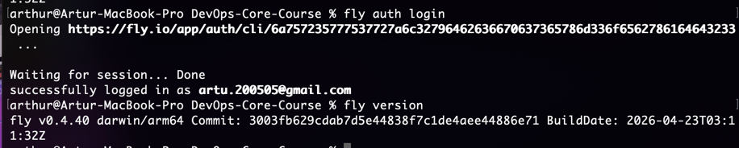
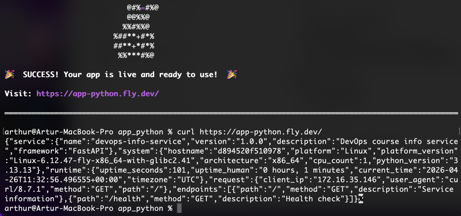
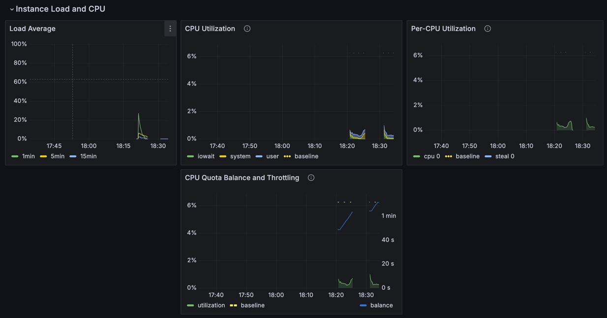
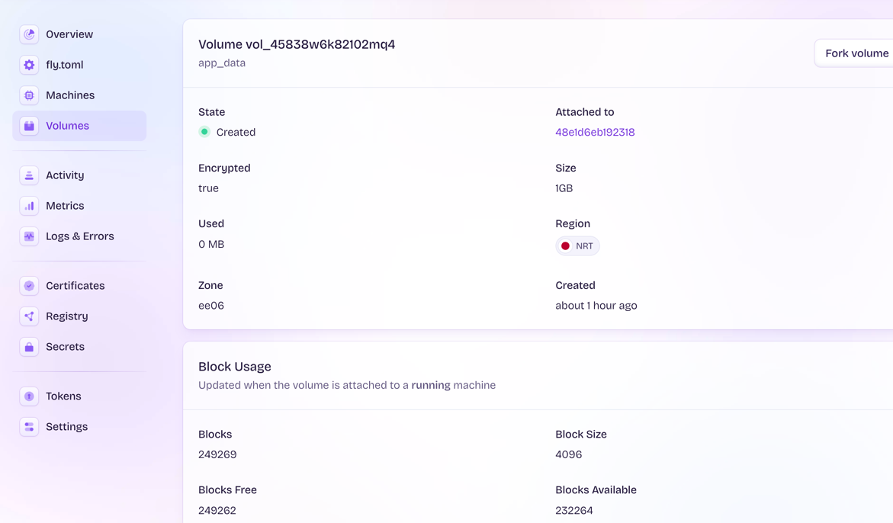
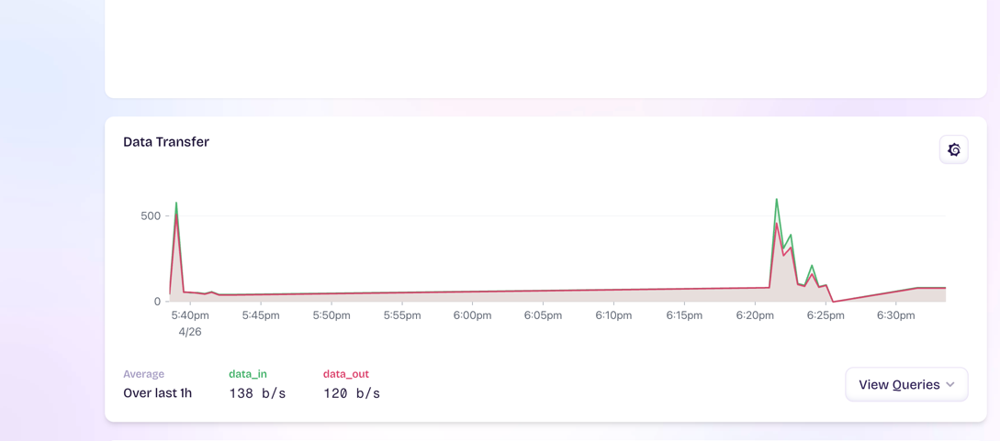

# Lab 17

---

### Task 1 — Fly.io Setup

#### **Install flyctl CLI**
- Authenticate with `fly auth login`
- Verify with `fly version`



#### **Explore Platform Concepts**
- Understand Fly Machines (VMs)
  - Fly Machines are lightweight VMs that run application instances. 
  - They can be started, stopped, and scaled across regions.

- Understand Fly Volumes (persistent storage)
  - Fly Volumes provide persistent storage that survives restarts. 
  - They are attached to a region and used for stateful data.

- Understand Regions and edge deployment
  - Fly.io runs apps in multiple regions worldwide. 
  - Requests are routed to the nearest region to reduce latency.

---

### Task 2 — Deploy Application



#### **Verify**
- Test all endpoints work

```
arthur@Artur-MacBook-Pro app_python % curl https://app-python.fly.dev/health

{"status":"healthy","timestamp":"2026-04-26T11:36:01.802218+00:00","uptime_seconds":287}
```
```
arthur@Artur-MacBook-Pro app_python % curl https://app-python.fly.dev/metrics

# HELP python_gc_objects_collected_total Objects collected during gc
# TYPE python_gc_objects_collected_total counter
python_gc_objects_collected_total{generation="0"} 505.0
python_gc_objects_collected_total{generation="1"} 0.0
python_gc_objects_collected_total{generation="2"} 0.0
# HELP python_gc_objects_uncollectable_total Uncollectable objects found during GC
# TYPE python_gc_objects_uncollectable_total counter
python_gc_objects_uncollectable_total{generation="0"} 0.0
python_gc_objects_uncollectable_total{generation="1"} 0.0
python_gc_objects_uncollectable_total{generation="2"} 0.0
# HELP python_gc_collections_total Number of times this generation was collected
# TYPE python_gc_collections_total counter
python_gc_collections_total{generation="0"} 37.0
python_gc_collections_total{generation="1"} 3.0
...
```

```
arthur@Artur-MacBook-Pro app_python % curl https://app-python.fly.dev/visits
{"visits":0}%                                               
```
- Check application logs

```
arthur@Artur-MacBook-Pro app_python % fly logs
2026-04-26T11:31:13Z app[d894520f510978] nrt [info] INFO Starting init (commit: 3040ac0)...
2026-04-26T11:31:13Z app[d894520f510978] nrt [info] INFO Preparing to run: `python app.py` as appuser
2026-04-26T11:31:13Z app[d894520f510978] nrt [info] INFO [fly api proxy] listening at /.fly/api
2026-04-26T11:31:13Z runner[d894520f510978] nrt [info]Machine created and started in 8.887s
2026-04-26T11:31:14Z app[d894520f510978] nrt [info]{"timestamp": "2026-04-26T11:31:14.725480+00:00", "level": "INFO", "logger": "__main__", "message": "Application starting - Host: 0.0.0.0, Port: 8000"}
2026-04-26T11:31:14Z app[d894520f510978] nrt [info]/app/app.py:120: DeprecationWarning:
2026-04-26T11:31:14Z app[d894520f510978] nrt [info]        on_event is deprecated, use lifespan event handlers instead.
2026-04-26T11:31:14Z app[d894520f510978] nrt [info]        Read more about it in the
2026-04-26T11:31:14Z app[d894520f510978] nrt [info]        [FastAPI docs for Lifespan Events](https://fastapi.tiangolo.com/advanced/events/).
2026-04-26T11:31:14Z app[d894520f510978] nrt [info]  @app.on_event("startup")
2026-04-26T11:31:14Z app[d894520f510978] nrt [info]/app/app.py:128: DeprecationWarning:
2026-04-26T11:31:14Z app[d894520f510978] nrt [info]        on_event is deprecated, use lifespan event handlers instead.
2026-04-26T11:31:14Z app[d894520f510978] nrt [info]        Read more about it in the
2026-04-26T11:31:14Z app[d894520f510978] nrt [info]        [FastAPI docs for Lifespan Events](https://fastapi.tiangolo.com/advanced/events/).
2026-04-26T11:31:14Z app[d894520f510978] nrt [info]  @app.on_event("shutdown")
2026-04-26T11:31:14Z app[d894520f510978] nrt [info]{"timestamp": "2026-04-26T11:31:14.854727+00:00", "level": "INFO", "logger": "__main__", "message": "Starting Uvicorn server on 0.0.0.0:8000"}
2026-04-26T11:31:14Z app[d894520f510978] nrt [info]INFO:     Started server process [636]
2026-04-26T11:31:14Z app[d894520f510978] nrt [info]INFO:     Waiting for application startup.
2026-04-26T11:31:14Z app[d894520f510978] nrt [info]{"timestamp": "2026-04-26T11:31:14.904690+00:00", "level": "INFO", "logger": "__main__", "message": "FastAPI application startup complete"}
2026-04-26T11:31:14Z app[d894520f510978] nrt [info]{"timestamp": "2026-04-26T11:31:14.904950+00:00", "level": "INFO", "logger": "__main__", "message": "Python version: 3.13.13"}
2026-04-26T11:31:14Z app[d894520f510978] nrt [info]{"timestamp": "2026-04-26T11:31:14.907641+00:00", "level": "INFO", "logger": "__main__", "message": "Platform: Linux Linux-6.12.47-fly-x86_64-with-glibc2.41"}
2026-04-26T11:31:14Z app[d894520f510978] nrt [info]{"timestamp": "2026-04-26T11:31:14.907807+00:00", "level": "INFO", "logger": "__main__", "message": "Hostname: d894520f510978"}
2026-04-26T11:31:14Z app[d894520f510978] nrt [info]INFO:     Application startup complete.
2026-04-26T11:31:14Z app[d894520f510978] nrt [info]INFO:     Uvicorn running on http://0.0.0.0:8000 (Press CTRL+C to quit)
2026-04-26T11:32:02Z app[d894520f510978] nrt [info]{"timestamp": "2026-04-26T11:32:02.110420+00:00", "level": "INFO", "logger": "__main__", "message": "Request started: GET / from 172.16.35.146"}
2026-04-26T11:32:02Z app[d894520f510978] nrt [info]{"timestamp": "2026-04-26T11:32:02.113149+00:00", "level": "INFO", "logger": "__main__", "message": "Request completed", "method": "GET", "path": "/", "status_code": 200, "client_ip": "172.16.35.146", "duration_seconds": 0.003}
2026-04-26T11:32:02Z app[d894520f510978] nrt [info]INFO:     172.16.35.146:37034 - "GET / HTTP/1.1" 200 OK
2026-04-26T11:32:02Z app[d894520f510978] nrt [info]{"timestamp": "2026-04-26T11:32:02.763552+00:00", "level": "INFO", "logger": "__main__", "message": "Request started: GET /favicon.ico from 172.16.35.146"}
2026-04-26T11:32:02Z app[d894520f510978] nrt [info]{"timestamp": "2026-04-26T11:32:02.764000+00:00", "level": "WARNING", "logger": "__main__", "message": "HTTP exception", "status_code": 404, "detail": "Not Found", "path": "/favicon.ico", "client_ip": "172.16.35.146"}
2026-04-26T11:32:02Z app[d894520f510978] nrt [info]{"timestamp": "2026-04-26T11:32:02.764312+00:00", "level": "INFO", "logger": "__main__", "message": "Request completed", "method": "GET", "path": "/favicon.ico", "status_code": 404, "client_ip": "172.16.35.146", "duration_seconds": 0.001}
2026-04-26T11:32:02Z app[d894520f510978] nrt [info]INFO:     172.16.35.146:37050 - "GET /favicon.ico HTTP/1.1" 404 Not Found
2026-04-26T11:32:56Z app[d894520f510978] nrt [info]{"timestamp": "2026-04-26T11:32:56.495580+00:00", "level": "INFO", "logger": "__main__", "message": "Request started: GET / from 172.16.35.146"}
2026-04-26T11:32:56Z app[d894520f510978] nrt [info]{"timestamp": "2026-04-26T11:32:56.497074+00:00", "level": "INFO", "logger": "__main__", "message": "Request completed", "method": "GET", "path": "/", "status_code": 200, "client_ip": "172.16.35.146", "duration_seconds": 0.002}
2026-04-26T11:32:56Z app[d894520f510978] nrt [info]INFO:     172.16.35.146:50358 - "GET / HTTP/1.1" 200 OK
2026-04-26T11:35:54Z app[d894520f510978] nrt [info]{"timestamp": "2026-04-26T11:35:54.428133+00:00", "level": "INFO", "logger": "__main__", "message": "Request started: GET /metrics from 172.16.35.146"}
2026-04-26T11:35:54Z app[d894520f510978] nrt [info]{"timestamp": "2026-04-26T11:35:54.430834+00:00", "level": "INFO", "logger": "__main__", "message": "Request completed", "method": "GET", "path": "/metrics", "status_code": 200, "client_ip": "172.16.35.146", "duration_seconds": 0.003}
2026-04-26T11:35:54Z app[d894520f510978] nrt [info]INFO:     172.16.35.146:35280 - "GET /metrics HTTP/1.1" 200 OK
2026-04-26T11:35:54Z app[d894520f510978] nrt [info]{"timestamp": "2026-04-26T11:35:54.850819+00:00", "level": "INFO", "logger": "__main__", "message": "Request started: GET /visits from 172.16.35.146"}
2026-04-26T11:35:54Z app[d894520f510978] nrt [info]{"timestamp": "2026-04-26T11:35:54.851823+00:00", "level": "INFO", "logger": "__main__", "message": "Request completed", "method": "GET", "path": "/visits", "status_code": 200, "client_ip": "172.16.35.146", "duration_seconds": 0.001}
2026-04-26T11:35:54Z app[d894520f510978] nrt [info]INFO:     172.16.35.146:35288 - "GET /visits HTTP/1.1" 200 OK
2026-04-26T11:36:07Z app[d894520f510978] nrt [info]{"timestamp": "2026-04-26T11:36:07.075893+00:00", "level": "INFO", "logger": "__main__", "message": "Request started: GET /metrics from 172.16.35.146"}
2026-04-26T11:36:07Z app[d894520f510978] nrt [info]{"timestamp": "2026-04-26T11:36:07.078356+00:00", "level": "INFO", "logger": "__main__", "message": "Request completed", "method": "GET", "path": "/metrics", "status_code": 200, "client_ip": "172.16.35.146", "duration_seconds": 0.002}
2026-04-26T11:36:07Z app[d894520f510978] nrt [info]INFO:     172.16.35.146:59604 - "GET /metrics HTTP/1.1" 200 OK
2026-04-26T11:36:10Z app[d894520f510978] nrt [info]{"timestamp": "2026-04-26T11:36:10.154319+00:00", "level": "INFO", "logger": "__main__", "message": "Request started: GET /visits from 172.16.35.146"}
2026-04-26T11:36:10Z app[d894520f510978] nrt [info]{"timestamp": "2026-04-26T11:36:10.155474+00:00", "level": "INFO", "logger": "__main__", "message": "Request completed", "method": "GET", "path": "/visits", "status_code": 200, "client_ip": "172.16.35.146", "duration_seconds": 0.001}
2026-04-26T11:36:10Z app[d894520f510978] nrt [info]INFO:     172.16.35.146:59616 - "GET /visits HTTP/1.1" 200 OK

```

- Verify health checks pass

```
arthur@Artur-MacBook-Pro app_python % fly status
App
 Name     │ app-python                                       
 Owner    │ personal                                         
 Hostname │ app-python.fly.dev                               
 Image    │ app-python:deployment-01KQ4TEYWW64FHWVDNCRW0H1EW 

Machines
 PROCESS │ ID             │ VERSION │ REGION │ STATE   │ ROLE │ CHECKS             │ LAST UPDATED         
 app     │ d894520f510978 │ 4       │ nrt    │ started │      │ 1 total, 1 passing │ 2026-04-26T11:58:38Z 
```

---

### Task 3 — Multi-Region Deployment 


**Add Regions**
- Deploy to at least 3 regions (e.g., ams, iad, sin)

```
arthur@Artur-MacBook-Pro app_python % fly scale count 1 --region iad
fly scale count 1 --region sin
App 'app-python' is going to be scaled according to this plan:
  +1 machines for group 'app' on region 'iad' of size 'shared-cpu-1x'
? Scale app app-python? Yes
Executing scale plan
  Created d8d3246f731528 group:app region:iad size:shared-cpu-1x
App 'app-python' is going to be scaled according to this plan:
  +1 machines for group 'app' on region 'sin' of size 'shared-cpu-1x'
? Scale app app-python? Yes
Executing scale plan
  Created 2873454f172738 group:app region:sin size:shared-cpu-1x
```

**Verify Global Distribution**
- Check machines in each region

```
arthur@Artur-MacBook-Pro app_python % fly machines list
3 machines have been retrieved from app app-python.
View them in the UI here (​https://fly.io/apps/app-python/machines/)

app-python
 ID             │ NAME              │ STATE   │ CHECKS │ REGION │ ROLE │ IMAGE                                            │ IP ADDRESS                       │ VOLUME │ CREATED              │ LAST UPDATED         │ PROCESS GROUP │ SIZE                 
 d894520f510978 │ wispy-frog-8399   │ started │ 1/1    │ nrt    │      │ app-python:deployment-01KQ4TEYWW64FHWVDNCRW0H1EW │ fdaa:70:51cf:a7b:604:d2e1:c64d:2 │        │ 2026-04-26T11:31:04Z │ 2026-04-26T12:26:49Z │ app           │ shared-cpu-1x:1024MB 
 d8d3246f731528 │ summer-paper-9533 │ started │ 1/1    │ iad    │      │ app-python:deployment-01KQ4TEYWW64FHWVDNCRW0H1EW │ fdaa:70:51cf:a7b:52b:5464:2bbd:2 │        │ 2026-04-26T12:24:10Z │ 2026-04-26T12:24:16Z │ app           │ shared-cpu-1x:1024MB 
 2873454f172738 │ damp-firefly-8937 │ started │ 1/1    │ sin    │      │ app-python:deployment-01KQ4TEYWW64FHWVDNCRW0H1EW │ fdaa:70:51cf:a7b:480:88fb:3ab9:2 │        │ 2026-04-26T12:24:44Z │ 2026-04-26T12:24:55Z │ app           │ shared-cpu-1x:1024MB 
```

**Test Latency**
- Document response times from different regions

```
arthur@Artur-MacBook-Pro app_python % fly ping app-python.internal
35 bytes from fdaa:70:51cf:a7b:604:d2e1:c64d:2 (app-python.internal), seq=0 time=114ms
35 bytes from fdaa:70:51cf:a7b:71b:7c7:b908:2 (app-python.internal), seq=0 time=183.3ms
35 bytes from fdaa:70:51cf:a7b:52d:95da:de85:2 (iad.app-python.internal), seq=0 time=289.2ms
35 bytes from fdaa:70:51cf:a7b:604:d2e1:c64d:2 (app-python.internal), seq=1 time=119.3ms
35 bytes from fdaa:70:51cf:a7b:71b:7c7:b908:2 (app-python.internal), seq=1 time=179ms
35 bytes from fdaa:70:51cf:a7b:52d:95da:de85:2 (iad.app-python.internal), seq=1 time=286ms
35 bytes from fdaa:70:51cf:a7b:604:d2e1:c64d:2 (nrt.app-python.internal), seq=2 time=125.1ms
35 bytes from fdaa:70:51cf:a7b:71b:7c7:b908:2 (sin.app-python.internal), seq=2 time=195.7ms
35 bytes from fdaa:70:51cf:a7b:52d:95da:de85:2 (iad.app-python.internal), seq=2 time=292.7ms
35 bytes from fdaa:70:51cf:a7b:604:d2e1:c64d:2 (nrt.app-python.internal), seq=3 time=105.8ms
35 bytes from fdaa:70:51cf:a7b:71b:7c7:b908:2 (sin.app-python.internal), seq=3 time=179.9ms
35 bytes from fdaa:70:51cf:a7b:52d:95da:de85:2 (iad.app-python.internal), seq=3 time=279.7ms
35 bytes from fdaa:70:51cf:a7b:604:d2e1:c64d:2 (nrt.app-python.internal), seq=4 time=114ms
35 bytes from fdaa:70:51cf:a7b:71b:7c7:b908:2 (sin.app-python.internal), seq=4 time=174.3ms
35 bytes from fdaa:70:51cf:a7b:52d:95da:de85:2 (iad.app-python.internal), seq=4 time=278.6ms
35 bytes from fdaa:70:51cf:a7b:604:d2e1:c64d:2 (nrt.app-python.internal), seq=5 time=121.2ms
35 bytes from fdaa:70:51cf:a7b:71b:7c7:b908:2 (sin.app-python.internal), seq=5 time=294.3ms
35 bytes from fdaa:70:51cf:a7b:52d:95da:de85:2 (iad.app-python.internal), seq=5 time=296.4ms
```

Latency was tested using internal Fly.io networking:

nrt (Tokyo): ~105–125 ms  
sin (Singapore): ~170–195 ms  
iad (US East): ~280–295 ms  

Results clearly show increasing latency based on geographic distance.  
This confirms that Fly.io deploys applications globally and routes traffic efficiently across regions.

- Understand how Fly routes requests to nearest region
  - Fly.io uses Anycast routing to direct user requests to the nearest available region. 
  - Traffic is automatically routed based on network latency, ensuring faster response times without manual configuration


**Scale Machines**
- Scale to 2 machines in primary region

```
arthur@Artur-MacBook-Pro app_python % fly scale count 2 --region nrt
App 'app-python' is going to be scaled according to this plan:
  +1 machines for group 'app' on region 'nrt' of size 'shared-cpu-1x'
```

```
arthur@Artur-MacBook-Pro app_python % fly machines list               
4 machines have been retrieved from app app-python.
View them in the UI here (https://fly.io/apps/app-python/machines/)

app-python
 ID             │ NAME                   │ STATE   │ CHECKS │ REGION │ ROLE │ IMAGE                                            │ IP ADDRESS                       │ VOLUME │ CREATED              │ LAST UPDATED         │ PROCESS GROUP │ SIZE                 
 d894520f510978 │ wispy-frog-8399        │ started │ 1/1    │ nrt    │      │ app-python:deployment-01KQ4WRVKAE465N6D28Q7FGG8V │ fdaa:70:51cf:a7b:604:d2e1:c64d:2 │        │ 2026-04-26T11:31:04Z │ 2026-04-26T13:18:20Z │ app           │ shared-cpu-1x:1024MB 
 d8939ddb639758 │ fragrant-night-8236    │ started │ 1/1    │ nrt    │      │ app-python:deployment-01KQ4WRVKAE465N6D28Q7FGG8V │ fdaa:70:51cf:a7b:75f:6cd9:29e3:2 │        │ 2026-04-26T13:16:53Z │ 2026-04-26T13:17:01Z │ app           │ shared-cpu-1x:1024MB 
 1859437c931428 │ muddy-sound-8892       │ stopped │ 0/1    │ iad    │      │ app-python:deployment-01KQ4WRVKAE465N6D28Q7FGG8V │ fdaa:70:51cf:a7b:52d:95da:de85:2 │        │ 2026-04-26T12:40:10Z │ 2026-04-26T13:17:31Z │ app           │ shared-cpu-1x:1024MB 
 286d921a712638 │ morning-resonance-5602 │ stopped │ 0/1    │ sin    │      │ app-python:deployment-01KQ4WRVKAE465N6D28Q7FGG8V │ fdaa:70:51cf:a7b:71b:7c7:b908:2  │        │ 2026-04-26T12:40:19Z │ 2026-04-26T13:17:20Z │ app           │ shared-cpu-1x:1024MB 
```

- Understand scaling commands
  - Fly.io uses commands like fly scale count to control the number of machines. 
  - Scaling can be applied globally or per region to handle load and ensure availability.

---

### Task 4 — Secrets & Persistence 

**Configure Secrets**
- Set at least 2 secrets using `fly secrets`

```
arthur@Artur-MacBook-Pro app_python % fly secrets set API_KEY="mysecret123" ENVIRONMENT="production"
Updating existing machines in 'app-python' with rolling strategy

-------
 ✔ [1/4] Machine 1859437c931428 [app] update succeeded
 ✔ [2/4] Machine 286d921a712638 [app] update succeeded
 ✔ [3/4] Machine d8939ddb639758 [app] update succeeded
 ✔ [4/4] Machine d894520f510978 [app] update succeeded
-------
Checking DNS configuration for app-python.fly.dev
✓ DNS configuration verified
arthur@Artur-MacBook-Pro app_python % fly secrets list                                                    
 NAME        │ DIGEST           │ STATUS   
 API_KEY     │ 095fe997344dba53 │ Deployed 
 ENVIRONMENT │ a331102148f18977 │ Deployed 
```

- Verify secrets are available in application

```
arthur@Artur-MacBook-Pro app_python % fly ssh console                 
Connecting to fdaa:70:51cf:a7b:75f:6cd9:29e3:2... complete
root@d8939ddb639758:/app# printenv | grep API_KEY
API_KEY=mysecret123
root@d8939ddb639758:/app# printenv | grep ENVIRONMENT
ENVIRONMENT=production
```

- Understand secret management on Fly

Fly.io stores secrets securely and injects them as environment variables into machines.
Secrets are not stored in code or configuration files and can be updated without rebuilding the image.


**Attach Volume** 
- Create Fly Volume

```
arthur@Artur-MacBook-Pro app_python % fly volumes create app_data --size 1 --region nrt
Warning! Every volume is pinned to a specific physical host. You should create two or more volumes per application to avoid downtime. Learn more at https://fly.io/docs/volumes/overview/
? Do you still want to use the volumes feature? Yes
                  ID: vol_45838w6k82102mq4
                Name: app_data
                 App: app-python
              Region: nrt
                Zone: ee06
             Size GB: 1
           Encrypted: true
          Created at: 26 Apr 26 14:41 UTC
  Snapshot retention: 5
 Scheduled snapshots: true
```

- Verify data persists across deployments

```
arthur@Artur-MacBook-Pro app_python % fly machines list
1 machines have been retrieved from app app-python.
View them in the UI here (https://fly.io/apps/app-python/machines/)

app-python
 ID             │ NAME           │ STATE   │ CHECKS │ REGION │ ROLE │ IMAGE                                            │ IP ADDRESS                       │ VOLUME               │ CREATED              │ LAST UPDATED         │ PROCESS GROUP │ SIZE                 
 48e1d6eb192318 │ lively-surf-19 │ started │ 1/1    │ nrt    │      │ app-python:deployment-01KQ55Z0VAP5E59AKMCMH8KP1S │ fdaa:70:51cf:a7b:6c7:7904:3c36:2 │ vol_45838w6k82102mq4 │ 2026-04-26T15:20:09Z │ 2026-04-26T15:20:11Z │ app           │ shared-cpu-1x:1024MB 

arthur@Artur-MacBook-Pro app_python % curl https://app-python.fly.dev/                 
{"service":{"name":"devops-info-service","version":"1.0.0","description":"DevOps course info service","framework":"FastAPI"},"system":{"hostname":"48e1d6eb192318","platform":"Linux","platform_version":"Linux-6.12.47-fly-x86_64-with-glibc2.41","architecture":"x86_64","cpu_count":1,"python_version":"3.13.13"},"runtime":{"uptime_seconds":52,"uptime_human":"0 hours, 0 minutes","current_time":"2026-04-26T15:21:06.117099+00:00","timezone":"UTC"},"request":{"client_ip":"172.16.37.154","user_agent":"curl/8.7.1","method":"GET","path":"/"},"endpoints":[{"path":"/","method":"GET","description":"Service information"},{"path":"/health","method":"GET","description":"Health check"}]}%                                                                                            arthur@Artur-MacBook-Pro app_python % curl https://app-python.fly.dev/visits
{"visits":1}%                                                                                                 
arthur@Artur-MacBook-Pro app_python % fly ssh console
Connecting to fdaa:70:51cf:a7b:6c7:7904:3c36:2... complete
root@48e1d6eb192318:/app# cat /app/data/visits
1
```

---

### Task 5 — Monitoring & Operations 

**View Metrics**
- Access Fly.io dashboard
- View CPU, memory, network metrics







- Understand machine states

Fly Machines can be in states such as started, stopped, or failed.
These states indicate whether the application is running, idle, or experiencing issues.

**Manage Deployments**
- Deploy a new version

```
arthur@Artur-MacBook-Pro app_python % fly deploy --strategy rolling
==> Verifying app config
Validating /Users/arthur/PycharmProjects/DevOps-Core-Course/app_python/fly.toml
✓ Configuration is valid
--> Verified app config
==> Building image
==> Building image with Depot
--> build:  (​)
[+] Building 6.5s (16/16) FINISHED                                                                            
 => [internal] load build definition from Dockerfile                                                     0.9s
 => => transferring dockerfile: 868B                                                                     0.9s
 => [internal] load metadata for docker.io/library/python:3.13-slim                                      0.3s
 => [internal] load .dockerignore                                                                        0.9s
 => => transferring context: 584B                                                                        0.9s
 => [internal] load build context                                                                        0.6s
 => => transferring context: 64B                                                                         0.6s
 => [builder 1/5] FROM docker.io/library/python:3.13-slim@sha256:a0779d7c12fc20be6ec6b4ddc901a4fd7657b8  0.0s
 => => resolve docker.io/library/python:3.13-slim@sha256:a0779d7c12fc20be6ec6b4ddc901a4fd7657b8a6bc9def  0.0s
 => CACHED [stage-1 2/7] WORKDIR /app                                                                    0.0s
 => CACHED [stage-1 3/7] RUN useradd --create-home --shell /bin/bash appuser &&     chown -R appuser:ap  0.0s
 => CACHED [stage-1 4/7] RUN apt-get update && apt-get install -y curl && rm -rf /var/lib/apt/lists/*    0.0s
 => CACHED [builder 2/5] WORKDIR /build                                                                  0.0s
 => CACHED [builder 3/5] COPY requirements.txt .                                                         0.0s
 => CACHED [builder 4/5] RUN python -m venv /opt/venv                                                    0.0s
 => CACHED [builder 5/5] RUN pip install --no-cache-dir -r requirements.txt                              0.0s
 => CACHED [stage-1 5/7] COPY --from=builder /opt/venv /opt/venv                                         0.0s
 => CACHED [stage-1 6/7] COPY --chown=appuser:appuser app.py .                                           0.0s
 => CACHED [stage-1 7/7] COPY --chown=appuser:appuser requirements.txt .                                 0.0s
 => exporting to image                                                                                   3.4s
 => => exporting layers                                                                                  0.0s
 => => exporting manifest sha256:eec0040d625d59669f8d0cb92ef89e398ae915a168748933f4212eb2501c91cc        0.0s
 => => exporting config sha256:aa2e710ce8aa53b301f17a0be3af067d87cfed17cf54d7fdc282d12755f730e0          0.0s
 => => pushing layers for registry.fly.io/app-python:deployment-01KQ5756SMH259SMM2YRFP994E@sha256:eec00  3.2s
 => => pushing layer sha256:738ec5a8de6e4d52e0c784d0507ee6b71d37997d48b00b32299f47d8cbb1c814             3.2s
 => => pushing layer sha256:1a5594d1f66d682ff1b61be48e50e6a5cd232c0214e27393b907803af622496e             1.2s
 => => pushing layer sha256:2a449abf6c162f7681fb1dbf50e315d151c60b1b7c7aa55fcd32c9688515e28a             0.3s
 => => pushing layer sha256:2f1596375c5192ca93443c1ff59e3485a1c2a0c8c5963ad0e68ddab3b579914a             3.2s
 => => pushing layer sha256:aa2e710ce8aa53b301f17a0be3af067d87cfed17cf54d7fdc282d12755f730e0             0.6s
 => => pushing layer sha256:4bc7412cab2e89a999ec0d7d0a64c8fb2d87ed31aed9a21e722c2ffdeeeb8f81             1.5s
 => => pushing layer sha256:723382f93e5e4cc4d1768a199fc93b41c0be7cadcfcb8db87455d75a49987060             1.8s
 => => pushing layer sha256:2a6d81a686370a2c6a1e8a2df70d0cf757ff3f30668032a4351d380fea9474c3             3.2s
 => => pushing layer sha256:0fe5597a98eff27588bd60e4cf4e5ddc7def24a880be6b7e1b690cbd67ff9c47             2.4s
 => => pushing layer sha256:f683a1b75ec81c549f9d32c5f21daafe537994387aab0a106bdf45a3f18c0bc4             2.1s
 => => pushing layer sha256:9f2fded8dd4345b28fbd67c47f1a45e79b81d1d798a397edb5c3e24a4a87da06             0.9s
 => => pushing manifest for registry.fly.io/app-python:deployment-01KQ5756SMH259SMM2YRFP994E@sha256:eec  0.1s
--> Build Summary:  (​)
--> Building image done
image: registry.fly.io/app-python:deployment-01KQ5756SMH259SMM2YRFP994E
image size: 54 MB

Watch your deployment at https://fly.io/apps/app-python/monitoring

-------
Updating existing machines in 'app-python' with rolling strategy

-------
 ✔ Cleared lease for 48e1d6eb192318
-------
Checking DNS configuration for app-python.fly.dev
✓ DNS configuration verified

Visit your newly deployed app at https://app-python.fly.dev/
```

- View deployment history

```
arthur@Artur-MacBook-Pro app_python % fly releases

 VERSION │ STATUS      │ DESCRIPTION │ USER                  │ DATE       
 v10     │ complete    │ Release     │ artu.200505@gmail.com │ 54s ago    
 v9      │ complete    │ Release     │ artu.200505@gmail.com │ 21m17s ago 
 v8      │ interrupted │ Release     │ artu.200505@gmail.com │ 27m24s ago 
 v7      │ interrupted │ Release     │ artu.200505@gmail.com │ 29m30s ago 
 v6      │ complete    │ Release     │ artu.200505@gmail.com │ 1h6m ago   
 v5      │ complete    │ Release     │ artu.200505@gmail.com │ 3h2m ago   
 v4      │ complete    │ Release     │ artu.200505@gmail.com │ 3h42m ago  
 v3      │ interrupted │ Release     │ artu.200505@gmail.com │ 3h44m ago  
 v2      │ complete    │ Release     │ artu.200505@gmail.com │ 3h47m ago  
 v1      │ complete    │ Release     │ artu.200505@gmail.com │ 4h10m ago  
 ```

- Understand rollback capability

Fly.io supports rollback by allowing redeployment of previous releases.
Using fly releases, earlier versions can be identified and redeployed if needed.
This enables quick recovery in case of failed deployments.

**Health Checks**
- Configure HTTP health checks

```toml
[checks]
  [checks.health]
    type = "http"
    port = 8000
    path = "/health"
    interval = "10s"
    timeout = "2s"
```

- Verify health check execution

```
arthur@Artur-MacBook-Pro app_python % fly status
App
 Name     │ app-python                                       
 Owner    │ personal                                         
 Hostname │ app-python.fly.dev                               
 Image    │ app-python:deployment-01KQ55Z0VAP5E59AKMCMH8KP1S 

Machines
 PROCESS │ ID             │ VERSION │ REGION │ STATE   │ ROLE │ CHECKS             │ LAST UPDATED         
 app     │ 48e1d6eb192318 │ 9       │ nrt    │ stopped │      │ 1 total, 1 warning │ 2026-04-26T15:25:12Z 

```
- Understand failure behavior

If a health check fails or the machine is stopped, Fly.io marks it as unhealthy and may stop routing traffic to it.
Unhealthy machines can be restarted or replaced automatically to maintain application availability.

---


### Task 6 — Documentation & Comparison

## 1. Deployment Summary

- **App URL:** https://app-python.fly.dev/
- **Regions deployed:** nrt (Tokyo), iad (US East), sin (Singapore)
- **Configuration used:**
  - Docker-based deployment
  - Multi-region scaling using `fly scale count`
  - Health checks configured via `fly.toml`
  - Persistent storage using Fly Volumes
  - Secrets managed via `fly secrets`

```toml
# fly.toml app configuration file generated for app-python on 2026-04-26T14:29:52+03:00
#
# See https://fly.io/docs/reference/configuration/ for information about how to use this file.
#

app = 'app-python'
primary_region = 'nrt'

[build]
  dockerfile = "Dockerfile"

[http_service]
  internal_port = 8000
  force_https = true
  auto_stop_machines = false
  auto_start_machines = true
  min_machines_running = 1

[[vm]]
  memory = '1gb'
  cpus = 1
  memory_mb = 1024

[mounts]
  source = "app_data"
  destination = "/app/data"

[checks]
  [checks.health]
    type = "http"
    port = 8000
    path = "/health"
    interval = "10s"
    timeout = "2s"
```
---

## 2. Screenshots

above

---

## 3. Kubernetes vs Fly.io Comparison

| Aspect | Kubernetes | Fly.io |
|--------|------------|--------|
| Setup complexity | High (cluster setup required) | Low (simple CLI-based setup) |
| Deployment speed | Slower (configs, manifests) | Fast (`fly deploy`) |
| Global distribution | Manual configuration | Built-in multi-region support |
| Cost (for small apps) | Higher (cluster overhead) | Lower (free tier available) |
| Learning curve | Steep | Easy to start |
| Control/flexibility | Very high | Moderate |
| Best use case | Complex, large-scale systems | Small to medium apps, quick deployments |

---

## 4. When to Use Each

### When to use Kubernetes
- Large-scale distributed systems
- Complex microservices architectures
- Need for full control over infrastructure
- Advanced networking and custom configurations

### When to use Fly.io
- Small to medium applications
- Rapid deployment and prototyping
- Global applications with low latency requirements
- When simplicity and speed are preferred over control

### Recommendation

Fly.io is ideal for fast, global deployments with minimal setup.  
Kubernetes is better suited for complex, production-grade systems requiring full control and flexibility.
