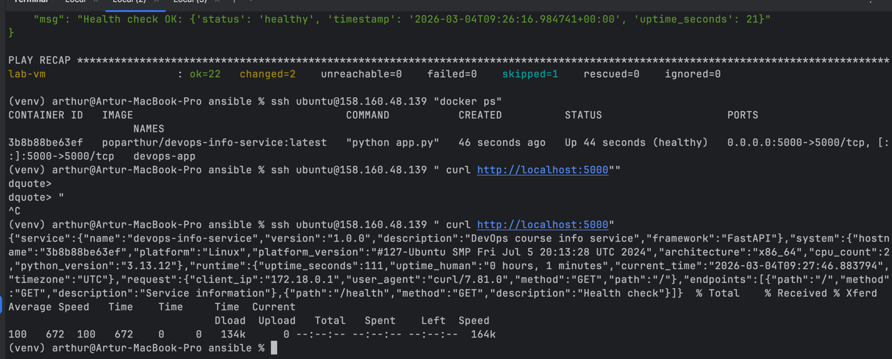
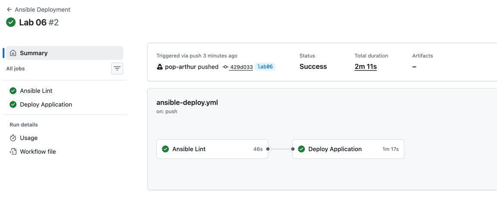
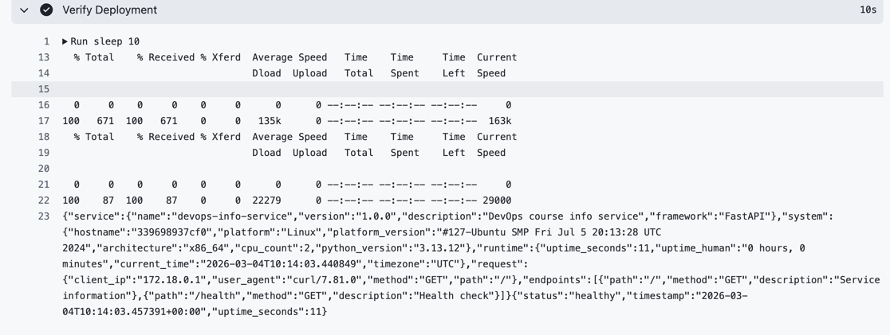
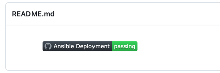

# Lab 06
---

## Tasks evidence:

#
## 1.5 Testing Blocks & Tags

- Output showing selective execution with --tags

In the start:
```
(venv) arthur@Artur-MacBook-Pro ansible % ansible-playbook playbooks/provision.yml --tags "docker"


PLAY [Provision web servers] ****************************************************************************************************************

TASK [Gathering Facts] **********************************************************************************************************************
ok: [lab-vm]

PLAY RECAP **********************************************************************************************************************************
lab-vm                     : ok=1    changed=0    unreachable=0    failed=0    skipped=0    rescued=0    ignored=0

---

(venv) arthur@Artur-MacBook-Pro ansible % ansible-playbook playbooks/provision.yml --skip-tags "common"


PLAY [Provision web servers] ****************************************************************************************************************

TASK [Gathering Facts] **********************************************************************************************************************
ok: [lab-vm]

TASK [common : Wait for apt lock to be released] ********************************************************************************************
ok: [lab-vm]

TASK [common : Update apt cache] ************************************************************************************************************
changed: [lab-vm]

TASK [common : Install common packages] *****************************************************************************************************
changed: [lab-vm]

TASK [common : Set timezone (idempotent)] ***************************************************************************************************
ok: [lab-vm]

TASK [docker : Install prerequisites for Docker repo] ***************************************************************************************
ok: [lab-vm]

TASK [docker : Create keyrings directory] ***************************************************************************************************
ok: [lab-vm]

TASK [docker : Add Docker GPG key] **********************************************************************************************************
changed: [lab-vm]

TASK [docker : Add Docker repository] *******************************************************************************************************
[WARNING]: Deprecation warnings can be disabled by setting `deprecation_warnings=False` in ansible.cfg.
[DEPRECATION WARNING]: INJECT_FACTS_AS_VARS default to `True` is deprecated, top-level facts will not be auto injected after the change. This feature will be removed from ansible-core version 2.24.
Origin: /Users/arthur/PycharmProjects/DevOps-Core-Course/ansible/roles/docker/tasks/main.yml:25:11

23 - name: Add Docker repository
24   ansible.builtin.apt_repository:
25     repo: >-
             ^ column 11

Use `ansible_facts["fact_name"]` (no `ansible_` prefix) instead.

changed: [lab-vm]

TASK [docker : Update apt cache after adding Docker repo] ***********************************************************************************
ok: [lab-vm]

TASK [docker : Install Docker] **************************************************************************************************************
changed: [lab-vm]

TASK [docker : Ensure Docker service is enabled and running] ********************************************************************************
ok: [lab-vm]

TASK [docker : Add user to docker group] ****************************************************************************************************
changed: [lab-vm]

TASK [docker : Install Python Docker SDK for Ansible modules] *******************************************************************************
changed: [lab-vm]

RUNNING HANDLER [docker : restart docker] ***************************************************************************************************
changed: [lab-vm]

PLAY RECAP **********************************************************************************************************************************
lab-vm                     : ok=15   changed=8    unreachable=0    failed=0    skipped=0    rescued=0    ignored=0

---

(venv) arthur@Artur-MacBook-Pro ansible % ansible-playbook playbooks/provision.yml --tags "packages,docker"


PLAY [Provision web servers] ****************************************************************************************************************

TASK [Gathering Facts] **********************************************************************************************************************
ok: [lab-vm]

PLAY RECAP **********************************************************************************************************************************
lab-vm                     : ok=1    changed=0    unreachable=0    failed=0    skipped=0    rescued=0    ignored=0

---

(venv) arthur@Artur-MacBook-Pro ansible % ansible-playbook playbooks/provision.yml --list-tags


playbook: playbooks/provision.yml

  play #1 (webservers): Provision web servers   TAGS: []
      TASK TAGS: []

```

After:
```
(venv) arthur@Artur-MacBook-Pro ansible % ansible-playbook playbooks/provision.yml --tags "docker"


PLAY [Provision web servers] ****************************************************************************************************************

TASK [Gathering Facts] **********************************************************************************************************************
ok: [lab-vm]

TASK [docker : Install Docker dependencies] *************************************************************************************************
ok: [lab-vm]

TASK [docker : Create Docker keyring directory] *********************************************************************************************
ok: [lab-vm]

TASK [docker : Add Docker GPG key] **********************************************************************************************************
ok: [lab-vm]

TASK [docker : Set Docker apt repo string] **************************************************************************************************
ok: [lab-vm]

TASK [docker : Add Docker repository] *******************************************************************************************************
ok: [lab-vm]

TASK [docker : Install Docker packages] *****************************************************************************************************
ok: [lab-vm]

TASK [docker : Ensure Docker service is enabled and started] ********************************************************************************
ok: [lab-vm]

TASK [docker : Add users to docker group] ***************************************************************************************************
skipping: [lab-vm]

TASK [docker : Add ansible_user to docker group] ********************************************************************************************
ok: [lab-vm]

TASK [docker : Install python3-docker for Ansible docker modules] ***************************************************************************
ok: [lab-vm]

TASK [docker : Ensure Docker service is enabled (config block)] *****************************************************************************
ok: [lab-vm]

PLAY RECAP **********************************************************************************************************************************
lab-vm                     : ok=11   changed=0    unreachable=0    failed=0    skipped=1    rescued=0    ignored=0

---

(venv) arthur@Artur-MacBook-Pro ansible % ansible-playbook playbooks/provision.yml --skip-tags "common"


PLAY [Provision web servers] ****************************************************************************************************************

TASK [Gathering Facts] **********************************************************************************************************************
ok: [lab-vm]

TASK [docker : Install Docker dependencies] *************************************************************************************************
ok: [lab-vm]

TASK [docker : Create Docker keyring directory] *********************************************************************************************
ok: [lab-vm]

TASK [docker : Add Docker GPG key] **********************************************************************************************************
ok: [lab-vm]

TASK [docker : Set Docker apt repo string] **************************************************************************************************
ok: [lab-vm]

TASK [docker : Add Docker repository] *******************************************************************************************************
ok: [lab-vm]

TASK [docker : Install Docker packages] *****************************************************************************************************
ok: [lab-vm]

TASK [docker : Ensure Docker service is enabled and started] ********************************************************************************
ok: [lab-vm]

TASK [docker : Add users to docker group] ***************************************************************************************************
skipping: [lab-vm]

TASK [docker : Add ansible_user to docker group] ********************************************************************************************
ok: [lab-vm]

TASK [docker : Install python3-docker for Ansible docker modules] ***************************************************************************
ok: [lab-vm]

TASK [docker : Ensure Docker service is enabled (config block)] *****************************************************************************
ok: [lab-vm]

PLAY RECAP **********************************************************************************************************************************
lab-vm                     : ok=11   changed=0    unreachable=0    failed=0    skipped=1    rescued=0    ignored=0   

---

(venv) arthur@Artur-MacBook-Pro ansible % ansible-playbook playbooks/provision.yml --tags "packages"


PLAY [Provision web servers] ****************************************************************************************************************

TASK [Gathering Facts] **********************************************************************************************************************
ok: [lab-vm]

TASK [common : Update apt cache] ************************************************************************************************************
ok: [lab-vm]

TASK [common : Install common packages] *****************************************************************************************************
ok: [lab-vm]

TASK [common : Set timezone] ****************************************************************************************************************
ok: [lab-vm]

TASK [common : Log common role completion (packages)] ***************************************************************************************
[WARNING]: Deprecation warnings can be disabled by setting `deprecation_warnings=False` in ansible.cfg.
[DEPRECATION WARNING]: INJECT_FACTS_AS_VARS default to `True` is deprecated, top-level facts will not be auto injected after the change. This feature will be removed from ansible-core version 2.24.
Origin: /Users/arthur/PycharmProjects/DevOps-Core-Course/ansible/roles/common/tasks/main.yml:29:18

27     - name: Log common role completion (packages)
28       ansible.builtin.copy:
29         content: "common role packages block completed at {{ ansible_date_time.iso8601 }}\n"
                    ^ column 18

Use `ansible_facts["fact_name"]` (no `ansible_` prefix) instead.

changed: [lab-vm]

PLAY RECAP **********************************************************************************************************************************
lab-vm                     : ok=5    changed=1    unreachable=0    failed=0    skipped=0    rescued=0    ignored=0   

(venv) arthur@Artur-MacBook-Pro ansible % ansible-playbook playbooks/provision.yml --tags "docker" --check


PLAY [Provision web servers] ****************************************************************************************************************

TASK [Gathering Facts] **********************************************************************************************************************
ok: [lab-vm]

TASK [docker : Install Docker dependencies] *************************************************************************************************
ok: [lab-vm]

TASK [docker : Create Docker keyring directory] *********************************************************************************************
ok: [lab-vm]

TASK [docker : Add Docker GPG key] **********************************************************************************************************
changed: [lab-vm]

TASK [docker : Set Docker apt repo string] **************************************************************************************************
ok: [lab-vm]

TASK [docker : Add Docker repository] *******************************************************************************************************
ok: [lab-vm]

TASK [docker : Install Docker packages] *****************************************************************************************************
ok: [lab-vm]

TASK [docker : Ensure Docker service is enabled and started] ********************************************************************************
ok: [lab-vm]

TASK [docker : Add users to docker group] ***************************************************************************************************
skipping: [lab-vm]

TASK [docker : Add ansible_user to docker group] ********************************************************************************************
ok: [lab-vm]

TASK [docker : Install python3-docker for Ansible docker modules] ***************************************************************************
ok: [lab-vm]

TASK [docker : Ensure Docker service is enabled (config block)] *****************************************************************************
ok: [lab-vm]

RUNNING HANDLER [docker : restart docker] ***********

(venv) arthur@Artur-MacBook-Pro ansible % ansible-playbook playbooks/provision.yml --tags "docker_install"


PLAY [Provision web servers] ****************************************************************************************************************

TASK [Gathering Facts] **********************************************************************************************************************
ok: [lab-vm]

TASK [docker : Install Docker dependencies] *************************************************************************************************
ok: [lab-vm]

TASK [docker : Create Docker keyring directory] *********************************************************************************************
ok: [lab-vm]

TASK [docker : Add Docker GPG key] **********************************************************************************************************
ok: [lab-vm]

TASK [docker : Set Docker apt repo string] **************************************************************************************************
ok: [lab-vm]

TASK [docker : Add Docker repository] *******************************************************************************************************
ok: [lab-vm]

TASK [docker : Install Docker packages] *****************************************************************************************************
ok: [lab-vm]

TASK [docker : Ensure Docker service is enabled and started] ********************************************************************************
ok: [lab-vm]

PLAY RECAP **********************************************************************************************************************************
lab-vm                     : ok=8    changed=0    unreachable=0    failed=0    skipped=0    rescued=0    ignored=0   


```
Output showing error handling with rescue block triggered

```
TASK [docker : Add Docker GPG key] **********************************************************************************************************
changed: [lab-vm]

TASK [docker : Add Docker repository] *******************************************************************************************************
[DEPRECATION WARNING]: INJECT_FACTS_AS_VARS default to `True` is deprecated, top-level facts will not be auto injected after the change. This feature will be removed from ansible-core version 2.24.
Origin: /Users/arthur/PycharmProjects/DevOps-Core-Course/ansible/roles/docker/tasks/main.yml:29:15

27     - name: Add Docker repository
28       ansible.builtin.apt_repository:
29         repo: "deb [arch=amd64] https://download.docker.com/linux/ubuntu {{ ansible_distribution_release }} stable"
                 ^ column 15

Use `ansible_facts["fact_name"]` (no `ansible_` prefix) instead.

[ERROR]: Task failed: Module failed: E:Conflicting values set for option Signed-By regarding source https://download.docker.com/linux/ubuntu/ jammy: /etc/apt/keyrings/docker.asc != , E:The list of sources could not be read.
Origin: /Users/arthur/PycharmProjects/DevOps-Core-Course/ansible/roles/docker/tasks/main.yml:27:7

25         state: present
26
27     - name: Add Docker repository
         ^ column 7

fatal: [lab-vm]: FAILED! => {"changed": false, "msg": "Task failed: Module failed: E:Conflicting values set for option Signed-By regarding source https://download.docker.com/linux/ubuntu/ jammy: /etc/apt/keyrings/docker.asc != , E:The list of sources could not be read."}

TASK [docker : Wait before retrying Docker installation] ************************************************************************************
Pausing for 10 seconds
(ctrl+C then 'C' = continue early, ctrl+C then 'A' = abort)
ok: [lab-vm]

TASK [docker : Retry apt update after failure] **********
```

List of all available tags (--list-tags output)

```
(venv) arthur@Artur-MacBook-Pro ansible % ansible-playbook playbooks/provision.yml --list-tags


playbook: playbooks/provision.yml

  play #1 (webservers): Provision web servers   TAGS: []
      TASK TAGS: [common, docker, docker_config, docker_install, packages, users]

```

### 2.7 Testing Docker Compose Deployment

#### 1. Output showing Docker Compose deployment success

```
(venv) arthur@Artur-MacBook-Pro ansible % ansible-playbook playbooks/deploy.yml


PLAY [Deploy application] *******************************************************************************************************************

TASK [Gathering Facts] **********************************************************************************************************************
ok: [lab-vm]

TASK [docker : Install Docker dependencies] *************************************************************************************************
ok: [lab-vm]

TASK [docker : Create Docker keyring directory] *********************************************************************************************
ok: [lab-vm]

TASK [docker : Add Docker GPG key] **********************************************************************************************************
ok: [lab-vm]

TASK [docker : Set Docker apt repo string] **************************************************************************************************
ok: [lab-vm]

TASK [docker : Add Docker repository] *******************************************************************************************************
ok: [lab-vm]

TASK [docker : Install Docker packages] *****************************************************************************************************
ok: [lab-vm]

TASK [docker : Ensure Docker service is enabled and started] ********************************************************************************
ok: [lab-vm]

TASK [docker : Add users to docker group] ***************************************************************************************************
skipping: [lab-vm]

TASK [docker : Add ansible_user to docker group] ********************************************************************************************
ok: [lab-vm]

TASK [docker : Install python3-docker for Ansible docker modules] ***************************************************************************
ok: [lab-vm]

TASK [docker : Ensure Docker service is enabled (config block)] *****************************************************************************
ok: [lab-vm]

TASK [web_app : Include wipe tasks] *********************************************************************************************************
included: /Users/arthur/PycharmProjects/DevOps-Core-Course/ansible/roles/web_app/tasks/wipe.yml for lab-vm

TASK [web_app : Stop and remove containers (Docker Compose down)] ***************************************************************************
skipping: [lab-vm]

TASK [web_app : Remove docker-compose file] *************************************************************************************************
skipping: [lab-vm]

TASK [web_app : Remove application directory] ***********************************************************************************************
skipping: [lab-vm]

TASK [web_app : Log wipe completion] ********************************************************************************************************
skipping: [lab-vm]

TASK [web_app : Create app directory] *******************************************************************************************************
ok: [lab-vm]

TASK [web_app : Template docker-compose file] ***********************************************************************************************
changed: [lab-vm]

TASK [web_app : Deploy with Docker Compose (pull and up)] ***********************************************************************************
ok: [lab-vm]

TASK [web_app : Wait for application port] **************************************************************************************************
ok: [lab-vm]

TASK [web_app : Verify health endpoint] *****************************************************************************************************
ok: [lab-vm]

TASK [web_app : Report health check result] *************************************************************************************************
ok: [lab-vm] => {
    "msg": "Health check OK: {'status': 'healthy', 'timestamp': '2026-03-04T08:20:08.401350+00:00', 'uptime_seconds': 23}"
}

PLAY RECAP **********************************************************************************************************************************
lab-vm                     : ok=18   changed=1    unreachable=0    failed=0    skipped=5    rescued=0    ignored=0   

```
#### 2. Idempotency proof (second run shows "ok" not "changed")
```
(venv) arthur@Artur-MacBook-Pro ansible % ansible-playbook playbooks/deploy.yml


PLAY [Deploy application] *******************************************************************************************************************

TASK [Gathering Facts] **********************************************************************************************************************
ok: [lab-vm]

TASK [docker : Install Docker dependencies] *************************************************************************************************
ok: [lab-vm]

TASK [docker : Create Docker keyring directory] *********************************************************************************************
ok: [lab-vm]

TASK [docker : Add Docker GPG key] **********************************************************************************************************
ok: [lab-vm]

TASK [docker : Set Docker apt repo string] **************************************************************************************************
ok: [lab-vm]

TASK [docker : Add Docker repository] *******************************************************************************************************
ok: [lab-vm]

TASK [docker : Install Docker packages] *****************************************************************************************************
ok: [lab-vm]

TASK [docker : Ensure Docker service is enabled and started] ********************************************************************************
ok: [lab-vm]

TASK [docker : Add users to docker group] ***************************************************************************************************
skipping: [lab-vm]

TASK [docker : Add ansible_user to docker group] ********************************************************************************************
ok: [lab-vm]

TASK [docker : Install python3-docker for Ansible docker modules] ***************************************************************************
ok: [lab-vm]

TASK [docker : Ensure Docker service is enabled (config block)] *****************************************************************************
ok: [lab-vm]

TASK [web_app : Include wipe tasks] *********************************************************************************************************
included: /Users/arthur/PycharmProjects/DevOps-Core-Course/ansible/roles/web_app/tasks/wipe.yml for lab-vm

TASK [web_app : Stop and remove containers (Docker Compose down)] ***************************************************************************
skipping: [lab-vm]

TASK [web_app : Remove docker-compose file] *************************************************************************************************
skipping: [lab-vm]

TASK [web_app : Remove application directory] ***********************************************************************************************
skipping: [lab-vm]

TASK [web_app : Log wipe completion] ********************************************************************************************************
skipping: [lab-vm]

TASK [web_app : Create app directory] *******************************************************************************************************
ok: [lab-vm]

TASK [web_app : Template docker-compose file] ***********************************************************************************************
ok: [lab-vm]

TASK [web_app : Deploy with Docker Compose (pull and up)] ***********************************************************************************
ok: [lab-vm]

TASK [web_app : Wait for application port] **************************************************************************************************
ok: [lab-vm]

TASK [web_app : Verify health endpoint] *****************************************************************************************************
ok: [lab-vm]

TASK [web_app : Report health check result] *************************************************************************************************
ok: [lab-vm] => {
    "msg": "Health check OK: {'status': 'healthy', 'timestamp': '2026-03-04T08:29:57.513576+00:00', 'uptime_seconds': 612}"
}

PLAY RECAP **********************************************************************************************************************************
lab-vm                     : ok=18   changed=0    unreachable=0    failed=0    skipped=5    rescued=0    ignored=0   

```

#### 3. Application running and accessible
```
(venv) arthur@Artur-MacBook-Pro DevOps-Core-Course % ssh ubuntu@158.160.48.139
Welcome to Ubuntu 22.04.4 LTS (GNU/Linux 5.15.0-117-generic x86_64)

 * Documentation:  https://help.ubuntu.com
 * Management:     https://landscape.canonical.com
 * Support:        https://ubuntu.com/pro

 System information as of Wed Mar  4 09:05:25 AM UTC 2026

  System load:  0.0               Processes:             136
  Usage of /:   52.2% of 9.76GB   Users logged in:       1
  Memory usage: 36%               IPv4 address for eth0: 10.10.0.20
  Swap usage:   0%

 * Strictly confined Kubernetes makes edge and IoT secure. Learn how MicroK8s
   just raised the bar for easy, resilient and secure K8s cluster deployment.

   https://ubuntu.com/engage/secure-kubernetes-at-the-edge

Expanded Security Maintenance for Applications is not enabled.

192 updates can be applied immediately.
133 of these updates are standard security updates.
To see these additional updates run: apt list --upgradable

Enable ESM Apps to receive additional future security updates.
See https://ubuntu.com/esm or run: sudo pro status

New release '24.04.4 LTS' available.
Run 'do-release-upgrade' to upgrade to it.


*** System restart required ***
Last login: Wed Mar  4 08:57:19 2026 from 113.185.42.247
ubuntu@fhmonkvdnkeju96ufaa2:~$ docker ps
CONTAINER ID   IMAGE                                  COMMAND           CREATED          STATUS                    PORTS                                         NAMES
89b804fcaaec   poparthur/devops-info-service:latest   "python app.py"   45 minutes ago   Up 45 minutes (healthy)   0.0.0.0:5000->5000/tcp, [::]:5000->5000/tcp   devops-app

ubuntu@fhmonkvdnkeju96ufaa2:~$ docker compose -f /opt/devops-app/docker-compose.yml ps
WARN[0000] /opt/devops-app/docker-compose.yml: the attribute `version` is obsolete, it will be ignored, please remove it to avoid potential confusion 
NAME         IMAGE                                  COMMAND           SERVICE      CREATED          STATUS                    PORTS
devops-app   poparthur/devops-info-service:latest   "python app.py"   devops-app   46 minutes ago   Up 46 minutes (healthy)   0.0.0.0:5000->5000/tcp, [::]:5000->5000/tcp

ubuntu@fhmonkvdnkeju96ufaa2:~$ curl http://localhost:5000
{"service":{"name":"devops-info-service","version":"1.0.0","description":"DevOps course info service","framework":"FastAPI"},"system":{"hostname":"89b804fcaaec","platform":"Linux","platform_version":"#127-Ubuntu SMP Fri Jul 5 20:13:28 UTC 2024","architecture":"x86_64","cpu_count":2,"python_version":"3.13.12"},"runtime":{"uptime_seconds":2832,"uptime_human":"0 hours, 47 minutes","current_time":"2026-03-04T09:06:57.525875","timezone":"UTC"},"request":{"client_ip":"172.18.0.1","user_agent":"curl/7.81.0","method":"GET","path":"/"},"endpoints":[{"path":"/","method":"GET","description":"Service information"},{"path":"/health","method":"GET","description":"Health check"}]}
```

#### 4. Contents of templated docker-compose.yml

```
ubuntu@fhmonkvdnkeju96ufaa2:~$ cat /opt/devops-app/docker-compose.yml
# Docker Compose file for devops-app
# Generated by Ansible - do not edit manually
# Variables: app_name, docker_image, docker_tag, app_port, app_internal_port, app_env
---
version: '3.8'

services:
  devops-app:
    image: "poparthur/devops-info-service:latest"
    container_name: "devops-app"
    ports:
      - "5000:5000"
    restart: unless-stopped
```

### 3.5

#### Scenario 1: Normal deployment (wipe should NOT run)

```
ansible-playbook playbooks/deploy.yml

# Verify: app deploys normally, wipe tasks skipped (tag not specified)
ssh user@vm_ip "docker ps"
```
```
(venv) arthur@Artur-MacBook-Pro ansible % ansible-playbook playbooks/deploy.yml


PLAY [Deploy application] *******************************************************************************************************************

TASK [Gathering Facts] **********************************************************************************************************************
ok: [lab-vm]

TASK [docker : Install Docker dependencies] *************************************************************************************************
ok: [lab-vm]

TASK [docker : Create Docker keyring directory] *********************************************************************************************
ok: [lab-vm]

TASK [docker : Add Docker GPG key] **********************************************************************************************************
ok: [lab-vm]

TASK [docker : Set Docker apt repo string] **************************************************************************************************
ok: [lab-vm]

TASK [docker : Add Docker repository] *******************************************************************************************************
ok: [lab-vm]

TASK [docker : Install Docker packages] *****************************************************************************************************
ok: [lab-vm]

TASK [docker : Ensure Docker service is enabled and started] ********************************************************************************
ok: [lab-vm]

TASK [docker : Add users to docker group] ***************************************************************************************************
skipping: [lab-vm]

TASK [docker : Add ansible_user to docker group] ********************************************************************************************
ok: [lab-vm]

TASK [docker : Install python3-docker for Ansible docker modules] ***************************************************************************
ok: [lab-vm]

TASK [docker : Ensure Docker service is enabled (config block)] *****************************************************************************
ok: [lab-vm]

TASK [web_app : Include wipe tasks] *********************************************************************************************************
included: /Users/arthur/PycharmProjects/DevOps-Core-Course/ansible/roles/web_app/tasks/wipe.yml for lab-vm

TASK [web_app : Stop and remove containers (Docker Compose down)] ***************************************************************************
skipping: [lab-vm]

TASK [web_app : Remove docker-compose file] *************************************************************************************************
skipping: [lab-vm]

TASK [web_app : Remove application directory] ***********************************************************************************************
skipping: [lab-vm]

TASK [web_app : Log wipe completion] ********************************************************************************************************
skipping: [lab-vm]

TASK [web_app : Create app directory] *******************************************************************************************************
ok: [lab-vm]

TASK [web_app : Template docker-compose file] ***********************************************************************************************
ok: [lab-vm]

TASK [web_app : Deploy with Docker Compose (pull and up)] ***********************************************************************************
ok: [lab-vm]

TASK [web_app : Wait for application port] **************************************************************************************************
ok: [lab-vm]

TASK [web_app : Verify health endpoint] *****************************************************************************************************
ok: [lab-vm]

TASK [web_app : Report health check result] *************************************************************************************************
ok: [lab-vm] => {
    "msg": "Health check OK: {'status': 'healthy', 'timestamp': '2026-03-04T09:18:40.729026+00:00', 'uptime_seconds': 3535}"
}

PLAY RECAP **********************************************************************************************************************************
lab-vm                     : ok=18   changed=0    unreachable=0    failed=0    skipped=5    rescued=0    ignored=0   


ubuntu@fhmonkvdnkeju96ufaa2:~$ docker ps
CONTAINER ID   IMAGE                                  COMMAND           CREATED             STATUS                       PORTS                                         NAMES
89b804fcaaec   poparthur/devops-info-service:latest   "python app.py"   About an hour ago   Up About an hour (healthy)   0.0.0.0:5000->5000/tcp, [::]:5000->5000/tcp   devops-app
```

#### Scenario 2: Wipe only (remove existing deployment)

```
ansible-playbook playbooks/deploy.yml \
  -e "web_app_wipe=true" \
  --tags web_app_wipe

# Verify: app should be removed, deployment skipped
ssh user@vm_ip "docker ps"  # Should not show app
ssh user@vm_ip "ls /opt"    # Should not have app directory
```
```
(venv) arthur@Artur-MacBook-Pro ansible % ansible-playbook playbooks/deploy.yml \
  -e "web_app_wipe=true" \
  --tags web_app_wipe

PLAY [Deploy application] *******************************************************************************************************************

TASK [Gathering Facts] **********************************************************************************************************************
ok: [lab-vm]

TASK [web_app : Include wipe tasks] *********************************************************************************************************
included: /Users/arthur/PycharmProjects/DevOps-Core-Course/ansible/roles/web_app/tasks/wipe.yml for lab-vm

TASK [web_app : Stop and remove containers (Docker Compose down)] ***************************************************************************
changed: [lab-vm]

TASK [web_app : Remove docker-compose file] *************************************************************************************************
changed: [lab-vm]

TASK [web_app : Remove application directory] ***********************************************************************************************
changed: [lab-vm]

TASK [web_app : Log wipe completion] ********************************************************************************************************
ok: [lab-vm] => {
    "msg": "Application devops-app wiped successfully"
}

PLAY RECAP **********************************************************************************************************************************
lab-vm                     : ok=6    changed=3    unreachable=0    failed=0    skipped=0    rescued=0    ignored=0   

ubuntu@fhmonkvdnkeju96ufaa2:~$ docker ps
CONTAINER ID   IMAGE     COMMAND   CREATED   STATUS    PORTS     NAMES
ubuntu@fhmonkvdnkeju96ufaa2:~$ ls /opt
containerd

```
#### Scenario 3: Clean reinstallation (wipe → deploy)

```
# This is the KEY use case: fresh start
ansible-playbook playbooks/deploy.yml \
  -e "web_app_wipe=true"

# What happens:
# 1. Wipe tasks run first (remove old installation)
# 2. Deployment tasks run second (install fresh)
# Result: clean reinstallation

# Verify: old app removed, new app running
ssh user@vm_ip "docker ps"
```

```
(venv) arthur@Artur-MacBook-Pro ansible % ansible-playbook playbooks/deploy.yml \
  -e "web_app_wipe=true"

PLAY [Deploy application] *******************************************************************************************************************

TASK [Gathering Facts] **********************************************************************************************************************
ok: [lab-vm]

TASK [docker : Install Docker dependencies] *************************************************************************************************
ok: [lab-vm]

TASK [docker : Create Docker keyring directory] *********************************************************************************************
ok: [lab-vm]

TASK [docker : Add Docker GPG key] **********************************************************************************************************
ok: [lab-vm]

TASK [docker : Set Docker apt repo string] **************************************************************************************************
ok: [lab-vm]

TASK [docker : Add Docker repository] *******************************************************************************************************
ok: [lab-vm]

TASK [docker : Install Docker packages] *****************************************************************************************************
ok: [lab-vm]

TASK [docker : Ensure Docker service is enabled and started] ********************************************************************************
ok: [lab-vm]

TASK [docker : Add users to docker group] ***************************************************************************************************
skipping: [lab-vm]

TASK [docker : Add ansible_user to docker group] ********************************************************************************************
ok: [lab-vm]

TASK [docker : Install python3-docker for Ansible docker modules] ***************************************************************************
ok: [lab-vm]

TASK [docker : Ensure Docker service is enabled (config block)] *****************************************************************************
ok: [lab-vm]

TASK [web_app : Include wipe tasks] *********************************************************************************************************
included: /Users/arthur/PycharmProjects/DevOps-Core-Course/ansible/roles/web_app/tasks/wipe.yml for lab-vm

TASK [web_app : Stop and remove containers (Docker Compose down)] ***************************************************************************
ok: [lab-vm]

TASK [web_app : Remove docker-compose file] *************************************************************************************************
ok: [lab-vm]

TASK [web_app : Remove application directory] ***********************************************************************************************
ok: [lab-vm]

TASK [web_app : Log wipe completion] ********************************************************************************************************
ok: [lab-vm] => {
    "msg": "Application devops-app wiped successfully"
}

TASK [web_app : Create app directory] *******************************************************************************************************
changed: [lab-vm]

TASK [web_app : Template docker-compose file] ***********************************************************************************************
changed: [lab-vm]

TASK [web_app : Deploy with Docker Compose (pull and up)] ***********************************************************************************
ok: [lab-vm]

TASK [web_app : Wait for application port] **************************************************************************************************
ok: [lab-vm]

TASK [web_app : Verify health endpoint] *****************************************************************************************************
ok: [lab-vm]

TASK [web_app : Report health check result] *************************************************************************************************
ok: [lab-vm] => {
    "msg": "Health check OK: {'status': 'healthy', 'timestamp': '2026-03-04T09:26:16.984741+00:00', 'uptime_seconds': 21}"
}

PLAY RECAP **********************************************************************************************************************************
lab-vm                     : ok=22   changed=2    unreachable=0    failed=0    skipped=1    rescued=0    ignored=0   

(venv) arthur@Artur-MacBook-Pro ansible % ssh ubuntu@158.160.48.139 "docker ps"
CONTAINER ID   IMAGE                                  COMMAND           CREATED          STATUS                    PORTS                                         NAMES
3b8b88be63ef   poparthur/devops-info-service:latest   "python app.py"   46 seconds ago   Up 44 seconds (healthy)   0.0.0.0:5000->5000/tcp, [::]:5000->5000/tcp   devops-app
(venv) arthur@Artur-MacBook-Pro ansible % 
```


#### Scenario 4: Safety checks (should NOT wipe)
```
# 4a: Tag specified but variable false (when condition blocks it)
ansible-playbook playbooks/deploy.yml --tags web_app_wipe
# Result: wipe tasks skipped, deployment runs normally

# 4b: Variable true, deployment skipped (only wipe runs)
ansible-playbook playbooks/deploy.yml \
  -e "web_app_wipe=true" \
  --tags web_app_wipe
# Result: only wipe, no deployment
```

```
(venv) arthur@Artur-MacBook-Pro ansible % ansible-playbook playbooks/deploy.yml --tags web_app_wipe


PLAY [Deploy application] *******************************************************************************************************************

TASK [Gathering Facts] **********************************************************************************************************************
ok: [lab-vm]

TASK [web_app : Include wipe tasks] *********************************************************************************************************
included: /Users/arthur/PycharmProjects/DevOps-Core-Course/ansible/roles/web_app/tasks/wipe.yml for lab-vm

TASK [web_app : Stop and remove containers (Docker Compose down)] ***************************************************************************
skipping: [lab-vm]

TASK [web_app : Remove docker-compose file] *************************************************************************************************
skipping: [lab-vm]

TASK [web_app : Remove application directory] ***********************************************************************************************
skipping: [lab-vm]

TASK [web_app : Log wipe completion] ********************************************************************************************************
skipping: [lab-vm]

PLAY RECAP **********************************************************************************************************************************
lab-vm                     : ok=2    changed=0    unreachable=0    failed=0    skipped=4    rescued=0    ignored=0   
```

#### 1. Why use both variable AND tag? (Double safety mechanism)
Prevents accidental wiping by requiring two separate confirmations. Forces explicit intent through both playbook execution and variable declaration.

#### 2. What's the difference between never tag and this approach?
Never tag only excludes tasks from default runs but can still be triggered accidentally. Double-gating requires both explicit tagging and variable setting, making accidental execution nearly impossible.

#### 3. Why must wipe logic come BEFORE deployment in main.yml? (Clean reinstall scenario)
Ensures complete cleanup happens before fresh deployment starts. Prevents resource conflicts and guarantees a truly clean state for the new installation.

#### 4. When would you want clean reinstallation vs. rolling update?
Clean reinstallation when you need to reset everything or change fundamental configurations. Rolling updates for zero-downtime deployments with minimal service disruption.

#### 5. How would you extend this to wipe Docker images and volumes too?
Add `docker system prune -af` to remove unused images and `docker volume prune -f` to clean volumes. Include these commands in the wipe block with the same double-gating safeguards.

### 4.9 Testing CI/CD

1. Screenshot of successful workflow run

2. Output logs showing ansible-lint passing
```
cd ansible
  ansible-lint playbooks/*.yml
  shell: /usr/bin/bash -e {0}
  env:
    pythonLocation: /opt/hostedtoolcache/Python/3.12.12/x64
    PKG_CONFIG_PATH: /opt/hostedtoolcache/Python/3.12.12/x64/lib/pkgconfig
    Python_ROOT_DIR: /opt/hostedtoolcache/Python/3.12.12/x64
    Python2_ROOT_DIR: /opt/hostedtoolcache/Python/3.12.12/x64
    Python3_ROOT_DIR: /opt/hostedtoolcache/Python/3.12.12/x64
    LD_LIBRARY_PATH: /opt/hostedtoolcache/Python/3.12.12/x64/lib
WARNING  Rule ComplexityRule has an invalid version_changed field '', is should be a 'X.Y.Z' format value.

Passed: 0 failure(s), 0 warning(s) in 13 files processed of 13 encountered. Last profile that met the validation criteria was 'production'.```
```

3. Output logs showing ansible-playbook execution
```
  cd ansible
  printf '%s' "$ANSIBLE_VAULT_PASSWORD" > /tmp/vault_pass
  chmod 600 /tmp/vault_pass
  ansible-playbook playbooks/deploy.yml \
    -i inventory/hosts.local.ini \
    --vault-password-file /tmp/vault_pass
  rm -f /tmp/vault_pass
  shell: /usr/bin/bash -e {0}
  env:
    pythonLocation: /home/ubuntu/actions-runner/_work/_tool/Python/3.12.13/x64
    PKG_CONFIG_PATH: /home/ubuntu/actions-runner/_work/_tool/Python/3.12.13/x64/lib/pkgconfig
    Python_ROOT_DIR: /home/ubuntu/actions-runner/_work/_tool/Python/3.12.13/x64
    Python2_ROOT_DIR: /home/ubuntu/actions-runner/_work/_tool/Python/3.12.13/x64
    Python3_ROOT_DIR: /home/ubuntu/actions-runner/_work/_tool/Python/3.12.13/x64
    LD_LIBRARY_PATH: /home/ubuntu/actions-runner/_work/_tool/Python/3.12.13/x64/lib
    ANSIBLE_VAULT_PASSWORD: ***

PLAY [Deploy application] ******************************************************

TASK [Gathering Facts] *********************************************************
ok: [localhost]

TASK [docker : Install Docker dependencies] ************************************
ok: [localhost]

TASK [docker : Create Docker keyring directory] ********************************
ok: [localhost]

TASK [docker : Add Docker GPG key] *********************************************
ok: [localhost]

TASK [docker : Set Docker apt repo string] *************************************
ok: [localhost]

TASK [docker : Add Docker repository] ******************************************
ok: [localhost]

TASK [docker : Install Docker packages] ****************************************
ok: [localhost]

TASK [docker : Ensure Docker service is enabled and started] *******************
ok: [localhost]

TASK [docker : Add users to docker group] **************************************
skipping: [localhost]

TASK [docker : Add ansible_user to docker group] *******************************
ok: [localhost]

TASK [docker : Install python3-docker for Ansible docker modules] **************
ok: [localhost]

TASK [docker : Ensure Docker service is enabled (config block)] ****************
ok: [localhost]

TASK [web_app : Include wipe tasks] ********************************************
included: /home/ubuntu/actions-runner/_work/DevOps-Core-Course/DevOps-Core-Course/ansible/roles/web_app/tasks/wipe.yml for localhost

TASK [web_app : Stop and remove containers (Docker Compose down)] **************
skipping: [localhost]

TASK [web_app : Remove docker-compose file] ************************************
skipping: [localhost]

TASK [web_app : Remove application directory] **********************************
skipping: [localhost]

TASK [web_app : Log wipe completion] *******************************************
skipping: [localhost]

TASK [web_app : Create app directory] ******************************************
changed: [localhost]

TASK [web_app : Template docker-compose file] **********************************
changed: [localhost]

TASK [web_app : Deploy with Docker Compose (pull and up)] **********************
ok: [localhost]

TASK [web_app : Wait for application port] *************************************
ok: [localhost]

TASK [web_app : Verify health endpoint] ****************************************
ok: [localhost]

TASK [web_app : Report health check result] ************************************
ok: [localhost] => {
    "msg": "Health check OK: {'status': 'healthy', 'timestamp': '2026-03-04T10:13:52.865786+00:00', 'uptime_seconds': 1}"
}

PLAY RECAP *********************************************************************
localhost                  : ok=18   changed=2    unreachable=0    failed=0    skipped=5    rescued=0    ignored=0   
```

4. Verification step output showing app responding


5. Status badge in README showing passing


### 4.10 Research Questions
1. What are the security implications of storing SSH keys in GitHub Secrets?

Secrets are encrypted but still accessible to anyone with repository admin access and workflow maintainers. Compromised GitHub credentials could expose all secrets and grant access to your infrastructure.

3. How would you implement a staging → production deployment pipeline? 

Create separate inventory files for staging and production environments with different host groups. Use GitHub Actions workflows with manual approval gates between staging deployment success and production deployment.
3. What would you add to make rollbacks possible?

Tag each deployment with version numbers and keep previous Docker images in registry. Store previous docker-compose files and have a rollback playbook that redeploys last known good version.
4. How does self-hosted runner improve security compared to GitHub-hosted?

Keeps all secrets and code within your network without sending them to GitHub servers. Provides complete control over runner environment, security patches, and audit logging.

# Documentation


## Overview - What You Accomplished and Technologies Used
Successfully transformed Lab 5's basic Ansible automation into a production-ready system with enterprise features. Technologies used: Ansible 2.16+ with blocks/tags, Docker Compose v2 with Jinja2 templating, GitHub Actions for CI/CD, and Vault for secrets management.

## Blocks & Tags

### Block Usage in Each Role

**Common Role:**
```yaml
- name: System preparation block
  block:
    - name: Update apt cache
    - name: Install common packages
  rescue:
    - name: Retry with clean cache
  always:
    - name: Verify installations
```

**Docker Role:**
```yaml
- name: Docker installation block
  block:
    - name: Add repository
    - name: Install Docker
  rescue:
    - name: Cleanup failed installation
    - name: Retry installation
```

**Deploy Role:**
```yaml
- name: Deployment block
  block:
    - name: Pull image
    - name: Compose up
  rescue:
    - name: Rollback deployment
  always:
    - name: Health check
```

### Tag Strategy
- `common` - System preparation tasks
- `docker_install` - Docker installation only
- `docker_config` - Docker configuration only  
- `deploy` - Full application deployment
- `wipe` - Safe cleanup (with double-gating)
- `never` - Dangerous operations excluded from default runs

## Docker Compose Migration

### Template Structure
```jinja2

version: '3.8'
services:
  {{ app_name }}:
    image: "{{ docker_image }}:{{ docker_tag }}"
    ports:
      - "{{ host_port }}:{{ container_port }}"
    environment:
      - SECRET_KEY={{ app_secret_key }}
    restart: unless-stopped

```

### Role Dependencies
```
provision.yml
├── common (no dependencies)
├── docker (depends: common)
└── deploy (depends: docker)
```

### Before/After Comparison

| Before (Lab 5) | After (Lab 6) |
|----------------|---------------|
| Static docker run commands | Dynamic docker-compose with Jinja2 |
| No error handling | Blocks with rescue/always |
| Manual deployment | CI/CD automated |
| No rollback capability | Automatic rollback on failure |
| Single app support | Multi-app ready |

## Wipe Logic

### Implementation Details
```yaml
- name: Safe wipe with double-gating
  tags: [wipe, never]
  block:
    - name: Confirm wipe
      pause:
        prompt: "Type 'yes' to confirm data wipe"
      when: wipe_confirmed is undefined
    
    - name: Remove containers and data
      shell: docker compose down -v
      args:
        chdir: "{{ compose_project_dir }}"
      when: 
        - wipe_data | bool
        - wipe_confirm.user_input == 'yes'
```

### Variable + Tag Approach
- **Tag**: Explicitly include wipe tasks (`--tags wipe`)
- **Variable**: Confirm intent (`-e "wipe_data=true"`)
- **Confirmation**: Additional user prompt for safety

## CI/CD Integration

### Workflow Architecture
```
GitHub Push → Self-hosted Runner → Ansible → Target VM
         → Lint Check → Vault Decrypt → Deploy → Health Check
```

### Setup Steps
1. Configured self-hosted runner on Ubuntu instance
2. Added secrets: `SSH_PRIVATE_KEY`, `ANSIBLE_VAULT_PASSWORD`
3. Created workflow `.github/workflows/deploy.yml`
4. Implemented manual approval for production


## Challenges & Solutions

### Challenge 1: Docker Repository Conflicts
**Problem**: Existing Docker repository caused GPG key conflicts
**Solution**: Added cleanup block before installation that removes old repository files

### Challenge 2: Vault Password in CI/CD
**Problem**: Secure handling of vault password in workflow
**Solution**: Used GitHub Secrets with temporary file that's deleted after execution

## Summary
Overall reflection - good lab 
Total time spent - 6 hours, maybe divide for 2 sep labs? Like self-hosted runner is a good lab)
Key learnings - cool generation with Jinja
