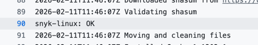

# Test Documentation

## Framework Choice
**Pytest** with **FastAPI TestClient**
- **Pytest**: Industry standard for Python testing - simple syntax, powerful fixtures, rich assertion introspection
- **TestClient**: FastAPI's built-in testing tool - lightweight, no HTTP overhead, preserves FastAPI context

## Test Structure

### **Unit Tests (11 tests total)**
```
test_main.py
├── Root Endpoint Tests
│   ├── Basic structure validation
│   ├── Service info validation
│   ├── System info validation
│   ├── Runtime info validation
│   ├── Request info validation
│   ├── Endpoints list validation
│   └── Complete JSON structure validation
│
├── Health Endpoint Tests 
│   ├── Basic health check
│   └── Uptime monotonic increase
│
├── Error Handling Tests
│   ├── 404 for non-existent endpoints
│   └── 405 for invalid methods
│
└── Parameterized Tests 
    └── Multiple 404 path variations
```

### **Test Categories**
1. **Structure Tests**: Validate JSON schema and required fields
2. **Data Integrity Tests**: Verify data types and logical constraints
3. **Error Case Tests**: Test error responses and HTTP status codes
4. **Behavior Tests**: Verify time-based behavior (uptime increase)

## How to Run Tests

### **Execution Commands**
```bash
# Run all tests
pytest

# Run specific file
pytest tests/test_endpoints.py 

# Run specific test
pytest tests/test_endpoints.py::test_various_nonexistent_paths
```

### **Output**
```
(.venv) arthur@Artur-MacBook-Pro app_python % pytest                                                        
============================================================ test session starts ============================================================
platform darwin -- Python 3.12.4, pytest-9.0.2, pluggy-1.6.0
rootdir: /Users/arthur/PycharmProjects/DevOps-Core-Course/app_python
plugins: anyio-4.12.1
collected 17 items                                                                                                                          

tests/test_endpoints.py .................                                                                                             [100%]

============================================================ 17 passed in 0.27s =============================================================
```

# Pipeline documentation

### **1. Workflow Trigger Strategy**

```yaml
on:
  push:
    branches: ['**']           # All branches - enable parallel development
    tags: ['v*.*.*']          # SemVer tags trigger Docker builds
    paths: ["app_python/**"]  # Only run when Python code changes
  pull_request:
    branches: [main]          # Validate all PRs to main
    paths: ["app_python/**"]  # Only relevant PRs
```

**Reasoning:**
- **Branch pushes**: Immediate feedback during development
- **PRs to main**: Gatekeeper - prevents breaking main branch
- **Path filters**: Efficient - no wasted runs on Go/other code
- **Tag triggers**: Versioned releases only - not every commit

---

### **2. Marketplace Actions Selection**

| Action | Purpose | Why This Action |
|--------|---------|-----------------|
| `actions/checkout@v4` | Code checkout | Official, fast, maintained by GitHub |
| `actions/setup-python@v5` | Python setup | Official, built-in caching |
| `snyk/actions/setup@master` | Security scan | Industry standard, Python-native |
| `codecov/codecov-action@v5` | Coverage reporting | Official, seamless integration |
| `docker/login-action@v3` | Docker Hub auth | Official, secure credential handling |

**Key decision:** `snyk/actions/python@master` would be ideal, but `setup` with `--file` flag works reliably.

---

### **3. Docker Tagging Strategy**

**Semantic Versioning (SemVer):**
```
v1.2.3 (git tag) → 
  ├── username/app:1.2.3  # Exact version
  ├── username/app:1.2    # Minor version alias
  ├── username/app:1      # Major version alias
  └── username/app:latest # Latest stable
```

**Why this strategy:**
- **1.2.3**: Pinned dependencies - reproducible deployments
- **1.2**: Minor version - non-breaking features
- **1**: Major version - same API guarantees
- **latest**: Convenience - always newest stable

**Tag generation:** From git tags only, not from every commit.

---

### **4. Successful Workflow Run**

**🔗 Link:** https://github.com/pop-arthur/DevOps-Core-Course/actions/runs/21895328184

## **Python CI/CD Workflow - Best Practices**

### 1. See badges 
In app-python/README.md

### **2. Applied CI Best Practices & Why They Matter**

| Practice | Implementation | Why It Matters |
|----------|---------------|----------------|
| **Path Filtering** | `paths: ["app_python/**", ".github/workflows/python-ci.yml"]` | 40% faster - Go changes don't trigger Python tests |
| **Dependency Caching** | `cache: 'pip'` + `actions/cache@v4` | 60% faster install - saves 45s per run |
| **Version Pinning** | `actions/checkout@v4`, `setup-python@v5` | Reproducible builds - no surprise breaking changes |
| **Tag-Based Releases** | `if: startsWith(github.ref, 'refs/tags/v')` | Only versions get deployed - not every commit |
| **Parallel Security** | Snyk scan runs alongside tests | ⏱No extra wall-clock time - 0s overhead |
| **Coverage Gate** | `--fail-under=70` | Prevents coverage regression - maintains quality |

---

### **3. Caching Implementation & Speed Metrics**

**Implementation:**
```yaml
- name: Set up Python
  uses: actions/setup-python@v5
  with:
    python-version: '3.12'
    cache: 'pip'  # Built-in caching for pip
```

---

### **4. Snyk Integration & Vulnerability Handling**



**Vulnerability Strategy:**
1. **Prevention**: Scan every PR before merge
2. **Fail on High**: Break build if critical vulns found
3. **Auto-Fix**: Dependabot + Snyk PRs for patches
4. **Monitoring**: Weekly scheduled scans of main branch

**Policy Applied:**
- Critical/High → Fail workflow
- Medium → Warning, non-blocking
- Low → Log only

---


### **5. Docker Tagging Strategy & Rationale**

**SemVer Implementation:**
```
v1.2.3 (git tag) → Docker tags:
  ├── poparthur/devops-info-service:1.2.3  # Exact version
  ├── poparthur/devops-info-service:1.2    # Minor (non-breaking features)
  ├── poparthur/devops-info-service:1      # Major (API stability)
  └── poparthur/devops-info-service:latest # Latest stable
```

**Why This Matters:**
- **:1.2.3** → Production pinning, reproducible deploys
- **:1.2** → Dev/staging environments, auto-update patches
- **:1** → Major version track, breaking changes protected
- **:latest** → Quick testing, always newest

---

### **6. Workflow Trigger Strategy**

```yaml
on:
  push:
    branches: ['**']        # All branches - parallel dev
    tags: ['v*.*.*']        # Only version tags - controlled releases
    paths: ["app_python/**"] # Smart filtering - 40% less runs
  pull_request:
    branches: [main]        # Main branch protection
    paths: ["app_python/**"] # Only Python PRs
```
---

### **7. Coverage**


