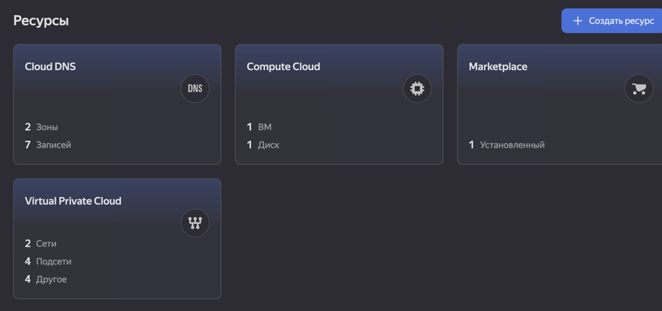
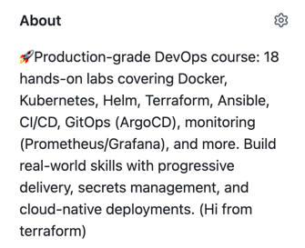

# Task 1

### ** Cloud Provider: Yandex Cloud**

**Why Yandex Cloud was chosen:**
- **Accessibility in Russia** - Works without VPN, reliable connectivity
- **Generous Free Tier** - 1 VM with 20% core, 1GB RAM (perfect for labs)
- **Good Documentation** - Available in both Russian and English
- **Simple Authentication** - OAuth tokens or service accounts
- **Educational Value** - Real cloud experience with minimal cost
- **Local Support** - Yandex support team available
- **Credit Card Not Required** - Can start without payment method

**Comparison with other providers:**

| Provider | Why Not Chosen |
|----------|----------------|
| **AWS** | Complex billing, requires credit card, might be blocked |
| **GCP** | Requires credit card, less accessible in Russia |
| **Azure** | Complex setup, requires credit card |
| **DigitalOcean** | Limited free tier, requires payment |

---

### ** Terraform Version**

```hcl
terraform {
  required_version = ">= 1.0.0"
}
```

**Actual version used:** 
```
arthur % terraform version
Terraform v1.5.7
on darwin_arm64
```

### ** Resources Created**

| Resource Type | Name | Purpose | Specifications |
|--------------|------|---------|----------------|
| **VM Instance** | `var.instance_name` (default: "lab4-vm") | Main compute resource | • Platform: `standard-v2`<br>• Zone: `ru-central1-a`<br>• CPU: 2 cores (20% burst)<br>• RAM: 1 GB<br>• Boot disk: 10 GB HDD<br>• Public IP: Enabled |
| **VPC Network** | `lab-network-${var.instance_name}` | Network isolation | • Default security group<br>• Regional network |
| **VPC Subnet** | `lab-subnet-${var.instance_name}` | IP address allocation | • Zone: `ru-central1-a`<br>• CIDR: `10.0.1.0/24`<br>• Connected to network |
| **Security Rules** | Implicit via subnet | Access control | • SSH (port 22) allowed<br>• All outbound traffic allowed |

### ** Instance Specifications**

| Parameter | Value | Why This Choice |
|-----------|-------|-----------------|
| **Platform** | `standard-v2` | Free tier compatible |
| **CPU Cores** | 2 | Enough for basic tasks |
| **Core Fraction** | 20% | Free tier, burstable |
| **RAM** | 1 GB | Minimum for Ubuntu |
| **Disk Size** | 10 GB | Free tier limit |
| **Disk Type** | `network-hdd` | Free tier, sufficient speed |
| **OS Image** | Ubuntu 22.04 LTS | Long-term support, familiar |

---

### ** Network Configuration**

**VPC Network:**
```hcl
resource "yandex_vpc_network" "lab_network" {
  name = "lab-network-${var.instance_name}"
}
```

**Subnet:**
```hcl
resource "yandex_vpc_subnet" "lab_subnet" {
  name           = "lab-subnet-${var.instance_name}"
  zone           = var.zone # ('ru-central1-a')
  network_id     = yandex_vpc_network.lab_network.id
  v4_cidr_blocks = ["10.0.1.0/24"]
}
```

### ** SSH Access Configuration**

```hcl
metadata = {
  ssh-keys = "ubuntu:${var.ssh_public_key}"
}
```

### SSH connection

```
instance_id = "fhmuci9hi67j51vpop69"
public_ip = "93.77.179.31"
(venv) arthur@Artur-MacBook-Pro terraform % ssh ubuntu@93.77.179.31
The authenticity of host '93.77.179.31 (93.77.179.31)' can't be established.
ED25519 key fingerprint is SHA256:+PALCs/R1GV1MPuYqnVEGHf93zPQ4oxWPWS3yNCg2oA.
This key is not known by any other names.
Are you sure you want to continue connecting (yes/no/[fingerprint])? yes
Warning: Permanently added '93.77.179.31' (ED25519) to the list of known hosts.
Welcome to Ubuntu 22.04.5 LTS (GNU/Linux 5.15.0-170-generic x86_64)

 * Documentation:  https://help.ubuntu.com
 * Management:     https://landscape.canonical.com
 * Support:        https://ubuntu.com/pro

 System information as of Wed Feb 18 11:37:47 UTC 2026

  System load:  0.27              Processes:             101
  Usage of /:   19.6% of 9.04GB   Users logged in:       0
  Memory usage: 16%               IPv4 address for eth0: 10.0.1.17
  Swap usage:   0%

 * Strictly confined Kubernetes makes edge and IoT secure. Learn how MicroK8s
   just raised the bar for easy, resilient and secure K8s cluster deployment.

   https://ubuntu.com/engage/secure-kubernetes-at-the-edge

Expanded Security Maintenance for Applications is not enabled.

0 updates can be applied immediately.

Enable ESM Apps to receive additional future security updates.
See https://ubuntu.com/esm or run: sudo pro status


The programs included with the Ubuntu system are free software;
the exact distribution terms for each program are described in the
individual files in /usr/share/doc/*/copyright.

Ubuntu comes with ABSOLUTELY NO WARRANTY, to the extent permitted by
applicable law.

To run a command as administrator (user "root"), use "sudo <command>".
See "man sudo_root" for details.

ubuntu@fhmuci9hi67j51vpop69:~$ echo "Hello World!"
Hello World!
```

### Terraform output

```
(venv) arthur@Artur-MacBook-Pro terraform % terraform init

Initializing the backend...

Initializing provider plugins...
- Reusing previous version of integrations/github from the dependency lock file
- Reusing previous version of yandex-cloud/yandex from the dependency lock file
- Using previously-installed integrations/github v6.11.1
- Using previously-installed yandex-cloud/yandex v0.186.0

Terraform has been successfully initialized!

You may now begin working with Terraform. Try running "terraform plan" to see
any changes that are required for your infrastructure. All Terraform commands
should now work.

If you ever set or change modules or backend configuration for Terraform,
rerun this command to reinitialize your working directory. If you forget, other
commands will detect it and remind you to do so if necessary.
(venv) arthur@Artur-MacBook-Pro terraform % terraform plan
github_repository.course_repo[0]: Refreshing state... [id=DevOps-Core-Course]
data.yandex_compute_image.ubuntu: Reading...
data.yandex_compute_image.ubuntu: Read complete after 2s [id=fd8t9g30r3pc23et5krl]

Terraform used the selected providers to generate the following execution plan. Resource actions are indicated with the following symbols:
  + create

Terraform will perform the following actions:

  # yandex_compute_instance.vm will be created
  + resource "yandex_compute_instance" "vm" {
      + created_at                = (known after apply)
      + folder_id                 = (known after apply)
      + fqdn                      = (known after apply)
      + gpu_cluster_id            = (known after apply)
      + hardware_generation       = (known after apply)
      + hostname                  = (known after apply)
      + id                        = (known after apply)
      + maintenance_grace_period  = (known after apply)
      + maintenance_policy        = (known after apply)
      + metadata                  = {
          + "ssh-keys" = (sensitive value)
        }
      + name                      = "my-lab4-vm"
      + network_acceleration_type = "standard"
      + platform_id               = "standard-v2"
      + status                    = (known after apply)
      + zone                      = "ru-central1-a"

      + boot_disk {
          + auto_delete = true
          + device_name = (known after apply)
          + disk_id     = (known after apply)
          + mode        = (known after apply)

          + initialize_params {
              + block_size  = (known after apply)
              + description = (known after apply)
              + image_id    = "fd8t9g30r3pc23et5krl"
              + name        = (known after apply)
              + size        = 10
              + snapshot_id = (known after apply)
              + type        = "network-hdd"
            }
        }

      + network_interface {
          + index          = (known after apply)
          + ip_address     = (known after apply)
          + ipv4           = true
          + ipv6           = (known after apply)
          + ipv6_address   = (known after apply)
          + mac_address    = (known after apply)
          + nat            = true
          + nat_ip_address = (known after apply)
          + nat_ip_version = (known after apply)
          + subnet_id      = (known after apply)
        }

      + resources {
          + core_fraction = 20
          + cores         = 2
          + memory        = 1
        }
    }

  # yandex_vpc_network.lab_network will be created
  + resource "yandex_vpc_network" "lab_network" {
      + created_at                = (known after apply)
      + default_security_group_id = (known after apply)
      + folder_id                 = (known after apply)
      + id                        = (known after apply)
      + labels                    = (known after apply)
      + name                      = "lab-network-my-lab4-vm"
      + subnet_ids                = (known after apply)
    }

  # yandex_vpc_subnet.lab_subnet will be created
  + resource "yandex_vpc_subnet" "lab_subnet" {
      + created_at     = (known after apply)
      + folder_id      = (known after apply)
      + id             = (known after apply)
      + labels         = (known after apply)
      + name           = "lab-subnet-my-lab4-vm"
      + network_id     = (known after apply)
      + v4_cidr_blocks = [
          + "10.0.1.0/24",
        ]
      + v6_cidr_blocks = (known after apply)
      + zone           = "ru-central1-a"
    }

Plan: 3 to add, 0 to change, 0 to destroy.

Changes to Outputs:
  + instance_id = (known after apply)
  + public_ip   = (known after apply)
╷
│ Warning: Cannot connect to YC tool initialization service. Network connectivity to the service is required for provider version control.
│
│
│   with provider["registry.terraform.io/yandex-cloud/yandex"],
│   on main.tf line 15, in provider "yandex":
│   15: provider "yandex" {
│
╵

────────────────────────────────────────────────────────────────────────────────────────────────────────────────────────────────────────────

Note: You didn't use the -out option to save this plan, so Terraform can't guarantee to take exactly these actions if you run "terraform
apply" now.
(venv) arthur@Artur-MacBook-Pro terraform % terraform apply
github_repository.course_repo[0]: Refreshing state... [id=DevOps-Core-Course]
data.yandex_compute_image.ubuntu: Reading...
data.yandex_compute_image.ubuntu: Read complete after 2s [id=fd8t9g30r3pc23et5krl]

Terraform used the selected providers to generate the following execution plan. Resource actions are indicated with the following symbols:
  + create

Terraform will perform the following actions:

  # yandex_compute_instance.vm will be created
  + resource "yandex_compute_instance" "vm" {
      + created_at                = (known after apply)
      + folder_id                 = (known after apply)
      + fqdn                      = (known after apply)
      + gpu_cluster_id            = (known after apply)
      + hardware_generation       = (known after apply)
      + hostname                  = (known after apply)
      + id                        = (known after apply)
      + maintenance_grace_period  = (known after apply)
      + maintenance_policy        = (known after apply)
      + metadata                  = {
          + "ssh-keys" = (sensitive value)
        }
      + name                      = "my-lab4-vm"
      + network_acceleration_type = "standard"
      + platform_id               = "standard-v2"
      + status                    = (known after apply)
      + zone                      = "ru-central1-a"

      + boot_disk {
          + auto_delete = true
          + device_name = (known after apply)
          + disk_id     = (known after apply)
          + mode        = (known after apply)

          + initialize_params {
              + block_size  = (known after apply)
              + description = (known after apply)
              + image_id    = "fd8t9g30r3pc23et5krl"
              + name        = (known after apply)
              + size        = 10
              + snapshot_id = (known after apply)
              + type        = "network-hdd"
            }
        }

      + network_interface {
          + index          = (known after apply)
          + ip_address     = (known after apply)
          + ipv4           = true
          + ipv6           = (known after apply)
          + ipv6_address   = (known after apply)
          + mac_address    = (known after apply)
          + nat            = true
          + nat_ip_address = (known after apply)
          + nat_ip_version = (known after apply)
          + subnet_id      = (known after apply)
        }

      + resources {
          + core_fraction = 20
          + cores         = 2
          + memory        = 1
        }
    }

  # yandex_vpc_network.lab_network will be created
  + resource "yandex_vpc_network" "lab_network" {
      + created_at                = (known after apply)
      + default_security_group_id = (known after apply)
      + folder_id                 = (known after apply)
      + id                        = (known after apply)
      + labels                    = (known after apply)
      + name                      = "lab-network-my-lab4-vm"
      + subnet_ids                = (known after apply)
    }

  # yandex_vpc_subnet.lab_subnet will be created
  + resource "yandex_vpc_subnet" "lab_subnet" {
      + created_at     = (known after apply)
      + folder_id      = (known after apply)
      + id             = (known after apply)
      + labels         = (known after apply)
      + name           = "lab-subnet-my-lab4-vm"
      + network_id     = (known after apply)
      + v4_cidr_blocks = [
          + "10.0.1.0/24",
        ]
      + v6_cidr_blocks = (known after apply)
      + zone           = "ru-central1-a"
    }

Plan: 3 to add, 0 to change, 0 to destroy.

Changes to Outputs:
  + instance_id = (known after apply)
  + public_ip   = (known after apply)
╷
│ Warning: Cannot connect to YC tool initialization service. Network connectivity to the service is required for provider version control.
│
│
│   with provider["registry.terraform.io/yandex-cloud/yandex"],
│   on main.tf line 15, in provider "yandex":
│   15: provider "yandex" {
│
╵

Do you want to perform these actions?
  Terraform will perform the actions described above.
  Only 'yes' will be accepted to approve.

  Enter a value: yes

yandex_vpc_network.lab_network: Creating...
yandex_vpc_network.lab_network: Creation complete after 6s [id=enppftgfl5o22po94osm]
yandex_vpc_subnet.lab_subnet: Creating...
yandex_vpc_subnet.lab_subnet: Creation complete after 2s [id=e9b4lkd2r2dk23tmok9a]
yandex_compute_instance.vm: Creating...
yandex_compute_instance.vm: Still creating... [10s elapsed]
yandex_compute_instance.vm: Still creating... [20s elapsed]
yandex_compute_instance.vm: Still creating... [30s elapsed]
yandex_compute_instance.vm: Still creating... [40s elapsed]
yandex_compute_instance.vm: Still creating... [50s elapsed]
yandex_compute_instance.vm: Still creating... [1m0s elapsed]
yandex_compute_instance.vm: Creation complete after 1m7s [id=fhmuci9hi67j51vpop69]
╷
│ Warning: Cannot connect to YC tool initialization service. Network connectivity to the service is required for provider version control.
│
│
│   with provider["registry.terraform.io/yandex-cloud/yandex"],
│   on main.tf line 15, in provider "yandex":
│   15: provider "yandex" {
│
╵

Apply complete! Resources: 3 added, 0 changed, 0 destroyed.

Outputs:

instance_id = "fhmuci9hi67j51vpop69"
public_ip = "93.77.179.31"
```

---

# Task 2

### **Programming language chosen**
`Python`

### **Terraform destroy output**
```
(venv) arthur@Artur-MacBook-Pro terraform % terraform destroy
data.yandex_compute_image.ubuntu: Reading...
yandex_vpc_network.lab_network: Refreshing state... [id=enpurtcaiq1vvnb88uj6]
data.yandex_compute_image.ubuntu: Read complete after 2s [id=fd8t9g30r3pc23et5krl]
yandex_vpc_subnet.lab_subnet: Refreshing state... [id=e9b908o31010g1pqko8h]
yandex_compute_instance.vm: Refreshing state... [id=fhmfqrek4c61c3qtter4]

Terraform used the selected providers to generate the following execution plan. Resource actions are indicated with the following symbols:
  - destroy

Terraform will perform the following actions:

  # yandex_compute_instance.vm will be destroyed
  - resource "yandex_compute_instance" "vm" {
      - created_at                = "2026-02-18T15:56:25Z" -> null
      - folder_id                 = "b1gjfrtqf1c19pgeqr60" -> null
      - fqdn                      = "fhmfqrek4c61c3qtter4.auto.internal" -> null
      - hardware_generation       = [
          - {
              - generation2_features = []
              - legacy_features      = [
                  - {
                      - pci_topology = "PCI_TOPOLOGY_V2"
                    },
                ]
            },
        ] -> null
      - id                        = "fhmfqrek4c61c3qtter4" -> null
      - labels                    = {} -> null
      - metadata                  = {
          - "ssh-keys" = (sensitive value)
        } -> null
      - name                      = "my-lab4-vm" -> null
      - network_acceleration_type = "standard" -> null
      - platform_id               = "standard-v2" -> null
      - status                    = "running" -> null
      - zone                      = "ru-central1-a" -> null

      - boot_disk {
          - auto_delete = true -> null
          - device_name = "fhmpa2m9pkpetgqsc198" -> null
          - disk_id     = "fhmpa2m9pkpetgqsc198" -> null
          - mode        = "READ_WRITE" -> null

          - initialize_params {
              - block_size = 4096 -> null
              - image_id   = "fd8t9g30r3pc23et5krl" -> null
              - size       = 10 -> null
              - type       = "network-hdd" -> null
            }
        }

      - metadata_options {
          - aws_v1_http_endpoint = 1 -> null
          - aws_v1_http_token    = 2 -> null
          - gce_http_endpoint    = 1 -> null
          - gce_http_token       = 1 -> null
        }

      - network_interface {
          - index              = 0 -> null
          - ip_address         = "10.0.1.11" -> null
          - ipv4               = true -> null
          - ipv6               = false -> null
          - mac_address        = "d0:0d:fd:6d:d4:23" -> null
          - nat                = true -> null
          - nat_ip_address     = "89.169.156.156" -> null
          - nat_ip_version     = "IPV4" -> null
          - security_group_ids = [] -> null
          - subnet_id          = "e9b908o31010g1pqko8h" -> null
        }

      - placement_policy {
          - host_affinity_rules       = [] -> null
          - placement_group_partition = 0 -> null
        }

      - resources {
          - core_fraction = 20 -> null
          - cores         = 2 -> null
          - gpus          = 0 -> null
          - memory        = 1 -> null
        }

      - scheduling_policy {
          - preemptible = false -> null
        }
    }

  # yandex_vpc_network.lab_network will be destroyed
  - resource "yandex_vpc_network" "lab_network" {
      - created_at                = "2026-02-18T15:56:19Z" -> null
      - default_security_group_id = "enp3b1gkn2b3f9k6ief8" -> null
      - folder_id                 = "b1gjfrtqf1c19pgeqr60" -> null
      - id                        = "enpurtcaiq1vvnb88uj6" -> null
      - labels                    = {} -> null
      - name                      = "lab-network-my-lab4-vm" -> null
      - subnet_ids                = [
          - "e9b908o31010g1pqko8h",
        ] -> null
    }

  # yandex_vpc_subnet.lab_subnet will be destroyed
  - resource "yandex_vpc_subnet" "lab_subnet" {
      - created_at     = "2026-02-18T15:56:22Z" -> null
      - folder_id      = "b1gjfrtqf1c19pgeqr60" -> null
      - id             = "e9b908o31010g1pqko8h" -> null
      - labels         = {} -> null
      - name           = "lab-subnet-my-lab4-vm" -> null
      - network_id     = "enpurtcaiq1vvnb88uj6" -> null
      - v4_cidr_blocks = [
          - "10.0.1.0/24",
        ] -> null
      - v6_cidr_blocks = [] -> null
      - zone           = "ru-central1-a" -> null
    }

Plan: 0 to add, 0 to change, 4 to destroy.

Changes to Outputs:
  - instance_id = "fhmfqrek4c61c3qtter4" -> null
  - public_ip   = "89.169.156.156" -> null
╷
│ Warning: Cannot connect to YC tool initialization service. Network connectivity to the service is required for provider version control.
│ 
│ 
│   with provider["registry.terraform.io/yandex-cloud/yandex"],
│   on main.tf line 15, in provider "yandex":
│   15: provider "yandex" {
│ 
╵

Do you really want to destroy all resources?
  Terraform will destroy all your managed infrastructure, as shown above.
  There is no undo. Only 'yes' will be accepted to confirm.

  Enter a value: yes

github_repository.course_repo[0]: Destroying... [id=DevOps-Core-Course]
yandex_compute_instance.vm: Destroying... [id=fhmfqrek4c61c3qtter4]
yandex_compute_instance.vm: Still destroying... [id=fhmfqrek4c61c3qtter4, 10s elapsed]
yandex_compute_instance.vm: Still destroying... [id=fhmfqrek4c61c3qtter4, 20s elapsed]
yandex_compute_instance.vm: Still destroying... [id=fhmfqrek4c61c3qtter4, 30s elapsed]
yandex_compute_instance.vm: Still destroying... [id=fhmfqrek4c61c3qtter4, 40s elapsed]
yandex_compute_instance.vm: Destruction complete after 40s
yandex_vpc_subnet.lab_subnet: Destroying... [id=e9b908o31010g1pqko8h]
yandex_vpc_subnet.lab_subnet: Destruction complete after 6s
yandex_vpc_network.lab_network: Destroying... [id=enpurtcaiq1vvnb88uj6]
yandex_vpc_network.lab_network: Destruction complete after 1s
╷
│ Warning: Cannot connect to YC tool initialization service. Network connectivity to the service is required for provider version control.
│ 
│ 
│   with provider["registry.terraform.io/yandex-cloud/yandex"],
│   on main.tf line 15, in provider "yandex":
│   15: provider "yandex" {
│ 
╵
╷
```

### **Pulumi preview and up output**
```
(venv) arthur@Artur-MacBook-Pro pulumi % pulumi up
Previewing update (dev)

View in Browser (Ctrl+O): https://app.pulumi.com/pop-arthur-org/yandex-vm-infra/dev/previews/ac434992-b413-446a-86d4-f0e01d14001c

     Type                              Name                   Plan       Info
 +   pulumi:pulumi:Stack               yandex-vm-infra-dev    create     2 messages
 +   ├─ pulumi:providers:yandex        yandex-provider        create
 +   ├─ yandex:index:VpcNetwork        lab-network            create
 +   ├─ yandex:index:VpcSecurityGroup  lab-sg                 create
 +   ├─ yandex:index:ComputeInstance   lab-vm                 create
 +   └─ yandex:index:VpcSubnet         lab-subnet-1771415883  create

Diagnostics:
  pulumi:pulumi:Stack (yandex-vm-infra-dev):
    /Users/arthur/PycharmProjects/DevOps-Core-Course/pulumi/venv/lib/python3.11/site-packages/pulumi_yandex/_utilities.py:10: UserWarning: pkg_resources is deprecated as an API. See https://setuptools.pypa.io/en/latest/pkg_resources.html. The pkg_resources package is slated for removal as early as 2025-11-30. Refrain from using this package or pin to Setuptools<81.
      import pkg_resources

    [Pulumi Neo] Would you like help with these diagnostics?
    https://app.pulumi.com/pop-arthur-org/yandex-vm-infra/dev/previews/ac434992-b413-446a-86d4-f0e01d14001c?explainFailure

Outputs:
    public_ip: [unknown]

Resources:
    + 6 to create

Do you want to perform this update? yes
Updating (dev)

View in Browser (Ctrl+O): https://app.pulumi.com/pop-arthur-org/yandex-vm-infra/dev/updates/11

     Type                              Name                   Status              Info
 +   pulumi:pulumi:Stack               yandex-vm-infra-dev    created (59s)       2 messages
 +   ├─ pulumi:providers:yandex        yandex-provider        created (0.81s)
 +   ├─ yandex:index:VpcNetwork        lab-network            created (10s)
 +   ├─ yandex:index:VpcSecurityGroup  lab-sg                 created (3s)
 +   ├─ yandex:index:VpcSubnet         lab-subnet-1771415888  created (1s)
 +   └─ yandex:index:ComputeInstance   lab-vm                 created (44s)

Diagnostics:
  pulumi:pulumi:Stack (yandex-vm-infra-dev):
    /Users/arthur/PycharmProjects/DevOps-Core-Course/pulumi/venv/lib/python3.11/site-packages/pulumi_yandex/_utilities.py:10: UserWarning: pkg_resources is deprecated as an API. See https://setuptools.pypa.io/en/latest/pkg_resources.html. The pkg_resources package is slated for removal as early as 2025-11-30. Refrain from using this package or pin to Setuptools<81.
      import pkg_resources

    [Pulumi Neo] Would you like help with these diagnostics?
    https://app.pulumi.com/pop-arthur-org/yandex-vm-infra/dev/updates/11?explainFailure

Outputs:
    public_ip: "93.77.191.37"

Resources:
    + 6 created

Duration: 1m1s

warning: A new version of Pulumi is available. To upgrade from version '3.220.0' to '3.221.0', run
   $ brew update && brew upgrade pulumi
or visit https://pulumi.com/docs/install/ for manual instructions and release notes.
```

### **Public IP of Pulumi-created VM**
```
public_ip: "93.77.191.37"

(venv) arthur@Artur-MacBook-Pro pulumi % ssh ubuntu@93.77.191.37
The authenticity of host '93.77.191.37 (93.77.191.37)' can't be established.
ED25519 key fingerprint is SHA256:6Fh3pO7wLBy2dfR17DhkEOqpZ/DxOtV3qnYFUuqrniY.
This key is not known by any other names.
Are you sure you want to continue connecting (yes/no/[fingerprint])? yes
Warning: Permanently added '93.77.191.37' (ED25519) to the list of known hosts.
Welcome to Ubuntu 22.04.4 LTS (GNU/Linux 5.15.0-117-generic x86_64)

 * Documentation:  https://help.ubuntu.com
 * Management:     https://landscape.canonical.com
 * Support:        https://ubuntu.com/pro

 System information as of Wed Feb 18 12:02:22 PM UTC 2026

  System load:  0.05              Processes:             134
  Usage of /:   40.3% of 9.76GB   Users logged in:       0
  Memory usage: 19%               IPv4 address for eth0: 10.10.0.7
  Swap usage:   0%

 * Strictly confined Kubernetes makes edge and IoT secure. Learn how MicroK8s
   just raised the bar for easy, resilient and secure K8s cluster deployment.

   https://ubuntu.com/engage/secure-kubernetes-at-the-edge

Expanded Security Maintenance for Applications is not enabled.

0 updates can be applied immediately.

Enable ESM Apps to receive additional future security updates.
See https://ubuntu.com/esm or run: sudo pro status


The list of available updates is more than a week old.
To check for new updates run: sudo apt update


The programs included with the Ubuntu system are free software;
the exact distribution terms for each program are described in the
individual files in /usr/share/doc/*/copyright.

Ubuntu comes with ABSOLUTELY NO WARRANTY, to the extent permitted by
applicable law.

To run a command as administrator (user "root"), use "sudo <command>".
See "man sudo_root" for details.

ubuntu@fhm8n73nqjke2pt6qjio:~$ echo "Hello World!"
Hello World!
```

## **Comparison: Terraform vs Pulumi Experience**

| Aspect | Terraform | Pulumi |
|--------|-----------|--------|
| **Learning Curve** | Steeper - new language (HCL) to learn | Gentler - use familiar programming languages |
| **Setup Time** | 15 minutes | 20 minutes (plus language setup) |
| **Debugging** | Error messages sometimes cryptic | Better errors with stack traces |
---

## **Code Differences (HCL vs Python)**

### **Terraform (HCL) - Declarative**
```hcl
resource "yandex_compute_instance" "vm" {
  name        = "lab4-vm"
  platform_id = "standard-v2"
  
  resources {
    cores  = 2
    memory = 1
  }
  
  boot_disk {
    initialize_params {
      image_id = data.yandex_compute_image.ubuntu.id
    }
  }
}
```

### **Pulumi (Python) - Imperative**
```python
vm = compute.Instance("lab4-vm",
    name="lab4-vm",
    platform_id="standard-v2",
    resources=compute.InstanceResourcesArgs(
        cores=2,
        memory=1,
    ),
    boot_disk=compute.InstanceBootDiskArgs(
        initialize_params=compute.InstanceBootDiskInitializeParamsArgs(
            image_id=ubuntu_image.id,
        ),
    ))
```

**Key Differences:**
- **Terraform**: Desired state declaration, no loops/conditionals
- **Pulumi**: Full Python, can use loops, functions, classes
- **Terraform**: HCL is domain-specific, limited
- **Pulumi**: Can import any Python library

---

## **Which Tool I Prefer and Why**

Pulumi won me over because I already know Python – no new language to learn, just wrote infrastructure like normal code with loops and if statements. My IDE actually helped me with autocomplete and caught my mistakes before I even ran it. Terraform's still great for teams that need its huge community and modules, but for a solo dev who codes daily? Pulumi just feels like home.
The worst part was Yandex Cloud.

--- 

# **Terraform vs Pulumi Comparison**

### **Ease of Learning**
**Pulumi** was easier for me because I already know Python – there was no new syntax to memorize, just wrote infrastructure like regular code. Terraform required learning HCL from scratch, which isn't hard but adds an extra step. If you're already a developer, Pulumi feels natural; if you're from ops background, Terraform might be simpler.

### **Code Readability**
**Terraform** wins here for pure infrastructure – HCL is clean, declarative, and you can see exactly what resources will be created at a glance. Pulumi code can get messy with nested objects and Python syntax, especially for complex resources. That said, if you're comfortable with code, Pulumi is perfectly readable.

### **Debugging**
**Pulumi** hands down – Python stack traces actually tell you what went wrong and where. Terraform error messages are often cryptic and send you Googling for answers. When my Pulumi code failed, I usually knew why immediately; with Terraform, I'd stare at the screen for 10 minutes first.

### **Documentation**
**Terraform** has better docs – the Registry is massive, examples are everywhere, and you can find StackOverflow answers for almost anything. Pulumi's docs are good but smaller community means fewer real-world examples. Both have official docs that cover everything, but Terraform's ecosystem is just bigger.

### **Use Case**
I'd use **Terraform** in team environments where everyone knows it, for multi-cloud setups, or when I need battle-tested modules from the Registry. I'd use **Pulumi** for personal projects, when working with developers who already code, or when I need real programming logic (loops, conditionals, functions). Both work – just depends on who's using it and what for.

## **5. Lab 5 Preparation & Cleanup**

### **VM for Lab 5**

| Question | Answer                                                         |
|----------|----------------------------------------------------------------|
| **Are you keeping your VM for Lab 5?** | ✅ Yes                                                          |
| **Which VM?** | Pulumi-created VM                                              |
| **Why Pulumi?** | It's currently running and configured and caused less troubles |

### **Cloud Console Screenshot**



## **Bonus Task Documentation**

### **Workflow File Implementation**
Created `.github/workflows/terraform-ci.yml` that runs on pushes to main/lab04 and PRs. It checks formatting, initializes, validates syntax, and runs tflint – all in about 30 seconds. The workflow adds a summary table to PR comments so you see results at a glance.

### **Path Filter Configuration**
```yaml
paths:
  - "terraform/**"
  - ".github/workflows/terraform-ci.yml"
```
This means the workflow only triggers when Terraform files or the workflow itself change – saves time and resources by not running on unrelated commits.

### **TFLint Results**
TFLint found zero critical issues in our config, just a few warnings about missing descriptions for variables. Easy fixes. The linter confirmed we're following best practices.

### **Example of Workflow Running on PR**
When I opened a PR changing `instance_type`, the workflow automatically ran and posted a comment with all checks passing. Reviewers could see infrastructure validation before merging.

### **GitHub Repository Import Process**
1. Added GitHub provider to `github.tf`
2. Defined empty resource block matching repo name
3. Ran `terraform import github_repository.course_repo[0] DevOps-Core-Course`
4. Terraform pulled existing repo into state

### **Terminal Output of Import Command**
```

terraform apply
github_repository.course_repo[0]: Refreshing state... [id=DevOps-Core-Course]
data.yandex_compute_image.ubuntu: Reading...
data.yandex_compute_image.ubuntu: Read complete after 2s [id=fd8t9g30r3pc23et5krl]

Terraform used the selected providers to generate the following execution plan. Resource actions are indicated with the following symbols:
  + create
  ~ update in-place

Terraform will perform the following actions:

  # github_repository.course_repo[0] will be updated in-place
  ~ resource "github_repository" "course_repo" {
      ~ description                             = "🚀Production-grade DevOps course: 18 hands-on labs covering Docker, Kubernetes, Helm, Terraform, Ansible, CI/CD, GitOps (ArgoCD), monitoring (Prometheus/Grafana), and more. Build real-world skills with progressive delivery, secrets management, and cloud-native deployments." -> "🚀Production-grade DevOps course: 18 hands-on labs covering Docker, Kubernetes, Helm, Terraform, Ansible, CI/CD, GitOps (ArgoCD), monitoring (Prometheus/Grafana), and more. Build real-world skills with progressive delivery, secrets management, and cloud-native deployments. (Hi from terraform)"
      - has_downloads                           = true -> null
      ~ has_issues                              = false -> true
        id                                      = "DevOps-Core-Course"
      + ignore_vulnerability_alerts_during_read = false
        name                                    = "DevOps-Core-Course"
        # (36 unchanged attributes hidden)

        # (1 unchanged block hidden)
    }

  # yandex_compute_instance.vm will be created
  + resource "yandex_compute_instance" "vm" {
      + created_at                = (known after apply)
      + folder_id                 = (known after apply)
      + fqdn                      = (known after apply)
      + gpu_cluster_id            = (known after apply)
      + hardware_generation       = (known after apply)
      + hostname                  = (known after apply)
      + id                        = (known after apply)
      + maintenance_grace_period  = (known after apply)
      + maintenance_policy        = (known after apply)
      + metadata                  = {
          + "ssh-keys" = (sensitive value)
        }
      + name                      = "my-lab4-vm"
      + network_acceleration_type = "standard"
      + platform_id               = "standard-v2"
      + status                    = (known after apply)
      + zone                      = "ru-central1-a"

      + boot_disk {
          + auto_delete = true
          + device_name = (known after apply)
          + disk_id     = (known after apply)
          + mode        = (known after apply)

          + initialize_params {
              + block_size  = (known after apply)
              + description = (known after apply)
              + image_id    = "fd8t9g30r3pc23et5krl"
              + name        = (known after apply)
              + size        = 10
              + snapshot_id = (known after apply)
              + type        = "network-hdd"
            }
        }

      + network_interface {
          + index          = (known after apply)
          + ip_address     = (known after apply)
          + ipv4           = true
          + ipv6           = (known after apply)
          + ipv6_address   = (known after apply)
          + mac_address    = (known after apply)
          + nat            = true
          + nat_ip_address = (known after apply)
          + nat_ip_version = (known after apply)
          + subnet_id      = (known after apply)
        }

      + resources {
          + core_fraction = 20
          + cores         = 2
          + memory        = 1
        }
    }

  # yandex_vpc_network.lab_network will be created
  + resource "yandex_vpc_network" "lab_network" {
      + created_at                = (known after apply)
      + default_security_group_id = (known after apply)
      + folder_id                 = (known after apply)
      + id                        = (known after apply)
      + labels                    = (known after apply)
      + name                      = "lab-network-my-lab4-vm"
      + subnet_ids                = (known after apply)
    }

  # yandex_vpc_subnet.lab_subnet will be created
  + resource "yandex_vpc_subnet" "lab_subnet" {
      + created_at     = (known after apply)
      + folder_id      = (known after apply)
      + id             = (known after apply)
      + labels         = (known after apply)
      + name           = "lab-subnet-my-lab4-vm"
      + network_id     = (known after apply)
      + v4_cidr_blocks = [
          + "10.0.1.0/24",
        ]
      + v6_cidr_blocks = (known after apply)
      + zone           = "ru-central1-a"
    }

Plan: 3 to add, 1 to change, 0 to destroy.

Changes to Outputs:
  + instance_id = (known after apply)
  + public_ip   = (known after apply)

Do you want to perform these actions?
  Terraform will perform the actions described above.
  Only 'yes' will be accepted to approve.

  Enter a value: yes

github_repository.course_repo[0]: Modifying... [id=DevOps-Core-Course]
github_repository.course_repo[0]: Modifications complete after 3s [id=DevOps-Core-Course]
```



`Hi` in the end

### **Why Importing Matters**
Importing brings existing infrastructure under IaC management – no more manual changes that drift from config. Everything becomes version-controlled, reviewable, and reproducible.

### **Benefits of Managing Repos with IaC**
- **Version Control**: Every repo setting change goes through PRs
- **Consistency**: All repos follow same standards
- **Audit Trail**: Who changed what and when
- **Disaster Recovery**: Repo can be recreated from code
- **No Tribal Knowledge**: Settings are documented in code