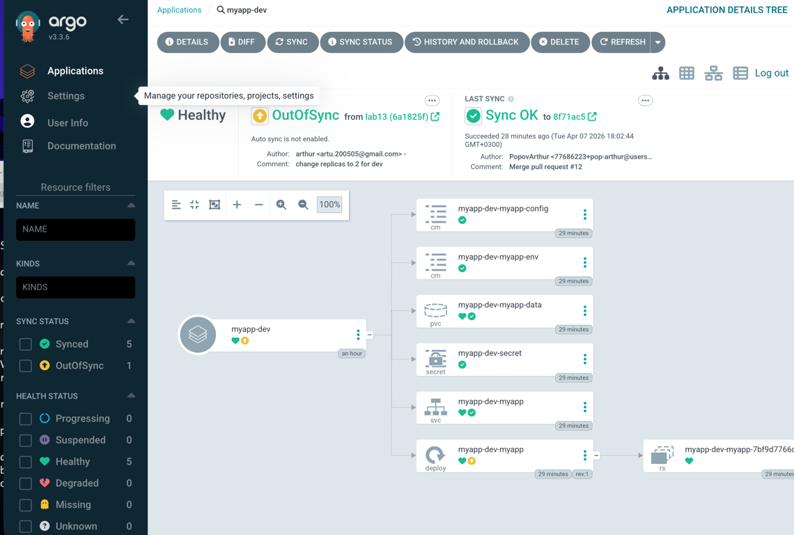
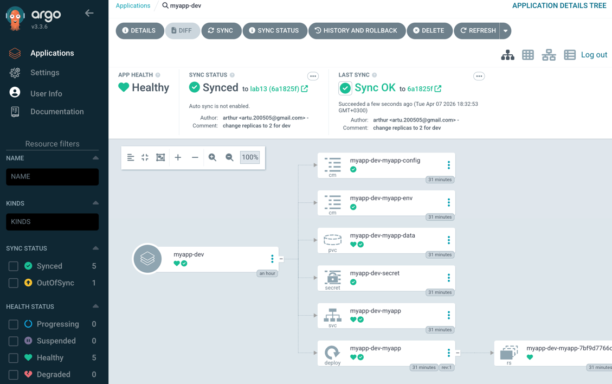
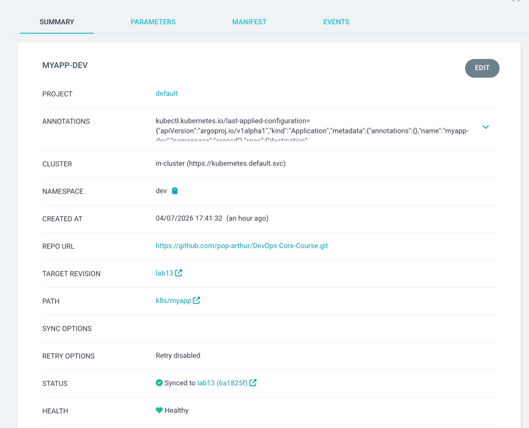
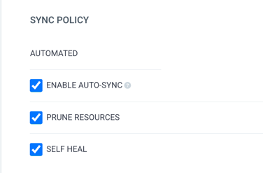
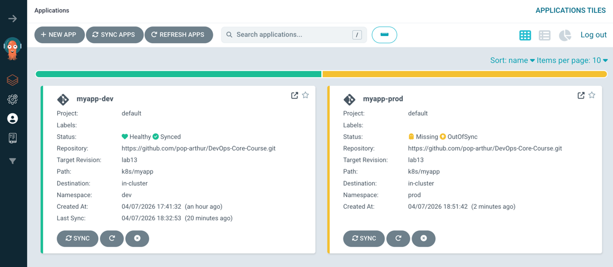
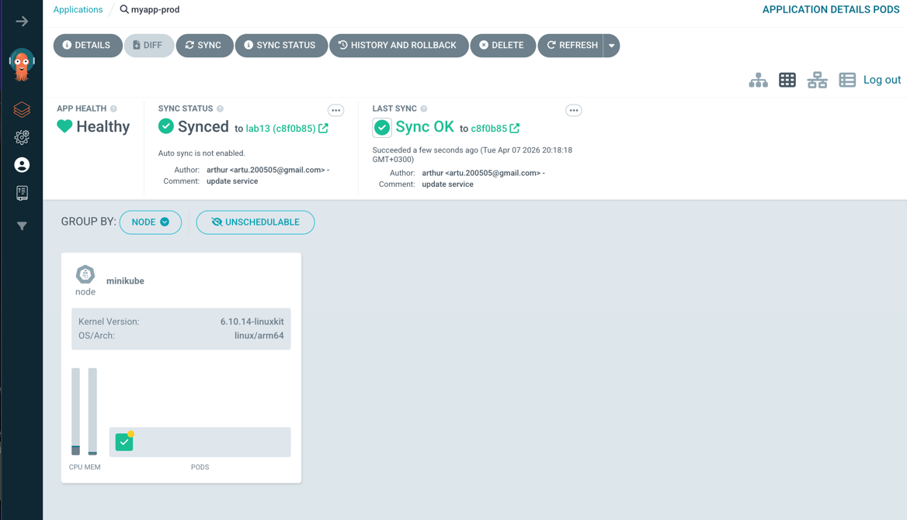
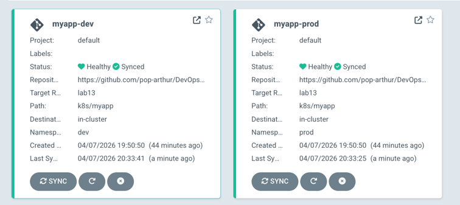

# Lab13

1. **ArgoCD Setup**
   - Installation verification
   
   
   
   - UI access method
   
   
   - CLI configuration
   
   
    ```
   arthur@192 DevOps-Core-Course % argocd app list             
    NAME  CLUSTER  NAMESPACE  PROJECT  STATUS  HEALTH  SYNCPOLICY  CONDITIONS  REPO  PATH  TARGET
    ```
2. **Application Configuration**
   - Application manifests
   ```yaml
   apiVersion: argoproj.io/v1alpha1
   kind: Application
   metadata:
     name: myapp-dev
     namespace: argocd
   spec:
     project: default
     source:
       repoURL: https://github.com/pop-arthur/DevOps-Core-Course.git
       targetRevision: lab13
       path: k8s/myapp
       helm:
         valueFiles:
           - values-dev.yaml
     destination:
       server: https://kubernetes.default.svc
       namespace: dev
     syncPolicy: {}
   ```
   - Source and destination configuration
   
   ```yaml
   source:
    repoURL: https://github.com/pop-arthur/DevOps-Core-Course.git
    targetRevision: lab13
    path: k8s/myapp
    helm:
      valueFiles:
        - values-dev.yaml
   ```
   ```yaml
   destination:
     server: https://kubernetes.default.svc
     namespace: dev
   ```

   - Values file selection
   ```yaml
   helm:
      valueFiles:
        - values-dev.yaml
   ```

```
arthur@192 DevOps-Core-Course % argocd app sync myapp-dev   
TIMESTAMP                  GROUP        KIND              NAMESPACE                  NAME      STATUS    HEALTH        HOOK  MESSAGE
2026-04-07T18:02:02+03:00          ConfigMap                    dev  myapp-dev-myapp-config  OutOfSync  Missing              
2026-04-07T18:02:02+03:00          ConfigMap                    dev   myapp-dev-myapp-env    OutOfSync  Missing              
2026-04-07T18:02:02+03:00         PersistentVolumeClaim         dev  myapp-dev-myapp-data    OutOfSync  Missing              
2026-04-07T18:02:02+03:00             Secret                    dev      myapp-dev-secret    OutOfSync  Missing              
2026-04-07T18:02:02+03:00            Service                    dev       myapp-dev-myapp    OutOfSync  Missing              
2026-04-07T18:02:02+03:00   apps  Deployment                    dev       myapp-dev-myapp    OutOfSync  Missing              
2026-04-07T18:02:03+03:00  batch         Job         dev  myapp-dev-pre-install            Progressing              
2026-04-07T18:02:04+03:00  batch         Job         dev  myapp-dev-pre-install   Running   Synced     PreSync  job.batch/myapp-dev-pre-install created
2026-04-07T18:02:15+03:00          ConfigMap         dev  myapp-dev-myapp-config    Synced  Missing              
2026-04-07T18:02:15+03:00          ConfigMap         dev   myapp-dev-myapp-env      Synced  Missing              
2026-04-07T18:02:15+03:00             Secret         dev      myapp-dev-secret      Synced  Missing              
2026-04-07T18:02:15+03:00         PersistentVolumeClaim         dev  myapp-dev-myapp-data    Synced  Progressing              
2026-04-07T18:02:16+03:00            Service         dev       myapp-dev-myapp    Synced  Healthy              
2026-04-07T18:02:16+03:00         PersistentVolumeClaim         dev  myapp-dev-myapp-data    Synced  Healthy                  
2026-04-07T18:02:16+03:00   apps  Deployment                    dev       myapp-dev-myapp    Synced  Progressing              
2026-04-07T18:02:18+03:00   apps  Deployment                    dev       myapp-dev-myapp      Synced   Progressing              deployment.apps/myapp-dev-myapp created
2026-04-07T18:02:18+03:00  batch         Job                    dev  myapp-dev-pre-install   Succeeded   Synced         PreSync  Reached expected number of succeeded pods
2026-04-07T18:02:18+03:00             Secret                    dev      myapp-dev-secret      Synced   Missing                  secret/myapp-dev-secret created
2026-04-07T18:02:18+03:00          ConfigMap                    dev  myapp-dev-myapp-config    Synced   Missing                  configmap/myapp-dev-myapp-config created
2026-04-07T18:02:18+03:00          ConfigMap                    dev   myapp-dev-myapp-env      Synced   Missing                  configmap/myapp-dev-myapp-env created
2026-04-07T18:02:18+03:00         PersistentVolumeClaim         dev  myapp-dev-myapp-data      Synced   Healthy                  persistentvolumeclaim/myapp-dev-myapp-data created
2026-04-07T18:02:18+03:00            Service                    dev       myapp-dev-myapp      Synced   Healthy                  service/myapp-dev-myapp created
2026-04-07T18:02:28+03:00   apps  Deployment         dev       myapp-dev-myapp    Synced  Healthy              deployment.apps/myapp-dev-myapp created
2026-04-07T18:02:28+03:00  batch         Job         dev  myapp-dev-post-install   Running   Synced    PostSync  job.batch/myapp-dev-post-install created
2026-04-07T18:02:44+03:00  batch         Job         dev  myapp-dev-post-install  Succeeded   Synced    PostSync  Reached expected number of succeeded pods

Name:               argocd/myapp-dev
Project:            default
Server:             https://kubernetes.default.svc
Namespace:          dev
URL:                https://argocd.example.com/applications/myapp-dev
Source:
- Repo:             https://github.com/pop-arthur/DevOps-Core-Course.git
  Target:           lab13
  Path:             k8s/myapp
  Helm Values:      values-dev.yaml
SyncWindow:         Sync Allowed
Sync Policy:        Manual
Sync Status:        Synced to lab13 (8f71ac5)
Health Status:      Healthy

Operation:          Sync
Sync Revision:      8f71ac5c6f43101b4ae32d7b903c76bda14adb99
Phase:              Succeeded
Start:              2026-04-07 18:02:02 +0300 MSK
Finished:           2026-04-07 18:02:44 +0300 MSK
Duration:           42s
Message:            successfully synced (no more tasks)

GROUP  KIND                   NAMESPACE  NAME                    STATUS     HEALTH   HOOK      MESSAGE
batch  Job            
```

After commit and push


After `argocd app sync myapp-dev`



3. **Multi-Environment**
   - **Dev vs Prod configuration differences**
     - Dev application configuration
     
     

     - Prod application
     
     


The application is deployed to two environments using different Helm values files:

Development (dev):
- Uses values-dev.yaml 
- Lower replica count (e.g., 1–2 replicas)
- Designed for fast iteration and testing


Production (prod):
- Uses values-prod.yaml
- Higher replica count (initially 4, later adjusted)
- Includes stricter resource limits (CPU/memory)
- Configured for stability and reliability

- **Sync policy differences and rationale**
**- Development Environment:**

- Auto-sync enabled:
```
automated:
  prune: true
  selfHeal: true
```
- Automatically applies changes from Git
- selfHeal restores state if manual changes occur
- prune removes deleted resources

**- Production Environment:**
- Manual sync only (no automated block)
- Changes must be explicitly approved and applied
- Ensures controlled releases


- **Namespace separation**
  - dev namespace
    - Hosts development environment
    - Isolated from production workloads
  - prod namespace
    - Hosts production environment
    - Ensures stability and security

4. **Self-Healing Evidence**
   - Manual scale test with before/after
   ```
   arthur@192 ~ % kubectl get pods -n dev
   NAME                               READY   STATUS    RESTARTS   AGE
   myapp-dev-myapp-5fbdd6984f-785nx   1/1     Running   0          2m20s
   myapp-dev-myapp-5fbdd6984f-jslfq   1/1     Running   0          2m11s
   myapp-dev-myapp-5fbdd6984f-wqtpd
   arthur@192 ~ % kubectl scale deployment myapp-dev-myapp -n dev --replicas=5
   deployment.apps/myapp-dev-myapp scaled
   arthur@192 ~ % kubectl get pods -n dev
   NAME                               READY   STATUS    RESTARTS   AGE
   myapp-dev-myapp-5fbdd6984f-785nx   1/1     Running   0          2m30s
   myapp-dev-myapp-5fbdd6984f-c6vpb   0/1     Running   0          11s
   myapp-dev-myapp-5fbdd6984f-jbnpr   0/1     Running   0          11s
   myapp-dev-myapp-5fbdd6984f-jslfq   1/1     Running   0          2m21s
   myapp-dev-myapp-5fbdd6984f-wqtpd   0/1     Running   0          11s
   arthur@192 ~ %
   ```
   - self-healing
   ```
   arthur@192 ~ % kubectl scale deployment myapp-dev-myapp -n dev --replicas=5
   deployment.apps/myapp-dev-myapp scaled
   arthur@192 ~ % kubectl get pods -n dev                                     
   NAME                               READY   STATUS        RESTARTS   AGE
   myapp-dev-myapp-5fbdd6984f-c6vpb   1/1     Running       0          9m56s
   myapp-dev-myapp-5fbdd6984f-jslfq   1/1     Running       0          12m
   myapp-dev-myapp-5fbdd6984f-kpx4g   0/1     Terminating   0          11s
   myapp-dev-myapp-5fbdd6984f-qpvtk   0/1     Terminating   0          11s
   myapp-dev-myapp-5fbdd6984f-v7k68   0/1     Terminating   0          11s
   ```
   - Pod deletion test
   ```
   arthur@192 ~ % kubectl delete pod -n dev -l app.kubernetes.io/instance=myapp-dev
   pod "myapp-dev-myapp-5fbdd6984f-c6vpb" deleted from dev namespace
   pod "myapp-dev-myapp-5fbdd6984f-jslfq" deleted from dev namespace
   kubectl get pods -n dev -w
   arthur@192 ~ % kubectl get pods -n dev -w
   NAME                               READY   STATUS              RESTARTS   AGE
   myapp-dev-myapp-5fbdd6984f-7dv9x   0/1     ContainerCreating   0          5s
   myapp-dev-myapp-5fbdd6984f-khj4q   0/1     ContainerCreating   0          5s
   myapp-dev-myapp-5fbdd6984f-7dv9x   0/1     Running             0          6s
   myapp-dev-myapp-5fbdd6984f-khj4q   0/1     Running             0          7s
   myapp-dev-myapp-5fbdd6984f-7dv9x   1/1     Running             0          11s
   myapp-dev-myapp-5fbdd6984f-khj4q   1/1     Running             0          14s
   ```
   - Configuration drift test
   ```
   arthur@192 DevOps-Core-Course % kubectl label deployment myapp-dev-myapp -n dev test=drift
   deployment.apps/myapp-dev-myapp labeled
   arthur@192 DevOps-Core-Course % kubectl get deployment myapp-dev-myapp -n dev -o yaml | grep test
         {"apiVersion":"apps/v1","kind":"Deployment","metadata":{"annotations":{"argocd.argoproj.io/tracking-id":"myapp-dev:apps/Deployment:dev/myapp-dev-myapp"},"labels":{"app.kubernetes.io/instance":"myapp-dev","app.kubernetes.io/name":"myapp"},"name":"myapp-dev-myapp","namespace":"dev"},"spec":{"replicas":2,"selector":{"matchLabels":{"app.kubernetes.io/instance":"myapp-dev","app.kubernetes.io/name":"myapp"}},"template":{"metadata":{"labels":{"app.kubernetes.io/instance":"myapp-dev","app.kubernetes.io/name":"myapp"}},"spec":{"containers":[{"envFrom":[{"secretRef":{"name":"myapp-dev-secret"}},{"configMapRef":{"name":"myapp-dev-myapp-env"}}],"image":"poparthur/devops-info-service:latest","imagePullPolicy":"Always","livenessProbe":{"httpGet":{"path":"/health","port":8000},"initialDelaySeconds":10,"periodSeconds":5},"name":"myapp","ports":[{"containerPort":8000}],"readinessProbe":{"httpGet":{"path":"/health","port":8000},"initialDelaySeconds":5,"periodSeconds":3},"resources":{"limits":{"cpu":"200m","memory":"128Mi"},"requests":{"cpu":"100m","memory":"64Mi"}},"volumeMounts":[{"mountPath":"/config","name":"config-volume"},{"mountPath":"/app/data","name":"data-volume"}]}],"volumes":[{"configMap":{"name":"myapp-dev-myapp-config"},"name":"config-volume"},{"name":"data-volume","persistentVolumeClaim":{"claimName":"myapp-dev-myapp-data"}}]}}}}
       test: drift
           image: poparthur/devops-info-service:latest
   deployment.apps/myapp-dev-myapp labeled
   arthur@192 DevOps-Core-Course % kubectl get deployment myapp-dev-myapp -n dev -o yaml | grep test
         {"apiVersion":"apps/v1","kind":"Deployment","metadata":{"annotations":{"argocd.argoproj.io/tracking-id":"myapp-dev:apps/Deployment:dev/myapp-dev-myapp"},"labels":{"app.kubernetes.io/instance":"myapp-dev","app.kubernetes.io/name":"myapp"},"name":"myapp-dev-myapp","namespace":"dev"},"spec":{"replicas":2,"selector":{"matchLabels":{"app.kubernetes.io/instance":"myapp-dev","app.kubernetes.io/name":"myapp"}},"template":{"metadata":{"labels":{"app.kubernetes.io/instance":"myapp-dev","app.kubernetes.io/name":"myapp"}},"spec":{"containers":[{"envFrom":[{"secretRef":{"name":"myapp-dev-secret"}},{"configMapRef":{"name":"myapp-dev-myapp-env"}}],"image":"poparthur/devops-info-service:latest","imagePullPolicy":"Always","livenessProbe":{"httpGet":{"path":"/health","port":8000},"initialDelaySeconds":10,"periodSeconds":5},"name":"myapp","ports":[{"containerPort":8000}],"readinessProbe":{"httpGet":{"path":"/health","port":8000},"initialDelaySeconds":5,"periodSeconds":3},"resources":{"limits":{"cpu":"200m","memory":"128Mi"},"requests":{"cpu":"100m","memory":"64Mi"}},"volumeMounts":[{"mountPath":"/config","name":"config-volume"},{"mountPath":"/app/data","name":"data-volume"}]}],"volumes":[{"configMap":{"name":"myapp-dev-myapp-config"},"name":"config-volume"},{"name":"data-volume","persistentVolumeClaim":{"claimName":"myapp-dev-myapp-data"}}]}}}}
           image: poparthur/devops-info-service:latest
   ```
   - Explanation of behaviors

   ### Explanation of Behaviors

During the experiments, both Kubernetes and ArgoCD self-healing mechanisms were observed and analyzed.

**1. Manual Scale Test (ArgoCD Self-Healing):**  
The Deployment in the dev environment was manually scaled from the desired number of replicas to a higher value (e.g., 5). This created a configuration drift between the cluster state and the Git-defined state.  
ArgoCD detected this drift and, with `selfHeal` enabled, automatically reverted the number of replicas back to the value defined in the Helm values file. Extra pods were terminated.  

**2. Pod Deletion Test (Kubernetes Self-Healing):**  
Pods were manually deleted from the dev namespace. Kubernetes, through the Deployment/ReplicaSet controller, automatically recreated the missing pods to maintain the desired replica count.  
This behavior is independent of ArgoCD and demonstrates Kubernetes’ built-in self-healing capabilities.  

**3. Configuration Drift Test (ArgoCD Self-Healing):**  
A manual change was introduced by modifying the Deployment configuration (adding a custom label). This created a mismatch between the live cluster state and the Git repository.  
ArgoCD detected the drift and restored the original configuration by removing the unauthorized change, ensuring consistency with Git.  

**4. Key Differences:**  
- Kubernetes self-healing operates at the infrastructure level (pods and replicas).  
- ArgoCD self-healing operates at the configuration level (ensuring cluster state matches Git).  

**5. Sync Behavior:**  
ArgoCD continuously monitors the cluster and compares it with the Git repository. It can automatically apply changes (auto-sync) or require manual approval, depending on the environment configuration.  
By default, ArgoCD checks for changes periodically, but synchronization can also be triggered manually or via webhooks.


5. **Screenshots**
   - ArgoCD UI showing both applications
   