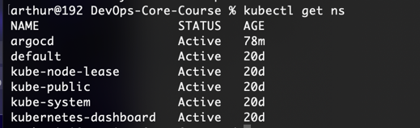
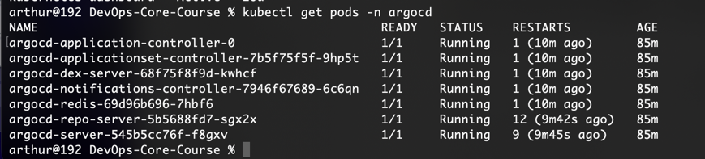
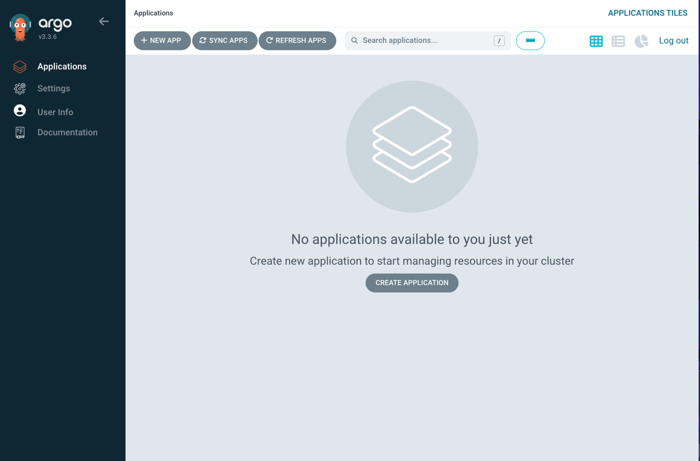
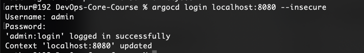
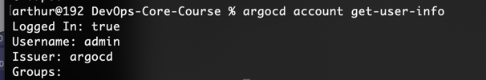
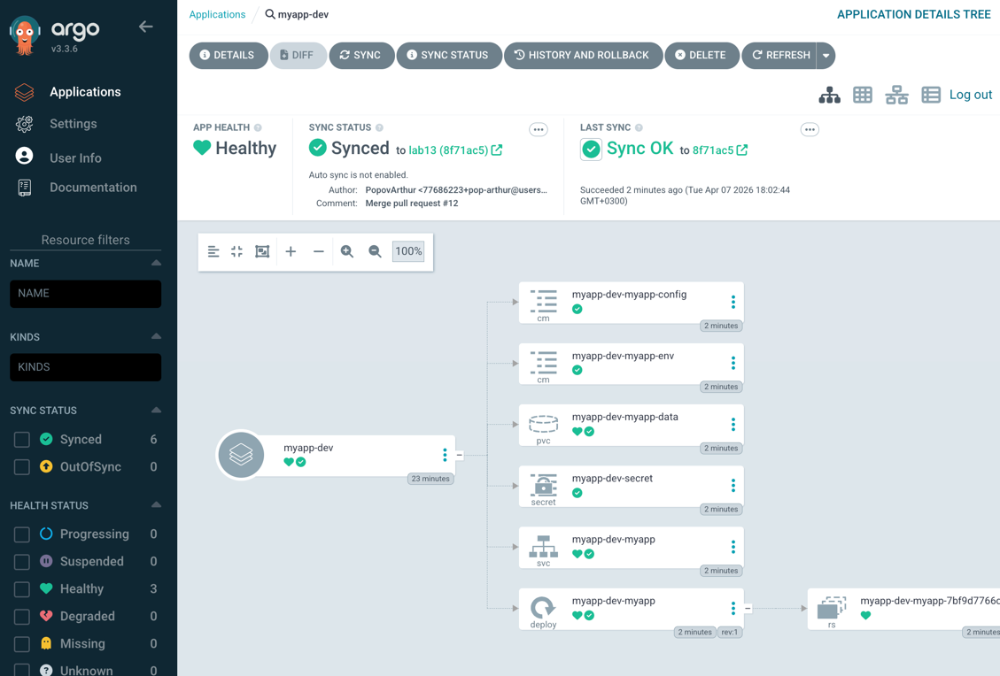

# Lab13

1. **ArgoCD Setup**
   - Installation verification
   
   
   
   - UI access method
   
   
   - CLI configuration
   
   
    ```
   arthur@192 DevOps-Core-Course % argocd app list             
    NAME  CLUSTER  NAMESPACE  PROJECT  STATUS  HEALTH  SYNCPOLICY  CONDITIONS  REPO  PATH  TARGET
    ```
2. **Application Configuration**
   - Application manifests
   ```yaml
   apiVersion: argoproj.io/v1alpha1
   kind: Application
   metadata:
     name: myapp-dev
     namespace: argocd
   spec:
     project: default
     source:
       repoURL: https://github.com/pop-arthur/DevOps-Core-Course.git
       targetRevision: lab13
       path: k8s/myapp
       helm:
         valueFiles:
           - values-dev.yaml
     destination:
       server: https://kubernetes.default.svc
       namespace: dev
     syncPolicy: {}
   ```
   - Source and destination configuration
   
   ```yaml
   source:
    repoURL: https://github.com/pop-arthur/DevOps-Core-Course.git
    targetRevision: lab13
    path: k8s/myapp
    helm:
      valueFiles:
        - values-dev.yaml
   ```
   ```yaml
   destination:
     server: https://kubernetes.default.svc
     namespace: dev
   ```

   - Values file selection
   ```yaml
   helm:
      valueFiles:
        - values-dev.yaml
   ```

```
arthur@192 DevOps-Core-Course % argocd app sync myapp-dev   
TIMESTAMP                  GROUP        KIND              NAMESPACE                  NAME      STATUS    HEALTH        HOOK  MESSAGE
2026-04-07T18:02:02+03:00          ConfigMap                    dev  myapp-dev-myapp-config  OutOfSync  Missing              
2026-04-07T18:02:02+03:00          ConfigMap                    dev   myapp-dev-myapp-env    OutOfSync  Missing              
2026-04-07T18:02:02+03:00         PersistentVolumeClaim         dev  myapp-dev-myapp-data    OutOfSync  Missing              
2026-04-07T18:02:02+03:00             Secret                    dev      myapp-dev-secret    OutOfSync  Missing              
2026-04-07T18:02:02+03:00            Service                    dev       myapp-dev-myapp    OutOfSync  Missing              
2026-04-07T18:02:02+03:00   apps  Deployment                    dev       myapp-dev-myapp    OutOfSync  Missing              
2026-04-07T18:02:03+03:00  batch         Job         dev  myapp-dev-pre-install            Progressing              
2026-04-07T18:02:04+03:00  batch         Job         dev  myapp-dev-pre-install   Running   Synced     PreSync  job.batch/myapp-dev-pre-install created
2026-04-07T18:02:15+03:00          ConfigMap         dev  myapp-dev-myapp-config    Synced  Missing              
2026-04-07T18:02:15+03:00          ConfigMap         dev   myapp-dev-myapp-env      Synced  Missing              
2026-04-07T18:02:15+03:00             Secret         dev      myapp-dev-secret      Synced  Missing              
2026-04-07T18:02:15+03:00         PersistentVolumeClaim         dev  myapp-dev-myapp-data    Synced  Progressing              
2026-04-07T18:02:16+03:00            Service         dev       myapp-dev-myapp    Synced  Healthy              
2026-04-07T18:02:16+03:00         PersistentVolumeClaim         dev  myapp-dev-myapp-data    Synced  Healthy                  
2026-04-07T18:02:16+03:00   apps  Deployment                    dev       myapp-dev-myapp    Synced  Progressing              
2026-04-07T18:02:18+03:00   apps  Deployment                    dev       myapp-dev-myapp      Synced   Progressing              deployment.apps/myapp-dev-myapp created
2026-04-07T18:02:18+03:00  batch         Job                    dev  myapp-dev-pre-install   Succeeded   Synced         PreSync  Reached expected number of succeeded pods
2026-04-07T18:02:18+03:00             Secret                    dev      myapp-dev-secret      Synced   Missing                  secret/myapp-dev-secret created
2026-04-07T18:02:18+03:00          ConfigMap                    dev  myapp-dev-myapp-config    Synced   Missing                  configmap/myapp-dev-myapp-config created
2026-04-07T18:02:18+03:00          ConfigMap                    dev   myapp-dev-myapp-env      Synced   Missing                  configmap/myapp-dev-myapp-env created
2026-04-07T18:02:18+03:00         PersistentVolumeClaim         dev  myapp-dev-myapp-data      Synced   Healthy                  persistentvolumeclaim/myapp-dev-myapp-data created
2026-04-07T18:02:18+03:00            Service                    dev       myapp-dev-myapp      Synced   Healthy                  service/myapp-dev-myapp created
2026-04-07T18:02:28+03:00   apps  Deployment         dev       myapp-dev-myapp    Synced  Healthy              deployment.apps/myapp-dev-myapp created
2026-04-07T18:02:28+03:00  batch         Job         dev  myapp-dev-post-install   Running   Synced    PostSync  job.batch/myapp-dev-post-install created
2026-04-07T18:02:44+03:00  batch         Job         dev  myapp-dev-post-install  Succeeded   Synced    PostSync  Reached expected number of succeeded pods

Name:               argocd/myapp-dev
Project:            default
Server:             https://kubernetes.default.svc
Namespace:          dev
URL:                https://argocd.example.com/applications/myapp-dev
Source:
- Repo:             https://github.com/pop-arthur/DevOps-Core-Course.git
  Target:           lab13
  Path:             k8s/myapp
  Helm Values:      values-dev.yaml
SyncWindow:         Sync Allowed
Sync Policy:        Manual
Sync Status:        Synced to lab13 (8f71ac5)
Health Status:      Healthy

Operation:          Sync
Sync Revision:      8f71ac5c6f43101b4ae32d7b903c76bda14adb99
Phase:              Succeeded
Start:              2026-04-07 18:02:02 +0300 MSK
Finished:           2026-04-07 18:02:44 +0300 MSK
Duration:           42s
Message:            successfully synced (no more tasks)

GROUP  KIND                   NAMESPACE  NAME                    STATUS     HEALTH   HOOK      MESSAGE
batch  Job            
```

3. **Multi-Environment**
   - Dev vs Prod configuration differences
   - Sync policy differences and rationale
   - Namespace separation

4. **Self-Healing Evidence**
   - Manual scale test with before/after
   - Pod deletion test
   - Configuration drift test
   - Explanation of behaviors

5. **Screenshots**
   - ArgoCD UI showing both applications
   - Sync status
   - Application details view