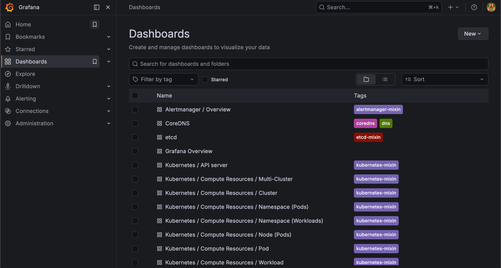
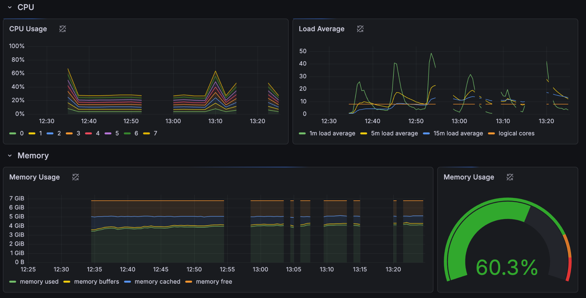
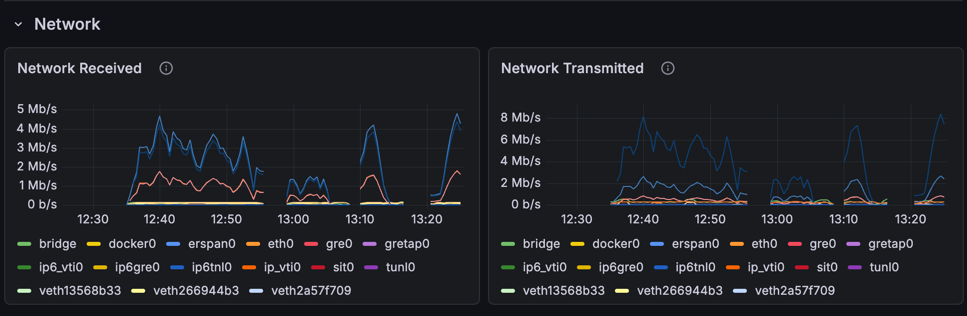
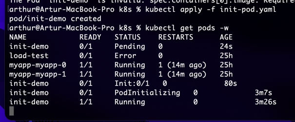
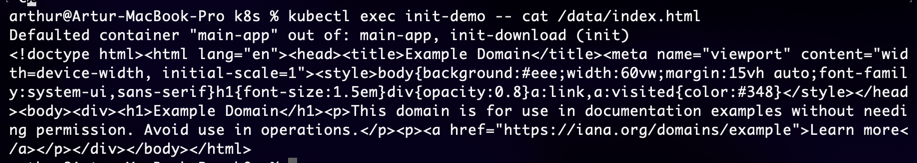
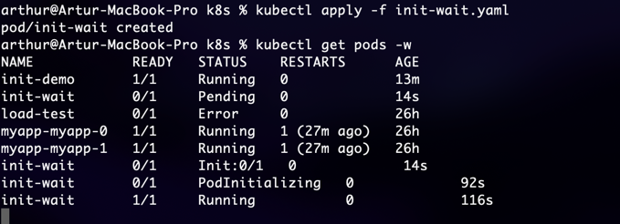
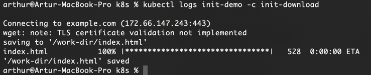

# Lab 16

---

## Task 1 - Kube-Prometheus Stack

### Understand Components

- **Prometheus Operator**  
  Manages the lifecycle of Prometheus, Alertmanager, and related resources in Kubernetes using Custom Resource Definitions (CRDs). Automates deployment, scaling, and configuration.

- **Prometheus**  
  Core monitoring system that collects and stores metrics from Kubernetes components and applications. Uses a time-series database and supports querying via PromQL.

- **Alertmanager**  
  Handles alerts sent by Prometheus. Responsible for grouping, deduplication, silencing, and routing alerts to different receivers (e.g., email, Slack).

- **Grafana**  
  Visualization tool used to create dashboards based on Prometheus metrics. Provides an intuitive UI for monitoring cluster health and performance.

- **kube-state-metrics**  
  Generates metrics from Kubernetes API objects (e.g., deployments, pods, nodes). Focuses on cluster state rather than resource usage.

- **node-exporter**  
  Collects hardware and OS-level metrics from cluster nodes (CPU, memory, disk, network) and exposes them for Prometheus scraping.


### Install via Helm
Verify all pods are running

```
arthur@Artur-MacBook-Pro DevOps-Core-Course % kubectl get pods -n monitoring
NAME                                                     READY   STATUS    RESTARTS   AGE
alertmanager-monitoring-kube-prometheus-alertmanager-0   2/2     Running   0          3m3s
monitoring-grafana-6dfb79b687-ckgwr                      3/3     Running   0          3m41s
monitoring-kube-prometheus-operator-64d78955c8-fwbwn     1/1     Running   0          3m41s
monitoring-kube-state-metrics-67d5f7bf68-gcsgl           1/1     Running   0          3m41s
monitoring-prometheus-node-exporter-fgr54                1/1     Running   0          3m41s
prometheus-monitoring-kube-prometheus-prometheus-0       2/2     Running   0          3m1s
```

```
arthur@Artur-MacBook-Pro DevOps-Core-Course % kubectl get po,svc -n monitoring
NAME                                                         READY   STATUS    RESTARTS   AGE
pod/alertmanager-monitoring-kube-prometheus-alertmanager-0   2/2     Running   0          9m12s
pod/monitoring-grafana-6dfb79b687-ckgwr                      3/3     Running   0          9m50s
pod/monitoring-kube-prometheus-operator-64d78955c8-fwbwn     0/1     Running   1          9m50s
pod/monitoring-kube-state-metrics-67d5f7bf68-gcsgl           0/1     Running   1          9m50s
pod/monitoring-prometheus-node-exporter-fgr54                1/1     Running   1          9m50s
pod/prometheus-monitoring-kube-prometheus-prometheus-0       1/2     Running   0          9m10s

NAME                                              TYPE        CLUSTER-IP       EXTERNAL-IP   PORT(S)                      AGE
service/alertmanager-operated                     ClusterIP   None             <none>        9093/TCP,9094/TCP,9094/UDP   9m12s
service/monitoring-grafana                        ClusterIP   10.108.238.46    <none>        80/TCP                       9m50s
service/monitoring-kube-prometheus-alertmanager   ClusterIP   10.102.171.132   <none>        9093/TCP,8080/TCP            9m50s
service/monitoring-kube-prometheus-operator       ClusterIP   10.110.23.174    <none>        443/TCP                      9m50s
service/monitoring-kube-prometheus-prometheus     ClusterIP   10.105.89.64     <none>        9090/TCP,8080/TCP            9m50s
service/monitoring-kube-state-metrics             ClusterIP   10.107.27.57     <none>        8080/TCP                     9m50s
service/monitoring-prometheus-node-exporter       ClusterIP   10.111.44.192    <none>        9100/TCP                     9m50s
service/prometheus-operated                       ClusterIP   None             <none>        9090/TCP                     9m10s
```

---

## Task 2 -  Grafana Dashboard Exploration



### 1. Pod Resources — StatefulSet

StatefulSet pod:
- `prometheus-monitoring-kube-prometheus-prometheus-0`

Observed resource usage:
- **CPU:** ~45 mCPU
- **Memory:** ~343 MiB

### 2. Namespace Analysis — `default`

Observed pods:
- `myapp-myapp-0` → ~2.7 mCPU
- `myapp-myapp-1` → ~2.8 mCPU
- `load-test` → ~0.15 mCPU

Result:
- **Highest CPU usage:** `myapp-myapp-1`
- **Lowest CPU usage:** `load-test`


### 3. Node Metrics — `minikube`



Grafana dashboard:
- Node Exporter / Nodes

Observed values:
- CPU usage: fluctuates between ~20% and ~60% under load
- Load average: peaks up to ~40 (1m load)
- Memory usage: ~60.3%
- Memory used: ~4–5 GiB out of ~6.8 GiB total

Conclusion:
- The node is under moderate load during testing
- CPU and memory usage increase during traffic generation

### 4. Kubelet Metrics

- **Pods managed:** 34
- **Containers managed:** multiple per pod (varies by workload)


### 5. Network Traffic — `default`



Grafana dashboard:
- Node Exporter / Nodes

Observed values:
- Network Received: up to ~5 Mb/s
- Network Transmitted: up to ~8 Mb/s

Explanation:
- Pod-level network metrics were not available in this Minikube environment.
- Node-level network metrics were used instead to analyze traffic.

### 6. Alerts — Alertmanager

Observed:

- Active alerts: 2
- Alerts:
  - etcdInsufficientMembers — critical
  - Watchdog — none
- Explanation:
  - These alerts are expected in single-node Minikube setups and do not indicate real cluster failure


## Task 3 — Init Containers

**Implement Basic Init Container**





**Wait-for-Service Pattern**




