# Lab 14

## **Argo Rollouts Setup**

Installation verification
```
arthur@192 DevOps-Core-Course % kubectl get pods -n argo-rollouts
NAME                            READY   STATUS    RESTARTS   AGE
argo-rollouts-5f64f8d68-g7k82   1/1     Running   0          3m39s

arthur@192 DevOps-Core-Course % kubectl argo rollouts version
kubectl-argo-rollouts: v1.9.0+838d4e7
  BuildDate: 2026-03-20T21:11:48Z
  GitCommit: 838d4e792be666ec11bd0c80331e0c5511b5010e
  GitTreeState: clean
  GoVersion: go1.24.13
  Compiler: gc
  Platform: darwin/arm64

```

Dashboard access
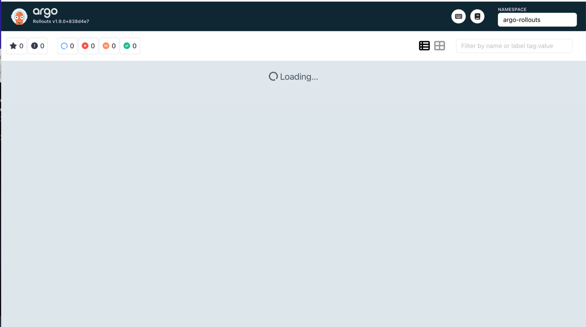

### **Rollout vs Deployment**

**Deployment** is a standard Kubernetes resource used for stateless application deployment with basic rolling update strategies.

**Rollout** (Argo Rollouts CRD) extends Deployment functionality by providing advanced progressive delivery features such as canary and blue-green deployments.

### **Key Differences**

* **Strategy**

  * Deployment: `RollingUpdate` or `Recreate`
  * Rollout: `canary`, `blueGreen`

* **Traffic Control**

  * Deployment: no traffic splitting
  * Rollout: supports traffic shifting between versions

* **Steps**

  * Rollout allows step-based deployment (`setWeight`, `pause`)

* **Analysis**

  * Rollout supports automated analysis and rollback based on metrics

* **Pause/Resume**

  * Rollout can pause deployments manually or automatically

### **Additional Fields in Rollout**

* `strategy.canary`
* `strategy.blueGreen`
* `steps`
* `analysis`
* `pause`


## **Canary Deployment**
Strategy configuration explained

The canary strategy gradually shifts traffic from the stable version to the new version in defined steps (20%, 40%, 60%, 80%, 100%).
It includes pause stages, allowing manual approval at the first step and timed pauses for controlled progression.
This approach reduces deployment risk by enabling monitoring, validation, and quick rollback if issues occur.


Step-by-step rollout progression (screenshots from dashboard)

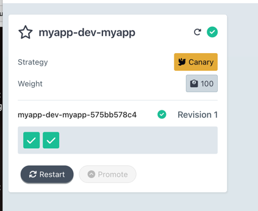

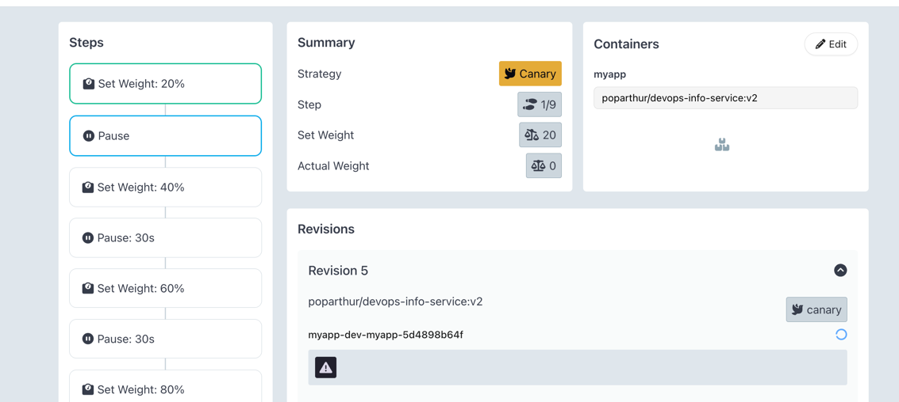

Promotion and abort demonstration

```
arthur@192 DevOps-Core-Course % kubectl argo rollouts promote myapp-dev-myapp -n dev
rollout 'myapp-dev-myapp' promoted
```

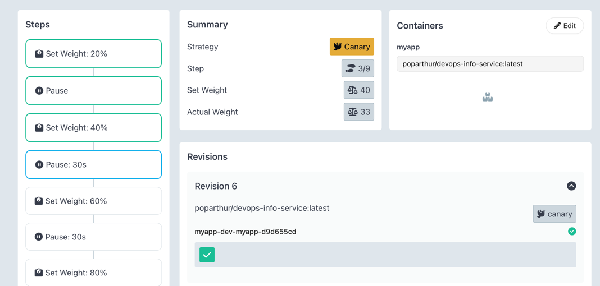

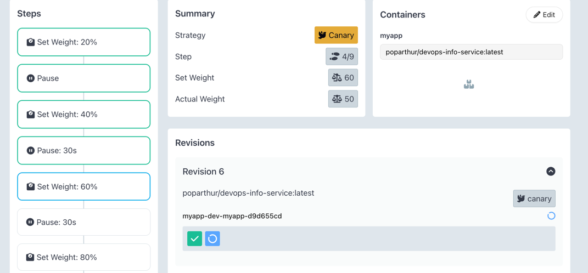

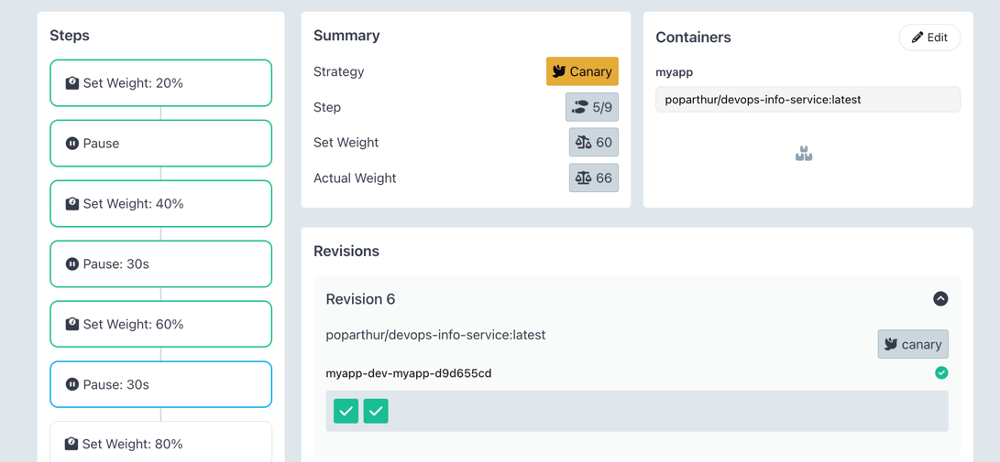

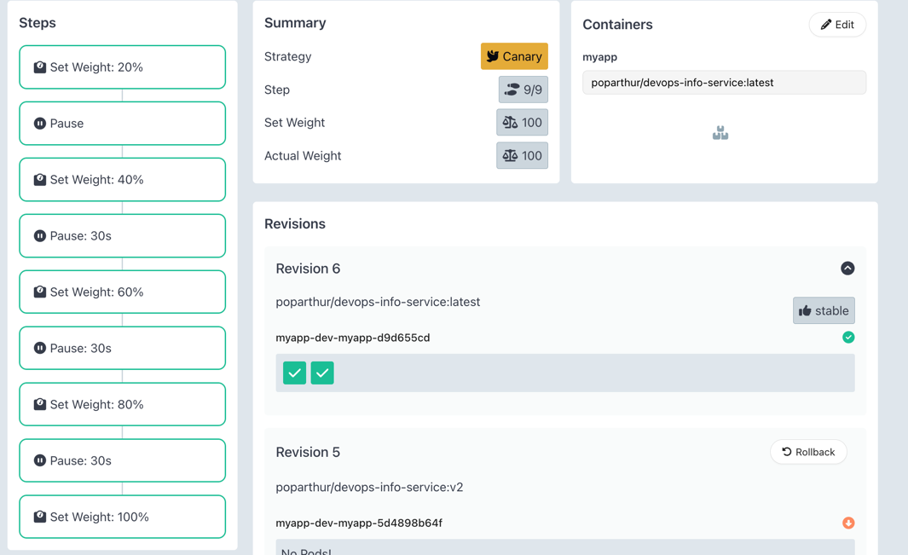

Abort

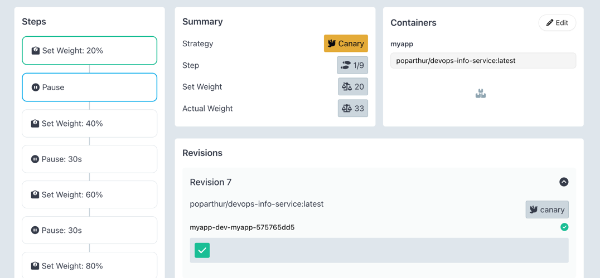

```
arthur@192 DevOps-Core-Course % kubectl argo rollouts abort myapp-dev-myapp -n dev
rollout 'myapp-dev-myapp' aborted
```

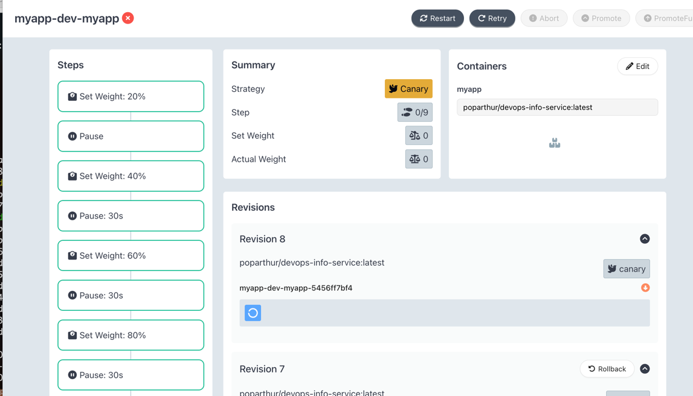

After retry

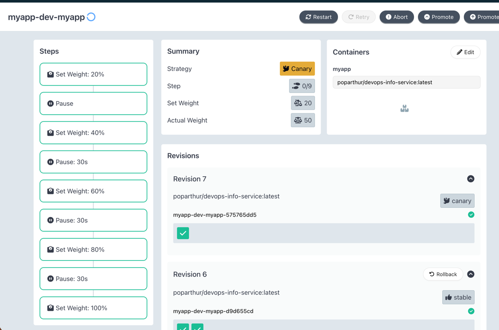

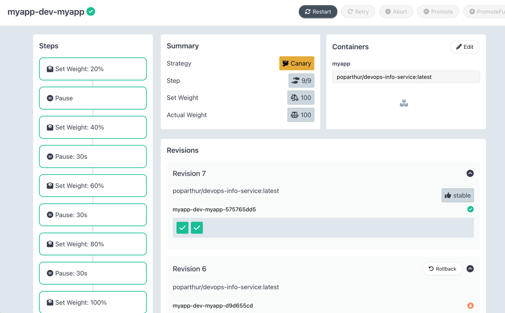

## **Blue-Green Deployment**

Strategy configuration explained

The blue-green strategy deploys a new version (green) alongside the current production version (blue) using separate ReplicaSets.
Traffic is routed through two services: the active service serves production traffic, while the preview service exposes the new version for testing.
With `autoPromotionEnabled: false`, promotion is manual, allowing controlled and instant switching between versions with immediate rollback capability.

Preview vs active service

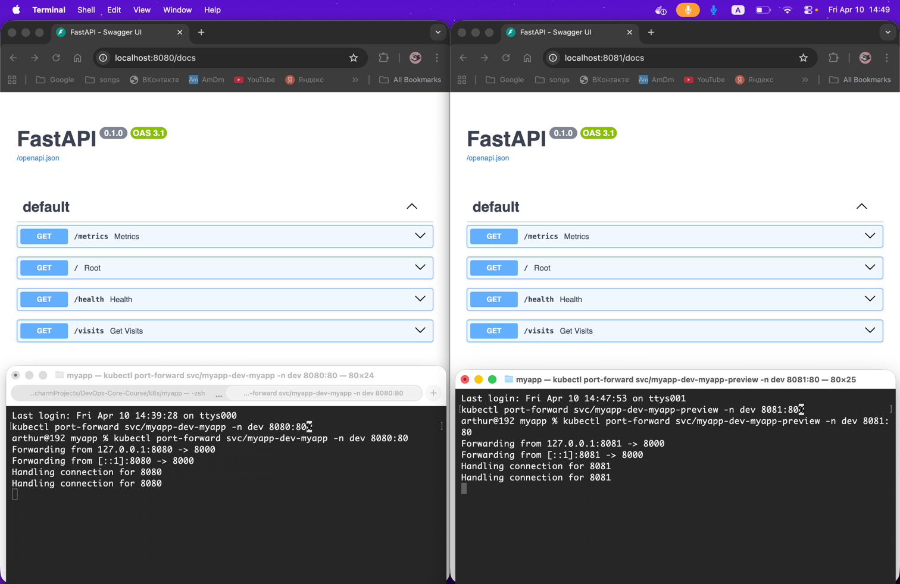

Promotion process

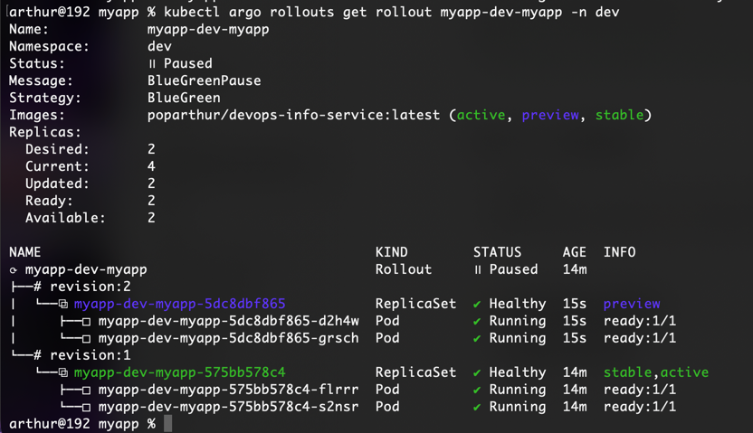

```
arthur@192 myapp % kubectl argo rollouts promote myapp-dev-myapp -n dev
rollout 'myapp-dev-myapp' promoted
```

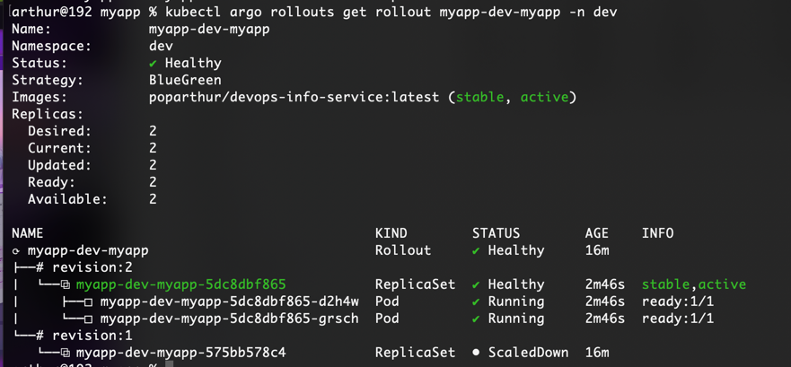

Rollout

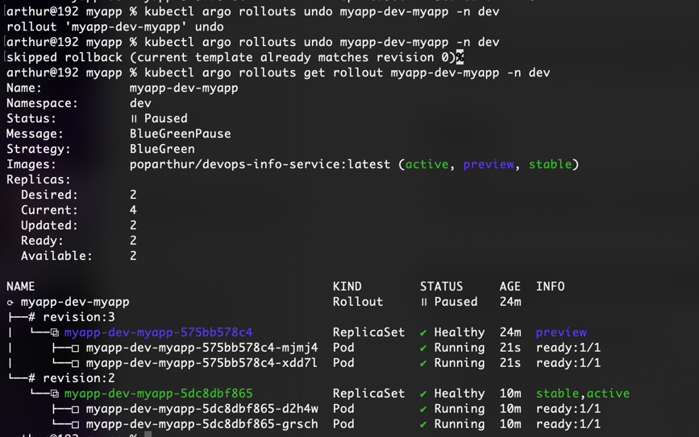

## **Strategy Comparison**

### **When to use Canary vs Blue-Green**

**Canary Deployment**
Use canary when you want to gradually introduce a new version and minimize risk by exposing it to a small percentage of users first. It is ideal for production systems where stability is critical and metrics/monitoring are available.

**Blue-Green Deployment**
Use blue-green when you want a fast and controlled release with the ability to fully test a new version before switching traffic. It is suitable when you can afford duplicate resources and need instant rollback.

### **Pros and Cons**

#### **Canary**

**Pros:**
- Gradual rollout reduces risk
- Easy to detect issues early
- No need for full duplicate environment
- Works well with monitoring and metrics

**Cons:**
- Slower deployment process
- More complex traffic management
- Partial failures may affect some users
- Rollback is not instant (needs traffic shift back)


#### **Blue-Green**

**Pros:**
- Instant traffic switch
- Easy and fast rollback
- Full testing in preview environment
- Simple concept (two environments)

**Cons:**
- Requires double resources (blue + green)
- No gradual exposure (all-or-nothing)
- Needs careful service configuration


### **Recommendation**

- Use **Canary** for:
  - High-traffic production systems
  - Risk-sensitive deployments
  - When monitoring and metrics are available

- Use **Blue-Green** for:
  - Fast releases with minimal downtime
  - Systems requiring instant rollback
  - When full pre-production testing is needed

## **CLI Commands Reference**

### **Rollout Management**

```bash
# Watch rollout status in real-time
kubectl argo rollouts get rollout myapp-dev-myapp -n dev -w

# Update image (trigger new rollout)
kubectl argo rollouts set image myapp-dev-myapp \
myapp=<image>:<tag> -n dev

# Promote rollout (manual step)
kubectl argo rollouts promote myapp-dev-myapp -n dev

# Abort rollout (canary rollback)
kubectl argo rollouts abort myapp-dev-myapp -n dev

# Retry aborted rollout
kubectl argo rollouts retry rollout myapp-dev-myapp -n dev

# Rollback to previous version (blue-green)
kubectl argo rollouts undo myapp-dev-myapp -n dev
```

### **Kubernetes Debugging**
```bash
# Check rollout resources
kubectl get rollouts -n dev

# Inspect rollout details
kubectl describe rollout myapp-dev-myapp -n dev

# Check pods
kubectl get pods -n dev

# Check services (active/preview)
kubectl get svc -n dev

# View logs
kubectl logs <pod-name> -n dev
```

### **Access Services**
```bash
# Active service (production)
kubectl port-forward svc/myapp-dev-myapp -n dev 8080:80

# Preview service (blue-green testing)
kubectl port-forward svc/myapp-dev-myapp-preview -n dev 8081:80
```

### **Troubleshooting**
```bash
# Check rollout events
kubectl describe rollout myapp-dev-myapp -n dev

# Check image pull errors
kubectl describe pod <pod-name> -n dev

# Verify ReplicaSets
kubectl get rs -n dev
```