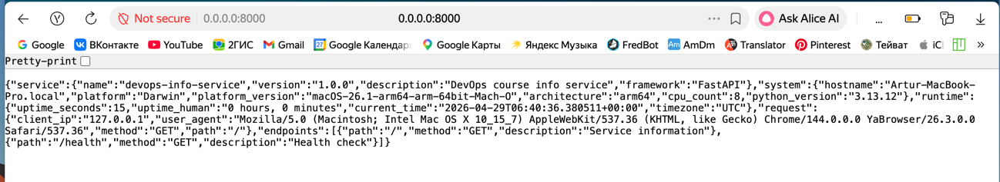
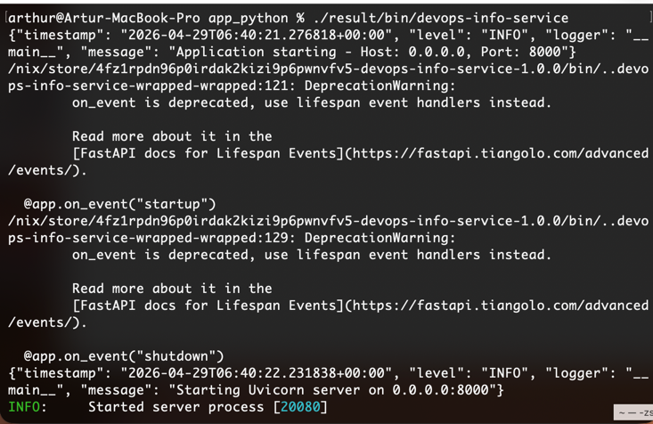
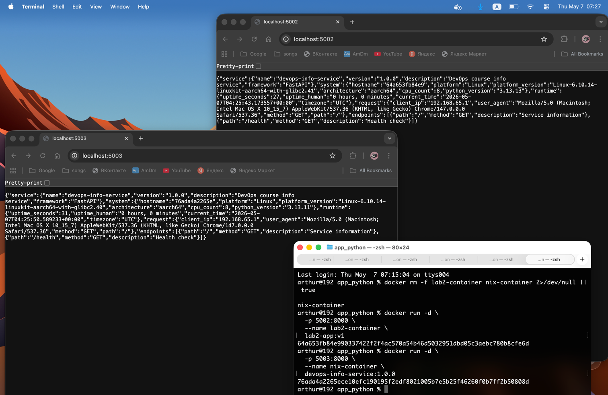

### Task 1 — Build Reproducible Python App

#### **Installation steps and verification output**

```
arthur@Artur-MacBook-Pro ~ % nix --version
nix run nixpkgs#hello
nix (Determinate Nix 3.18.1) 2.33.4
Hello, world!
arthur@Artur-MacBook-
```

#### **Your `default.nix` file with explanations of each field**

```nix
{ pkgs ? import <nixpkgs> {} }:

pkgs.python3Packages.buildPythonApplication {
  pname = "devops-info-service";
  version = "1.0.0";
  src = ./.;

  format = "other";

  propagatedBuildInputs = with pkgs.python3Packages; [
    fastapi
    uvicorn
    prometheus-client
  ];

  nativeBuildInputs = [ pkgs.makeWrapper ];

  installPhase = ''
    mkdir -p $out/bin
    cp app.py $out/bin/devops-info-service

    chmod +x $out/bin/devops-info-service

    wrapProgram $out/bin/devops-info-service \
      --prefix PYTHONPATH : "$PYTHONPATH"
  '';
}
```


- **`pkgs ? import <nixpkgs> {}`**  
  Imports the Nix package set (**nixpkgs**), which provides all dependencies used in the build.

- **`pname`**  
  Defines the name of the application (`devops-info-service`).

- **`version`**  
  Specifies the version of the application.

- **`src = ./.;`**  
  Uses the current directory as the source code for the build.

- **`format = "other"`**  
  Indicates that the project does not follow standard Python packaging (no `setup.py` or `pyproject.toml`).

- **`propagatedBuildInputs`**  
  Lists runtime Python dependencies:
  - `fastapi` — web framework  
  - `uvicorn` — ASGI server  
  - `prometheus-client` — metrics library  

- **`nativeBuildInputs`**  
  Includes build-time tools:
  - `makeWrapper` — used to wrap the executable with required environment variables  

- **`installPhase`**  
  Custom installation logic:
  - Copies `app.py` into `$out/bin`  
  - Makes it executable (`chmod +x`)  
  - Wraps it using `makeWrapper` to ensure correct execution environment via `PYTHONPATH`  
  
```
arthur@Artur-MacBook-Pro app_python % nix-build
this derivation will be built:
  /nix/store/ymi58lpkhn5va510c51fl3s6x9i3g778-devops-info-service-1.0.0.drv
building '/nix/store/ymi58lpkhn5va510c51fl3s6x9i3g778-devops-info-service-1.0.0.drv'...
Sourcing python-remove-tests-dir-hook
Sourcing python-catch-conflicts-hook.sh
Sourcing python-remove-bin-bytecode-hook.sh
Sourcing python-imports-check-hook.sh
Using pythonImportsCheckPhase
Sourcing python-namespaces-hook
Running phase: unpackPhase
unpacking source archive /nix/store/lbg4lvi0r5xg04hg6h6bbljj4rjcs22f-app_python
source root is app_python
setting SOURCE_DATE_EPOCH to timestamp 315619200 of file "app_python/tests/test_endpoints.py"
Running phase: patchPhase
Running phase: updateAutotoolsGnuConfigScriptsPhase
Running phase: configurePhase
no configure script, doing nothing
Running phase: buildPhase
no Makefile or custom buildPhase, doing nothing
Running phase: installPhase
Running phase: fixupPhase
checking for references to /nix/var/nix/builds/nix-17983-1484817784/ in /nix/store/nflm14ymdmq23psvs5zmij8k3q62jal5-devops-info-service-1.0.0...
patching script interpreter paths in /nix/store/nflm14ymdmq23psvs5zmij8k3q62jal5-devops-info-service-1.0.0
stripping (with command strip and flags -S) in  /nix/store/nflm14ymdmq23psvs5zmij8k3q62jal5-devops-info-service-1.0.0/bin
Rewriting #! /nix/store/f700nj7wlwg441h39gkq29qbviy99sgq-bash-5.3p9/bin/bash -e to #!/nix/store/kwnbzccaiqi6iwdchcy6xc8br4x9hn0j-python3-3.13.12
Executing pythonRemoveTestsDir
Finished executing pythonRemoveTestsDir
Running phase: installCheckPhase
no Makefile or custom installCheckPhase, doing nothing
Running phase: pythonCatchConflictsPhase
Running phase: pythonRemoveBinBytecodePhase
Running phase: pythonImportsCheckPhase
Executing pythonImportsCheckPhase
/nix/store/nflm14ymdmq23psvs5zmij8k3q62jal5-devops-info-service-1.0.0
```

#### **Store path from multiple builds (prove they're identical)**

```
arthur@Artur-MacBook-Pro app_python % readlink result
/nix/store/nflm14ymdmq23psvs5zmij8k3q62jal5-devops-info-service-1.0.0
```

```
arthur@Artur-MacBook-Pro app_python % rm result
arthur@Artur-MacBook-Pro app_python % nix-build
/nix/store/nflm14ymdmq23psvs5zmij8k3q62jal5-devops-info-service-1.0.0
arthur@Artur-MacBook-Pro app_python % readlink result
/nix/store/nflm14ymdmq23psvs5zmij8k3q62jal5-devops-info-service-1.0.0
```

```
arthur@Artur-MacBook-Pro app_python % rm result
arthur@Artur-MacBook-Pro app_python % nix-store --delete $STORE_PATH
finding garbage collector roots...
removing stale link from '/nix/var/nix/gcroots/auto/gjk6dg4ymqk0pkwbyv1xr19j90ivniag' to '/Users/arthur/PycharmProjects/DevOps-Core-Course/labs/lab18/app_python/result'
deleting unused links...
note: hard linking is currently saving 0.0 KiB
0 store paths deleted, 0.0 KiB freed
arthur@Artur-MacBook-Pro app_python % nix-build

/nix/store/nflm14ymdmq23psvs5zmij8k3q62jal5-devops-info-service-1.0.0
arthur@Artur-MacBook-Pro app_python % readlink result
/nix/store/nflm14ymdmq23psvs5zmij8k3q62jal5-devops-info-service-1.0.0
arthur@Artur-MacBook-Pro app_python % 
```


| Build attempt | Store path |
|---|---|
| Initial build | `/nix/store/nflm14ymdmq23psvs5zmij8k3q62jal5-devops-info-service-1.0.0` |
| Rebuild after removing `result` | `/nix/store/nflm14ymdmq23psvs5zmij8k3q62jal5-devops-info-service-1.0.0` |
| Rebuild after GC-root cleanup attempt | `/nix/store/nflm14ymdmq23psvs5zmij8k3q62jal5-devops-info-service-1.0.0` |

The store path remained identical across all builds.


```
arthur@Artur-MacBook-Pro app_python % nix-hash --type sha256 result
9ddbe99dd5fdffb7a53bf59d9261f6dae1d1603da69fe61361b20b2f0cf10537
```

#### **Comparison table: `pip install` vs Nix derivation**

```
arthur@Artur-MacBook-Pro app_python % echo "fastapi" > requirements-unpinned.txt 

python3 -m venv venv1
source venv1/bin/activate
pip install -r requirements-unpinned.txt
pip freeze | grep -i fastapi > freeze1.txt
deactivate

pip cache purge 2>/dev/null || rm -rf ~/.cache/pip

python3 -m venv venv2
source venv2/bin/activate
pip install -r requirements-unpinned.txt
pip freeze | grep -i fastapi > freeze2.txt
deactivate

Collecting fastapi (from -r requirements-unpinned.txt (line 1))
  Downloading fastapi-0.136.1-py3-none-any.whl.metadata (28 kB)
Collecting starlette>=0.46.0 (from fastapi->-r requirements-unpinned.txt (line 1))
  Downloading starlette-1.0.0-py3-none-any.whl.metadata (6.3 kB)
Collecting pydantic>=2.9.0 (from fastapi->-r requirements-unpinned.txt (line 1))
  Downloading pydantic-2.13.3-py3-none-any.whl.metadata (108 kB)
Collecting typing-extensions>=4.8.0 (from fastapi->-r requirements-unpinned.txt (line 1))
  Using cached typing_extensions-4.15.0-py3-none-any.whl.metadata (3.3 kB)
Collecting typing-inspection>=0.4.2 (from fastapi->-r requirements-unpinned.txt (line 1))
  Using cached typing_inspection-0.4.2-py3-none-any.whl.metadata (2.6 kB)
Collecting annotated-doc>=0.0.2 (from fastapi->-r requirements-unpinned.txt (line 1))
  Using cached annotated_doc-0.0.4-py3-none-any.whl.metadata (6.6 kB)
Collecting annotated-types>=0.6.0 (from pydantic>=2.9.0->fastapi->-r requirements-unpinned.txt (line 1))
  Using cached annotated_types-0.7.0-py3-none-any.whl.metadata (15 kB)
Collecting pydantic-core==2.46.3 (from pydantic>=2.9.0->fastapi->-r requirements-unpinned.txt (line 1))
  Downloading pydantic_core-2.46.3-cp314-cp314-macosx_11_0_arm64.whl.metadata (6.6 kB)
Collecting anyio<5,>=3.6.2 (from starlette>=0.46.0->fastapi->-r requirements-unpinned.txt (line 1))
  Using cached anyio-4.13.0-py3-none-any.whl.metadata (4.5 kB)
Collecting idna>=2.8 (from anyio<5,>=3.6.2->starlette>=0.46.0->fastapi->-r requirements-unpinned.txt (line 1))
  Downloading idna-3.13-py3-none-any.whl.metadata (8.0 kB)
Downloading fastapi-0.136.1-py3-none-any.whl (117 kB)
Using cached annotated_doc-0.0.4-py3-none-any.whl (5.3 kB)
Downloading pydantic-2.13.3-py3-none-any.whl (471 kB)
Downloading pydantic_core-2.46.3-cp314-cp314-macosx_11_0_arm64.whl (2.0 MB)
   ━━━━━━━━━━━━━━━━━━━━━━━━━━━━━━━━━━━━━━━━ 2.0/2.0 MB 2.1 MB/s  0:00:00
Using cached annotated_types-0.7.0-py3-none-any.whl (13 kB)
Downloading starlette-1.0.0-py3-none-any.whl (72 kB)
Using cached anyio-4.13.0-py3-none-any.whl (114 kB)
Downloading idna-3.13-py3-none-any.whl (68 kB)
Using cached typing_extensions-4.15.0-py3-none-any.whl (44 kB)
Using cached typing_inspection-0.4.2-py3-none-any.whl (14 kB)
Installing collected packages: typing-extensions, idna, annotated-types, annotated-doc, typing-inspection, pydantic-core, anyio, starlette, pydantic, fastapi
Successfully installed annotated-doc-0.0.4 annotated-types-0.7.0 anyio-4.13.0 fastapi-0.136.1 idna-3.13 pydantic-2.13.3 pydantic-core-2.46.3 starlette-1.0.0 typing-extensions-4.15.0 typing-inspection-0.4.2

[notice] A new release of pip is available: 26.0 -> 26.1
[notice] To update, run: pip install --upgrade pip
Collecting fastapi (from -r requirements-unpinned.txt (line 1))
  Using cached fastapi-0.136.1-py3-none-any.whl.metadata (28 kB)
Collecting starlette>=0.46.0 (from fastapi->-r requirements-unpinned.txt (line 1))
  Using cached starlette-1.0.0-py3-none-any.whl.metadata (6.3 kB)
Collecting pydantic>=2.9.0 (from fastapi->-r requirements-unpinned.txt (line 1))
  Using cached pydantic-2.13.3-py3-none-any.whl.metadata (108 kB)
Collecting typing-extensions>=4.8.0 (from fastapi->-r requirements-unpinned.txt (line 1))
  Using cached typing_extensions-4.15.0-py3-none-any.whl.metadata (3.3 kB)
Collecting typing-inspection>=0.4.2 (from fastapi->-r requirements-unpinned.txt (line 1))
  Using cached typing_inspection-0.4.2-py3-none-any.whl.metadata (2.6 kB)
Collecting annotated-doc>=0.0.2 (from fastapi->-r requirements-unpinned.txt (line 1))
  Using cached annotated_doc-0.0.4-py3-none-any.whl.metadata (6.6 kB)
Collecting annotated-types>=0.6.0 (from pydantic>=2.9.0->fastapi->-r requirements-unpinned.txt (line 1))
  Using cached annotated_types-0.7.0-py3-none-any.whl.metadata (15 kB)
Collecting pydantic-core==2.46.3 (from pydantic>=2.9.0->fastapi->-r requirements-unpinned.txt (line 1))
  Using cached pydantic_core-2.46.3-cp314-cp314-macosx_11_0_arm64.whl.metadata (6.6 kB)
Collecting anyio<5,>=3.6.2 (from starlette>=0.46.0->fastapi->-r requirements-unpinned.txt (line 1))
  Using cached anyio-4.13.0-py3-none-any.whl.metadata (4.5 kB)
Collecting idna>=2.8 (from anyio<5,>=3.6.2->starlette>=0.46.0->fastapi->-r requirements-unpinned.txt (line 1))
  Using cached idna-3.13-py3-none-any.whl.metadata (8.0 kB)
Using cached fastapi-0.136.1-py3-none-any.whl (117 kB)
Using cached annotated_doc-0.0.4-py3-none-any.whl (5.3 kB)
Using cached pydantic-2.13.3-py3-none-any.whl (471 kB)
Using cached pydantic_core-2.46.3-cp314-cp314-macosx_11_0_arm64.whl (2.0 MB)
Using cached annotated_types-0.7.0-py3-none-any.whl (13 kB)
Using cached starlette-1.0.0-py3-none-any.whl (72 kB)
Using cached anyio-4.13.0-py3-none-any.whl (114 kB)
Using cached idna-3.13-py3-none-any.whl (68 kB)
Using cached typing_extensions-4.15.0-py3-none-any.whl (44 kB)
Using cached typing_inspection-0.4.2-py3-none-any.whl (14 kB)
Installing collected packages: typing-extensions, idna, annotated-types, annotated-doc, typing-inspection, pydantic-core, anyio, starlette, pydantic, fastapi
Successfully installed annotated-doc-0.0.4 annotated-types-0.7.0 anyio-4.13.0 fastapi-0.136.1 idna-3.13 pydantic-2.13.3 pydantic-core-2.46.3 starlette-1.0.0 typing-extensions-4.15.0 typing-inspection-0.4.2

[notice] A new release of pip is available: 26.0 -> 26.1
[notice] To update, run: pip install --upgrade pip
arthur@Artur-MacBook-Pro app_python % diff freeze1.txt freeze2.txt
```

Although the versions matched in this run, pip installs the latest available versions when dependencies are not pinned. Over time, this leads to non-reproducible environments, unlike Nix which guarantees identical builds.

- **Why does `requirements.txt` provide weaker guarantees than Nix?**

`requirements.txt` provides weaker reproducibility guarantees because it only specifies direct dependencies, and even then, not always strictly:

- Even when versions are pinned, **transitive dependencies** (dependencies of dependencies) are not fully controlled
- Package resolution happens at install time (`pip install`), meaning results may vary over time
- Different environments (OS, Python version) can lead to different builds
- No guarantee of bit-for-bit identical environments across machines

In contrast, Nix:
- Pins the **entire dependency tree**, including transitive dependencies
- Uses a **pure, declarative build system**
- Produces **bit-for-bit identical outputs**
- Ensures the same result across different machines and time


#### **Screenshots showing your Lab 1 app running from Nix-built version**






#### **Explanation of the Nix store path format and what each part means**

/nix/store/nflm14ymdmq23psvs5zmij8k3q62jal5-devops-info-service-1.0.0


Each part has a specific meaning:

- **`/nix/store/`**  
  The global Nix store where all packages are stored

- **`nflm14ymdmq23psvs5zmij8k3q62jal5`**  
  A cryptographic hash derived from:
  - source code
  - dependencies (including transitive)
  - build instructions
  - environment and configuration

  This ensures that identical inputs always produce the same path

- **`devops-info-service`**  
  The package name (`pname`)

- **`1.0.0`**  
  The package version


#### **Reflection: How would Nix have helped in Lab 1?**

If Nix had been used in Lab 1, it would have significantly improved reliability and reproducibility:

- Eliminated "works on my machine" issues by ensuring identical environments everywhere
- Removed dependency on system Python and local configurations
- Guaranteed consistent dependency versions, including transitive ones
- Simplified environment setup — no need for virtual environments (`venv`)
- Enabled reproducible builds across time, even months later
- Made debugging easier by removing hidden environmental differences

Overall, Nix would have provided a more robust, deterministic, and portable setup compared to the traditional `pip + venv` approach.


### Task 2 - Reproducible Docker Images

#### **Test Lab 2 Dockerfile reproducibility**

```
arthur@Artur-MacBook-Pro DevOps-Core-Course % docker build --no-cache -t lab2-app:v3 ./app_python

[+] Building 101.2s (16/16) FINISHED                       docker:desktop-linux
 => [internal] load build definition from Dockerfile                       0.0s
 => => transferring dockerfile: 905B                                       0.0s
 => WARN: FromAsCasing: 'as' and 'FROM' keywords' casing do not match (li  0.0s
 => [internal] load metadata for docker.io/library/python:3.13-slim        1.4s
 => [internal] load .dockerignore                                          0.0s
 => => transferring context: 621B                                          0.0s
 => [internal] load build context                                          0.0s
 => => transferring context: 138B                                          0.0s
 => [builder 1/5] FROM docker.io/library/python:3.13-slim@sha256:a0779d7c  0.0s
 => CACHED [builder 2/5] WORKDIR /build                                    0.0s
 => CACHED [stage-1 2/7] WORKDIR /app                                      0.0s
 => [stage-1 3/7] RUN useradd --create-home --shell /bin/bash appuser &&   0.9s
 => [builder 3/5] COPY requirements.txt .                                  0.1s
 => [builder 4/5] RUN python -m venv /opt/venv                             3.3s
 => [stage-1 4/7] RUN apt-get update && apt-get install -y curl && rm -r  98.1s
 => [builder 5/5] RUN pip install --no-cache-dir -r requirements.txt      88.6s
 => [stage-1 5/7] COPY --from=builder /opt/venv /opt/venv                  0.3s 
 => [stage-1 6/7] COPY --chown=appuser:appuser app.py .                    0.0s 
 => [stage-1 7/7] COPY --chown=appuser:appuser requirements.txt .          0.0s 
 => exporting to image                                                     0.3s 
 => => exporting layers                                                    0.3s 
 => => writing image sha256:00281d327882fc19513e7f10e0a795b42a766f36987ca  0.0s 
 => => naming to docker.io/library/lab2-app:v3                             0.0s

View build details: docker-desktop://dashboard/build/desktop-linux/desktop-linux/tm0gx97y6titpy1w37utvht0j

 1 warning found (use docker --debug to expand):
 - FromAsCasing: 'as' and 'FROM' keywords' casing do not match (line 1)

What's next:
    View a summary of image vulnerabilities and recommendations → docker scout quickview 
arthur@Artur-MacBook-Pro DevOps-Core-Course % docker inspect lab2-app:v3 | grep Created

        "Created": "2026-04-29T08:03:29.555066553Z",
arthur@Artur-MacBook-Pro DevOps-Core-Course % docker build --no-cache -t lab2-app:v4 ./app_python

[+] Building 120.0s (16/16) FINISHED                       docker:desktop-linux
 => [internal] load build definition from Dockerfile                       0.0s
 => => transferring dockerfile: 905B                                       0.0s
 => WARN: FromAsCasing: 'as' and 'FROM' keywords' casing do not match (li  0.0s
 => [internal] load metadata for docker.io/library/python:3.13-slim        1.3s
 => [internal] load .dockerignore                                          0.0s
 => => transferring context: 621B                                          0.0s
 => [builder 1/5] FROM docker.io/library/python:3.13-slim@sha256:a0779d7c  0.0s
 => [internal] load build context                                          0.0s
 => => transferring context: 138B                                          0.0s
 => CACHED [builder 2/5] WORKDIR /build                                    0.0s
 => CACHED [stage-1 2/7] WORKDIR /app                                      0.0s
 => [stage-1 3/7] RUN useradd --create-home --shell /bin/bash appuser &&   0.2s
 => [builder 3/5] COPY requirements.txt .                                  0.0s
 => [builder 4/5] RUN python -m venv /opt/venv                             2.8s
 => [stage-1 4/7] RUN apt-get update && apt-get install -y curl && rm -  117.9s
 => [builder 5/5] RUN pip install --no-cache-dir -r requirements.txt      71.7s
 => [stage-1 5/7] COPY --from=builder /opt/venv /opt/venv                  0.4s 
 => [stage-1 6/7] COPY --chown=appuser:appuser app.py .                    0.0s 
 => [stage-1 7/7] COPY --chown=appuser:appuser requirements.txt .          0.0s 
 => exporting to image                                                     0.2s 
 => => exporting layers                                                    0.2s 
 => => writing image sha256:7dea4dfe0c381ace4c3de0162d41085c47d68aab0c5f8  0.0s 
 => => naming to docker.io/library/lab2-app:v4                             0.0s

View build details: docker-desktop://dashboard/build/desktop-linux/desktop-linux/h98n7afxqommwl5nfrikdk7o1

 1 warning found (use docker --debug to expand):
 - FromAsCasing: 'as' and 'FROM' keywords' casing do not match (line 1)

What's next:
    View a summary of image vulnerabilities and recommendations → docker scout quickview 
arthur@Artur-MacBook-Pro DevOps-Core-Course % docker inspect lab2-app:v4 | grep Created
        "Created": "2026-04-29T08:05:48.96945259Z",
```

The traditional Lab 2 Dockerfile was rebuilt twice using `--no-cache`. Even though the Dockerfile and source code were unchanged, the resulting images had different creation timestamps and different image SHA values.

First build:
- Image SHA: `00281d327882...`
- Created: `2026-04-29T08:03:29.555066553Z`

Second build:
- Image SHA: `7dea4dfe0c38...`
- Created: `2026-04-29T08:05:48.96945259Z`

This proves that the traditional Docker build is not bit-for-bit reproducible. Build timestamps and dynamically resolved dependencies such as base images, `apt-get`, and `pip install` can affect the final image output.

#### **Build Docker Image with Nix**
Load

```
arthur@192 app_python % 
docker run --rm \
  -v "$PWD":/work \
  -w /work \
  nixos/nix:latest \
  sh -c 'OUT=$(nix-build docker.nix --no-out-link); cp -L "$OUT" /work/devops-info-service.tar.gz'

Creating layer 46 with customisation...
Adding manifests...
Done.
arthur@192 app_python % ls -lh devops-info-service.tar.gz
-rw-r--r--@ 1 arthur  staff    84M May  7 06:56 devops-info-service.tar.gz
arthur@192 app_python % ls -lh devops-info-service.tar.gz
-rw-r--r--@ 1 arthur  staff    84M May  7 06:56 devops-info-service.tar.gz
arthur@192 app_python % docker load -i devops-info-service.tar.gz
docker images | grep devops-info-service
80027ab57fc0: Loading layer  20.48kB/20.48kB
d9a29c18e72a: Loading layer  133.1kB/133.1kB
f46beb20e6ff: Loading layer  163.8kB/163.8kB
18cb9d6eb9bc: Loading layer  163.8kB/163.8kB
df528aa3443b: Loading layer   2.14MB/2.14MB
2e5654d1ee6b: Loading layer  2.939MB/2.939MB
2c2a3760bbe9: Loading layer  419.8kB/419.8kB
3c6b7a0c1988: Loading layer   42.3MB/42.3MB
611e7eecacda: Loading layer  92.16kB/92.16kB
d74203b47bf4: Loading layer  163.8kB/163.8kB
de7e6393f00b: Loading layer  153.6kB/153.6kB
bd6871a01800: Loading layer  153.6kB/153.6kB
8bc65bc3f114: Loading layer    297kB/297kB
335bd4f9566c: Loading layer  184.3kB/184.3kB
370bb50ca7da: Loading layer  327.7kB/327.7kB
f46f959b916d: Loading layer  593.9kB/593.9kB
5874ab1c373d: Loading layer  962.6kB/962.6kB
4c8a64e35701: Loading layer  2.396MB/2.396MB
172d5b7efe4d: Loading layer  4.045MB/4.045MB
f1e16ff9e7a5: Loading layer  4.004MB/4.004MB
fc26b5dbdd60: Loading layer  5.591MB/5.591MB
7628cfdf51de: Loading layer  563.2kB/563.2kB
13a6898c88d6: Loading layer  9.277MB/9.277MB
061e41436882: Loading layer  9.841MB/9.841MB
498bf87d9379: Loading layer  675.8kB/675.8kB
05e077c14f55: Loading layer  1.751MB/1.751MB
3bf3bb91678a: Loading layer  9.677MB/9.677MB
5fa9f17ba2dd: Loading layer  119.9MB/119.9MB
071ac31170a2: Loading layer  102.4kB/102.4kB
eabbd90ec782: Loading layer  143.4kB/143.4kB
133f9e19f3b6: Loading layer  194.6kB/194.6kB
69450692cd33: Loading layer  358.4kB/358.4kB
5849cd47cbef: Loading layer  532.5kB/532.5kB
a5e044b44be8: Loading layer  174.1kB/174.1kB
20e4e777b280: Loading layer  829.4kB/829.4kB
632865d81972: Loading layer  1.004MB/1.004MB
b2525bc59dd8: Loading layer  1.341MB/1.341MB
c1f2aa6f0189: Loading layer  1.065MB/1.065MB
893a725aa5f0: Loading layer  1.956MB/1.956MB
2977ec41134e: Loading layer  1.178MB/1.178MB
517d5a4b224c: Loading layer  235.5kB/235.5kB
eaa1c6cad8b4: Loading layer  5.028MB/5.028MB
fbbe841fe267: Loading layer  6.042MB/6.042MB
8dd7ce65ee0b: Loading layer  1.864MB/1.864MB
6207b4e31f71: Loading layer  1.034MB/1.034MB
adb1bf389026: Loading layer  266.2kB/266.2kB
Loaded image: devops-info-service:1.0.0
poparthur/devops-info-service     latest          1ec49ab32d7f   4 weeks ago     199MB
poparthur/devops-info-service     <none>          0b7414729ebc   8 weeks ago     197MB
devops-info-service               1.0.0           1dc175daf58c   56 years ago    229MB
arthur@192 app_python % docker rm -f nix-container 2>/dev/null || true

docker run -d \
  -p 5003:8000 \
  --name nix-container \
  devops-info-service:1.0.0
daee5355f7c3c195f954cdeb57724e895e9ea9c0396337d26ee74f01772a1982
arthur@192 app_python % docker ps | grep nix-container
curl http://localhost:5003/health
daee5355f7c3   devops-info-service:1.0.0   "/nix/store/a268p895…"   12 seconds ago   Up 10 seconds   0.0.0.0:5003->8000/tcp   nix-container
{"status":"healthy","timestamp":"2026-05-07T04:01:07.107606+00:00","uptime_seconds":10}%          
```


#### Your `docker.nix` file with explanations of each field

```nix
{ pkgs ? import <nixpkgs> {} }:

let
  pythonEnv = pkgs.python3.withPackages (ps: with ps; [
    fastapi
    uvicorn
    python-json-logger
    prometheus-fastapi-instrumentator
    prometheus-client
  ]);

  appSrc = pkgs.runCommand "devops-info-service-src" {} ''
    mkdir -p $out/app
    cp ${./app.py} $out/app/app.py
  '';
in

pkgs.dockerTools.buildLayeredImage {
  name = "devops-info-service";
  tag = "1.0.0";

  created = "1970-01-01T00:00:01Z";

  contents = [
    pythonEnv
    appSrc
    pkgs.coreutils
    pkgs.bash
  ];

  config = {
    Cmd = [
      "${pythonEnv}/bin/uvicorn"
      "app:app"
      "--host"
      "0.0.0.0"
      "--port"
      "8000"
    ];

    Env = [
      "PYTHONPATH=${appSrc}/app"
      "HOST=0.0.0.0"
      "PORT=8000"
      "DEBUG=False"
      "VISITS_FILE=/tmp/visits"
    ];

    ExposedPorts = {
      "8000/tcp" = {};
    };

    WorkingDir = "${appSrc}/app";

    Labels = {
      "org.opencontainers.image.title" = "devops-info-service";
      "org.opencontainers.image.version" = "1.0.0";
      "org.opencontainers.image.description" = "DevOps Info Service built reproducibly with Nix";
      "build.tool" = "nix-dockerTools";
    };
  };

  maxLayers = 120;
}
````


* **`{ pkgs ? import <nixpkgs> {} }:`**
  Imports the Nix package set. This provides access to Python, Python packages, `dockerTools`, Bash, Coreutils, and other dependencies.

* **`pythonEnv = pkgs.python3.withPackages (...)`**
  Creates a Python environment with all runtime dependencies required by the FastAPI application.

  Included packages:

  * `fastapi` — web framework
  * `uvicorn` — ASGI server used to run the app
  * `python-json-logger` — structured JSON logging
  * `prometheus-fastapi-instrumentator` — Prometheus integration for FastAPI
  * `prometheus-client` — Prometheus metrics client library

* **`appSrc = pkgs.runCommand "devops-info-service-src" ...`**
  Creates a small Nix store path containing the application source code.
  The `app.py` file is copied into `$out/app/app.py`, making the source part of the reproducible Nix build.

* **`pkgs.dockerTools.buildLayeredImage`**
  Builds a Docker image directly from Nix store paths instead of using a traditional Dockerfile.

* **`name = "devops-info-service";`**
  Defines the Docker image name.

* **`tag = "1.0.0";`**
  Defines the Docker image tag.

* **`created = "1970-01-01T00:00:01Z";`**
  Sets a fixed creation timestamp.
  This is important for reproducibility because changing timestamps can cause different image hashes between builds.

* **`contents`**
  Defines what is included in the image:

  * `pythonEnv` — Python interpreter and all Python dependencies
  * `appSrc` — application source code
  * `pkgs.coreutils` — basic Unix utilities
  * `pkgs.bash` — shell support

* **`config.Cmd`**
  Defines the default command executed when the container starts.
  The image runs the FastAPI app using Uvicorn:

  ```bash
  uvicorn app:app --host 0.0.0.0 --port 8000
  ```

* **`config.Env`**
  Defines runtime environment variables:

  * `PYTHONPATH=${appSrc}/app` allows Python to import `app.py`
  * `HOST=0.0.0.0` makes the app reachable from outside the container
  * `PORT=8000` sets the application port
  * `DEBUG=False` disables debug mode
  * `VISITS_FILE=/tmp/visits` stores runtime data in `/tmp`, which is writable inside the container

* **`ExposedPorts`**
  Documents that the container exposes port `8000/tcp`.

* **`WorkingDir = "${appSrc}/app";`**
  Sets the working directory to the folder containing `app.py`.

* **`Labels`**
  Adds metadata to the image, including the title, version, description, and build tool.

* **`maxLayers = 120;`**
  Allows Nix to create multiple image layers from individual Nix store paths.
  This makes the image structure more transparent and helps Docker reuse layers efficiently.


#### Side-by-side comparison: Lab 2 Dockerfile vs Nix docker.nix

| Aspect | Lab 2 Dockerfile | Lab 18 Nix `docker.nix` |
|---|---|---|
| Build method | Uses a traditional multi-stage Dockerfile | Uses Nix `dockerTools.buildLayeredImage` |
| Base image | Starts from `python:3.13-slim` | Does not use a mutable Docker base image |
| Dependency installation | Installs dependencies with `pip install -r requirements.txt` | Builds a Python environment using `pkgs.python3.withPackages` |
| System packages | Installs `curl` with `apt-get` | Includes only explicitly declared Nix packages such as `coreutils` and `bash` |
| Reproducibility | Weaker, because base image tags, `apt-get`, and `pip` can change over time | Stronger, because dependencies are immutable Nix store paths |
| Timestamp behavior | Docker creates new image metadata during rebuilds | Uses fixed timestamp: `1970-01-01T00:00:01Z` |
| Application startup | Runs `python app.py` | Runs `uvicorn app:app --host 0.0.0.0 --port 8000` |
| Runtime data | App originally expected writable paths like `/app` | Uses `/tmp/visits` for writable runtime data |
| Image size | `199MB` | `229MB` |
| Layer structure | Dockerfile-based layers, including base image, `apt-get`, venv, and copied files | Nix store-path layers for Python, dependencies, app source, Bash, Coreutils, and libraries |
| Transparency | Harder to audit exact transitive dependencies | Easier to audit because each dependency appears as a Nix store path |
| Port | Exposes `8000/tcp` | Exposes `8000/tcp` |

**Analysis**

The Lab 2 Dockerfile follows common Docker best practices: it uses a multi-stage build, creates a Python virtual environment, installs dependencies, creates a non-root user, and defines a health check. However, it still depends on mutable external inputs such as the `python:3.13-slim` base image, Debian package repositories used by `apt-get`, and Python packages resolved by `pip`.

The Nix `docker.nix` approach avoids these mutable build steps. Instead of installing packages during the Docker build, it constructs the image from explicit Nix store paths. The Python interpreter, FastAPI, Uvicorn, Prometheus libraries, Bash, Coreutils, and the application source are all included as reproducible Nix outputs.

The Dockerfile image was slightly smaller (`199MB`) than the Nix image (`229MB`), but the Nix image provides stronger reproducibility and clearer dependency tracking. The fixed `created` timestamp also prevents image metadata from changing between builds.

Overall, the traditional Dockerfile is simpler and more familiar, while the Nix-based image is better for reproducible builds, dependency auditing, and deterministic CI/CD pipelines.

#### SHA256 hash comparison proving Nix reproducibility

To verify reproducibility of the Nix-built Docker image, I rebuilt the image twice using the same `docker.nix` file and compared the SHA256 hashes of both generated image tarballs.


```bash
docker run --rm \
  -v "$PWD":/work \
  -w /work \
  nixos/nix:latest \
  sh -c 'OUT=$(nix-build docker.nix --no-out-link); cp -L "$OUT" /work/devops-info-service-build1.tar.gz'

shasum -a 256 devops-info-service-build1.tar.gz
````

```bash
docker run --rm \
  -v "$PWD":/work \
  -w /work \
  nixos/nix:latest \
  sh -c 'OUT=$(nix-build docker.nix --no-out-link); cp -L "$OUT" /work/devops-info-service-build2.tar.gz'

shasum -a 256 devops-info-service-build2.tar.gz
```

| Build                   | SHA256 Hash                                                        |
| ----------------------- | ------------------------------------------------------------------ |
| First Nix Docker build  | `2861d07d273e2cf64a378c3e62ba09465d17675e6c4173b4c9465a37b37bb0cf` |
| Second Nix Docker build | `2861d07d273e2cf64a378c3e62ba09465d17675e6c4173b4c9465a37b37bb0cf` |


Both Nix Docker builds produced the exact same SHA256 hash. This proves that the image tarball is reproducible: the same source code, Nix expression, and dependency graph produced bit-for-bit identical output.

Nix achieves this by using immutable Nix store paths for all dependencies and by avoiding mutable package resolution during the build. The image also uses a fixed creation timestamp:

```
arthur@192 app_python % shasum -a 256 devops-info-service-build1.tar.gz
2861d07d273e2cf64a378c3e62ba09465d17675e6c4173b4c9465a37b37bb0cf  devops-info-service-build1.tar.gz
arthur@192 app_python % 
```

```
arthur@192 app_python % shasum -a 256 devops-info-service-build2.tar.gz
2861d07d273e2cf64a378c3e62ba09465d17675e6c4173b4c9465a37b37bb0cf  devops-info-service-build2.tar.gz
```

#### Image size comparison table with analysis

| Image | Build Method | Image Size | Notes |
|---|---:|---:|---|
| `lab2-app:v1` | Traditional Dockerfile | `199MB` | Uses `python:3.13-slim` as a base image, creates a virtual environment, installs dependencies with `pip`, and adds `curl` via `apt-get`. |
| `devops-info-service:1.0.0` | Nix `dockerTools` | `229MB` | Built reproducibly with Nix. Contains the Python runtime, application source, and all required dependencies as explicit Nix store paths. |

The traditional Docker image is slightly smaller in this run (`199MB`) compared to the Nix-built image (`229MB`). However, image size alone does not determine build quality or reproducibility.

The Lab 2 Docker image depends on a mutable base image (`python:3.13-slim`), `apt-get`, and `pip install`. These steps can produce different results over time because package repositories, base image tags, and dependency resolution may change.

The Nix-built image is larger, but its contents are more explicit and reproducible. The `docker history` output shows that the Nix image is built from exact Nix store paths, such as Python, FastAPI, Uvicorn, Prometheus dependencies, Bash, Coreutils, and the application source. This makes the dependency tree much more transparent and auditable.

Another important difference is timestamps. The traditional Docker image contains layers created at different times, while the Nix image shows `N/A` in the `CREATED` column because it was built with a fixed timestamp using:

```nix
created = "1970-01-01T00:00:01Z";
```

#### `docker history` output for both approaches

```
arthur@192 app_python % docker history lab2-app:v1

IMAGE          CREATED         CREATED BY                                      SIZE      COMMENT
3e171b0c3e4d   3 seconds ago   CMD ["python" "app.py"]                         0B        buildkit.dockerfile.v0
<missing>      3 seconds ago   HEALTHCHECK &{["CMD-SHELL" "python -c \"impo…   0B        buildkit.dockerfile.v0
<missing>      3 seconds ago   EXPOSE map[8000/tcp:{}]                         0B        buildkit.dockerfile.v0
<missing>      3 seconds ago   USER appuser                                    0B        buildkit.dockerfile.v0
<missing>      3 seconds ago   COPY --chown=appuser:appuser requirements.tx…   526B      buildkit.dockerfile.v0
<missing>      3 seconds ago   COPY --chown=appuser:appuser app.py . # buil…   8.99kB    buildkit.dockerfile.v0
<missing>      7 days ago      COPY /opt/venv /opt/venv # buildkit             39.4MB    buildkit.dockerfile.v0
<missing>      7 days ago      RUN /bin/sh -c apt-get update && apt-get ins…   16.7MB    buildkit.dockerfile.v0
<missing>      7 days ago      RUN /bin/sh -c useradd --create-home --shell…   8.92kB    buildkit.dockerfile.v0
<missing>      7 days ago      WORKDIR /app                                    0B        buildkit.dockerfile.v0
<missing>      7 days ago      ENV PATH=/opt/venv/bin:/usr/local/bin:/usr/l…   0B        buildkit.dockerfile.v0
<missing>      2 weeks ago     CMD ["python3"]                                 0B        buildkit.dockerfile.v0
<missing>      2 weeks ago     RUN /bin/sh -c set -eux;  for src in idle3 p…   36B       buildkit.dockerfile.v0
<missing>      2 weeks ago     RUN /bin/sh -c set -eux;   savedAptMark="$(a…   38.6MB    buildkit.dockerfile.v0
<missing>      2 weeks ago     ENV PYTHON_SHA256=2ab91ff401783ccca64f75d10c…   0B        buildkit.dockerfile.v0
<missing>      2 weeks ago     ENV PYTHON_VERSION=3.13.13                      0B        buildkit.dockerfile.v0
<missing>      2 weeks ago     ENV GPG_KEY=7169605F62C751356D054A26A821E680…   0B        buildkit.dockerfile.v0
<missing>      2 weeks ago     RUN /bin/sh -c set -eux;  apt-get update;  a…   3.86MB    buildkit.dockerfile.v0
<missing>      2 weeks ago     ENV PATH=/usr/local/bin:/usr/local/sbin:/usr…   0B        buildkit.dockerfile.v0
<missing>      2 weeks ago     # debian.sh --arch 'arm64' out/ 'trixie' '@1…   100MB     debuerreotype 0.17
```

```
arthur@192 app_python % docker history devops-info-service:1.0.0
IMAGE          CREATED   CREATED BY   SIZE      COMMENT
1dc175daf58c   N/A                    28.3kB    store paths: ['/nix/store/igk008znm2rjy1vsrq3zakr42sjxxnl8-devops-info-service-customisation-layer']
<missing>      N/A                    869kB     store paths: ['/nix/store/a268p895bwwmymmkzyacgxl1npb0f9dz-python3-3.13.11-env']
<missing>      N/A                    1.58MB    store paths: ['/nix/store/3s53aywfl0dr45462ck13xi3a9pcp836-python3.13-fastapi-0.116.1']
<missing>      N/A                    5.44MB    store paths: ['/nix/store/5pw9qxdf5p3a6mfxfmn72i8yibbk40cx-python3.13-pydantic-2.11.7']
<missing>      N/A                    4.99MB    store paths: ['/nix/store/3gzx32bqnidawxx7pisvig4lwd10j0wh-python3.13-pydantic-core-2.33.2']
<missing>      N/A                    181kB     store paths: ['/nix/store/76sbfa32992clzvya76vpli6c02gmjfw-python3.13-prometheus-fastapi-instrumentator-7.1.0']
<missing>      N/A                    960kB     store paths: ['/nix/store/ldis6a9vpmbpswg6bmxrhgwm4dz4pzgf-python3.13-starlette-0.47.2']
<missing>      N/A                    1.69MB    store paths: ['/nix/store/gkfrf6jd44cw7ah3kw2f7dyyvjvfnga9-python3.13-anyio-4.11.0']
<missing>      N/A                    802kB     store paths: ['/nix/store/hzrz7530swz537prxl9r3r3hk8qnvbxg-python3.13-uvicorn-0.35.0']
<missing>      N/A                    1.23MB    store paths: ['/nix/store/mv1xhqpfbwimj5v4gfhs1aa79n1dkz7x-python3.13-click-8.2.1']
<missing>      N/A                    934kB     store paths: ['/nix/store/x90cc5wyf0l5nnqfkdbb9andwdjisg55-python3.13-idna-3.11']
<missing>      N/A                    649kB     store paths: ['/nix/store/mpsq5wkmla00k7l465fw96lxsf4kvc2v-python3.13-prometheus-client-0.22.1']
<missing>      N/A                    125kB     store paths: ['/nix/store/b7wkvm7gwykn3bc1jx3ap1r0j0ffyjpg-python3.13-typing-inspection-0.4.2']
<missing>      N/A                    504kB     store paths: ['/nix/store/ck98197jsjn30qpvfnkwvy8p286dikxj-python3.13-typing-extensions-4.15.0']
<missing>      N/A                    267kB     store paths: ['/nix/store/pvrnhx220jf4mkkx594xhkxcdvbjq7rc-python3.13-h11-0.16.0']
<missing>      N/A                    120kB     store paths: ['/nix/store/ixx557ck4gkyp074g3nqh95cmx2nlg3a-python3.13-python-json-logger-3.3.0']
<missing>      N/A                    102kB     store paths: ['/nix/store/dh4ka2nh4g5648sj5r2i51r4z80sm0ky-python3.13-annotated-types-0.7.0']
<missing>      N/A                    38.8kB    store paths: ['/nix/store/dg7bbbr8p7bqaj5av75k49yxgv5h35sl-python3.13-sniffio-1.3.1']
<missing>      N/A                    114MB     store paths: ['/nix/store/jzdlbnr23z8c05w0ss4ck91cwrgs48x0-python3-3.13.11']
<missing>      N/A                    9.52MB    store paths: ['/nix/store/7bs9aqn70xmh8cy3wfzjz97bnf5g4clc-bash-interactive-5.3p3']
<missing>      N/A                    1.69MB    store paths: ['/nix/store/5h2h4brfrgr89gvh1l93mh63mm0h5r6s-coreutils-9.8']
<missing>      N/A                    668kB     store paths: ['/nix/store/lwazfw1crq6573iv31l9jwfbmq27875v-gmp-with-cxx-6.3.0']
<missing>      N/A                    9.81MB    store paths: ['/nix/store/b072105qs6av7xadbl69sn8xrqm09bgx-gcc-14.3.0-lib']
<missing>      N/A                    9.25MB    store paths: ['/nix/store/avdwa9rdrfhq29s7pnqr32iyfx82b5i3-openssl-3.6.1']
<missing>      N/A                    552kB     store paths: ['/nix/store/wnqpgc696j0pnmnpcivp30r03zasvi3s-readline-8.3p1']
<missing>      N/A                    3.62MB    store paths: ['/nix/store/pakvg593f6wgyjkr4cpxs9xfm4mshz5c-ncurses-6.5']
<missing>      N/A                    3.99MB    store paths: ['/nix/store/i00sbir59slrvb2wf709x5wd6hlfds57-sqlite-3.50.4']
<missing>      N/A                    4MB       store paths: ['/nix/store/4k7jxlgyjib8s3pkdp95rbl36r16qam4-bash-5.3p3']
<missing>      N/A                    2.38MB    store paths: ['/nix/store/iz38qzc06q4d7h1jnyma9s8picfcz8hj-util-linux-minimal-2.41.3-lib']
<missing>      N/A                    909kB     store paths: ['/nix/store/zb0djsfmmdzzl1caawg5jn3h3ppw01xd-xz-5.8.1']
<missing>      N/A                    555kB     store paths: ['/nix/store/agfznvh3zcpwgmzqmp2w6nfsyw0gjxdk-gdbm-1.26-lib']
<missing>      N/A                    311kB     store paths: ['/nix/store/gd29vxzc7v4l5l22iks6gmrq5kb5pqc3-expat-2.7.3']
<missing>      N/A                    154kB     store paths: ['/nix/store/szfjg8zg6i2ggxk72vdvma269ly8whbw-acl-2.3.2']
<missing>      N/A                    287kB     store paths: ['/nix/store/hn851kd2jipicxyddb8xbbg63wl4kjdm-mpdecimal-4.0.1']
<missing>      N/A                    145kB     store paths: ['/nix/store/046lzpf3pxmv5mmvmlkf9vpcpqp0kmnm-zlib-1.3.1']
<missing>      N/A                    143kB     store paths: ['/nix/store/6gk117wh5nymmvz2azhbfds80f7403jq-libffi-3.5.2']
<missing>      N/A                    127kB     store paths: ['/nix/store/4bcdxnl6xr93mndh3a37cn77ablvjhhh-attr-2.5.2']
<missing>      N/A                    76.7kB    store paths: ['/nix/store/3mq0snz6k3z8n0f43prps9i9lkd58xag-bzip2-1.0.8']
<missing>      N/A                    41.5MB    store paths: ['/nix/store/86wgxj5p9yry03cg7czian66bvz1r1bj-glibc-2.40-218']
<missing>      N/A                    359kB     store paths: ['/nix/store/fdy9f9amsb4c7qgvq5ifsk923p8sd3w5-libidn2-2.3.8']
<missing>      N/A                    1.9MB     store paths: ['/nix/store/4jj5z82fqisvr0b4nx76g31rkxpdwyan-tzdata-2025c']
<missing>      N/A                    2.13MB    store paths: ['/nix/store/qmgi5gdgg4vf1lhshlwsr3i5hpsk8w4a-libunistring-1.4.1']
<missing>      N/A                    153kB     store paths: ['/nix/store/nr3snpsrc4nb946zcacw8y9knryiw5zi-gcc-14.3.0-libgcc']
<missing>      N/A                    153kB     store paths: ['/nix/store/7yd21750d8mfw2ycsp2fiifa4l4wsscp-xgcc-14.3.0-libgcc']
<missing>      N/A                    118kB     store paths: ['/nix/store/lzv4hg27ylcvac5dqkdzr4cibzfy9p6s-mailcap-2.1.54']
<missing>      N/A                    8.99kB    store paths: ['/nix/store/i5xcb1scj6ns04qsi7kxx7xg8q7rabra-devops-info-service-src']
```

#### Screenshots showing both containers running simultaneously



#### **Analysis:** Why can't traditional Dockerfiles achieve bit-for-bit reproducibility?


Traditional Dockerfiles usually cannot guarantee bit-for-bit reproducibility because they depend on mutable external inputs and build-time metadata.

In my Lab 2 Dockerfile, several parts can change between builds:

- **Mutable base image tag**  
  The Dockerfile uses:

```dockerfile
FROM python:3.13-slim
```

Even if the tag name stays the same, the image behind that tag can be updated over time. This means rebuilding the same Dockerfile later may use a different base image.

* **Dynamic package installation with `apt-get`**
  The Dockerfile installs `curl` using:

  ```dockerfile
  RUN apt-get update && apt-get install -y curl
  ```

  Debian package repositories change over time, so this command may install different package versions depending on when the build is executed.

* **Dynamic Python dependency resolution with `pip`**
  The Dockerfile installs Python dependencies using:

  ```dockerfile
  RUN pip install --no-cache-dir -r requirements.txt
  ```

  If dependencies or transitive dependencies are not fully pinned with hashes, `pip` may resolve different versions over time.

* **Build timestamps and image metadata**
  Docker image layers include metadata such as creation timestamps. When I rebuilt the Lab 2 image with `--no-cache`, the two images had different `Created` timestamps and different image SHA values:

  ```text
  lab2-app:v3 Created: 2026-04-29T08:03:29.555066553Z
  lab2-app:v4 Created: 2026-04-29T08:05:48.96945259Z
  ```

  This shows that even with the same Dockerfile and source code, the image output was not identical.

Because of these factors, traditional Dockerfiles can be good for packaging and deployment, but they do not automatically provide cryptographic, bit-for-bit reproducibility. Nix improves this by using immutable store paths, explicit dependency graphs, and fixed image metadata.

#### **Reflection:** If you could redo Lab 2 with Nix, what would you do differently?

If I could redo Lab 2 with Nix, I would build the Docker image using `dockerTools` instead of relying only on a traditional Dockerfile.

In Lab 2, my Dockerfile worked correctly and followed common containerization practices, such as using a slim Python base image, installing dependencies, creating a non-root user, exposing a port, and defining a health check. However, it still depended on mutable inputs like `python:3.13-slim`, `apt-get`, and `pip install`.

With Nix, I would define the Python runtime, application dependencies, and image metadata declaratively in `docker.nix`. This would make the image more reproducible and easier to audit.

The main changes I would make are:

- Replace the mutable `python:3.13-slim` base image with a Nix-built Python environment
- Define Python dependencies using `pkgs.python3.withPackages`
- Avoid `apt-get` and include only explicitly required Nix packages
- Use a fixed image creation timestamp
- Store runtime files in writable paths such as `/tmp`
- Run the app with an explicit Uvicorn command
- Build the Docker image from deterministic Nix store paths

This would reduce the risk of "works on my machine" problems and make rebuilds more predictable across CI/CD systems and developer machines.

The main tradeoff is that Nix adds complexity and requires learning a new build system. For small projects, a Dockerfile may be simpler. However, for production environments, CI/CD pipelines, security audits, and rollback scenarios, the reproducibility benefits of Nix are worth the extra setup.

#### Practical scenarios where Nix's reproducibility matters

Nix reproducibility is especially useful in environments where consistency, traceability, and reliability are important.

**CI/CD pipelines**

In CI/CD, builds should produce the same result every time. With traditional tools, a pipeline can break because a base image, `apt` package, or Python dependency changed upstream.

Nix helps because:

- Build inputs are explicitly declared
- Dependencies are resolved through immutable Nix store paths
- The same source code and Nix expression produce the same output
- CI builds are less affected by changes in the host machine

This reduces "works on my machine" problems and makes pipeline failures easier to debug.

**Security audits**

For security audits, it is important to know exactly what is inside an application or container image.

Nix helps because:

- Every dependency is visible as a Nix store path
- Transitive dependencies are included in the dependency closure
- The build can be reproduced later for verification
- Auditors can compare hashes to confirm that the artifact was not changed

This makes it easier to prove which versions of Python, FastAPI, Uvicorn, Prometheus libraries, Bash, Coreutils, and system libraries were included in the image.

**Rollbacks**

In production, rollback must be fast and reliable. If a previous version was built using mutable dependencies, rebuilding it later may not produce the same artifact.

Nix helps because:

- Previous builds can be identified by their store paths or hashes
- The same inputs recreate the same artifact
- Rollbacks are not dependent on the current state of external package repositories
- Older working versions can be restored more safely

This is useful when a new deployment fails and the team needs to return to a known-good version.

**Collaboration across machines**

Different developers may have different OS versions, Python versions, package caches, or local tools.

Nix helps because:

- The development and build environment is described declaratively
- Developers can reproduce the same environment
- Differences between local machines matter less
- Debugging becomes easier because everyone is using the same dependency graph

**Long-term maintenance**

Projects often need to be rebuilt months later. With traditional Dockerfiles or `requirements.txt`, upstream dependencies may have changed or disappeared.

Nix helps because:

- Dependencies are pinned through the Nix dependency graph
- Builds are more stable over time
- Old artifacts can be reproduced for debugging, compliance, or migration work

Overall, Nix's reproducibility is valuable whenever build outputs must be predictable, auditable, and recoverable.