## Task 1 — Application Metrics (3 pts)

### Screenshot of /metrics endpoint output
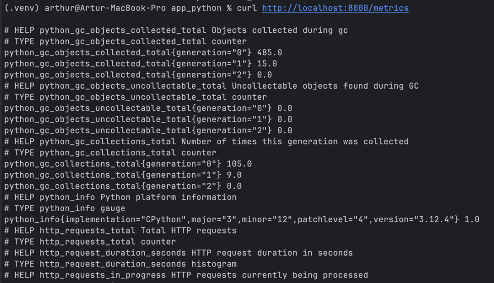

### Code showing metric definitions
```python
# Prometheus Metrics
http_requests_total = Counter(
    "http_requests_total",
    "Total HTTP requests",
    ["method", "endpoint", "status_code"],
)

http_request_duration_seconds = Histogram(
    "http_request_duration_seconds",
    "HTTP request duration in seconds",
    ["method", "endpoint"],
    buckets=[0.005, 0.01, 0.025, 0.05, 0.1, 0.25, 0.5, 1.0, 2.5],
)

http_requests_in_progress = Gauge(
    "http_requests_in_progress", "HTTP requests currently being processed"
)

devops_info_endpoint_calls = Counter(
    "devops_info_endpoint_calls_total", "Calls per endpoint", ["endpoint"]
)

```

### Documentation explaining your metric choices
These metrics were chosen to provide basic observability of the FastAPI service using Prometheus. 

- A **Counter (`http_requests_total`)** tracks the total number of HTTP requests and is labeled by method, endpoint, and status code to analyze traffic patterns and error rates. 
- A **Histogram (`http_request_duration_seconds`)** measures request latency with predefined buckets, allowing monitoring systems to calculate response time distributions and service performance. 
- A **Gauge (`http_requests_in_progress`)** tracks the number of currently active requests to observe load on the service. 
- Finally, the **`devops_info_endpoint_calls_total` counter** records how often each endpoint is used, providing simple application-level usage metrics.

## Task 2 — Prometheus Setup (3 pts)

### Screenshot of /targets page showing all targets UP
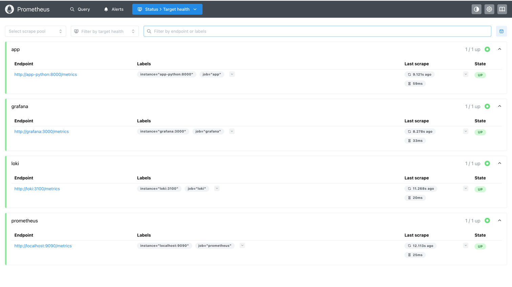

### Screenshot of a successful PromQL query
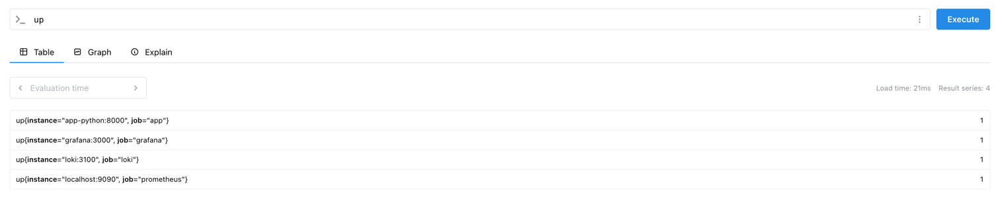

### prometheus.yml configuration file
```yml
global:
  scrape_interval: 15s
  evaluation_interval: 15s

scrape_configs:
  - job_name: 'prometheus'
    static_configs:
      - targets: ['localhost:9090']

  - job_name: 'app'
    static_configs:
      - targets: ['app-python:8000']
    metrics_path: '/metrics'

  - job_name: 'loki'
    static_configs:
      - targets: ['loki:3100']
    metrics_path: '/metrics'

  - job_name: 'grafana'
    static_configs:
      - targets: ['grafana:3000']
    metrics_path: '/metrics'
```

## Task 3 — Grafana Dashboards

### Screenshot showing all 6+ panels working

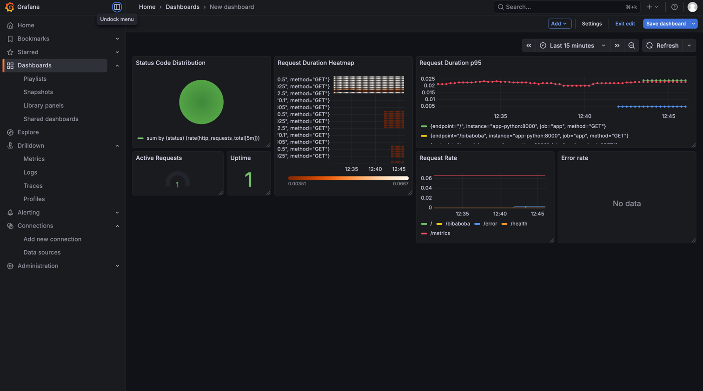

### Exported dashboard JSON file

[app-dashboard.json](../grafana/dashboards/app-dashboard.json)

### Community dashboards

- Prometheus
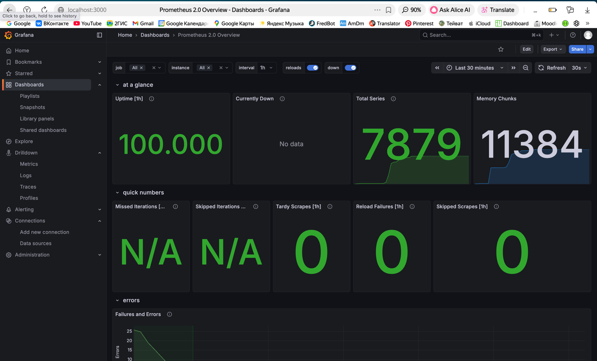

- Loki
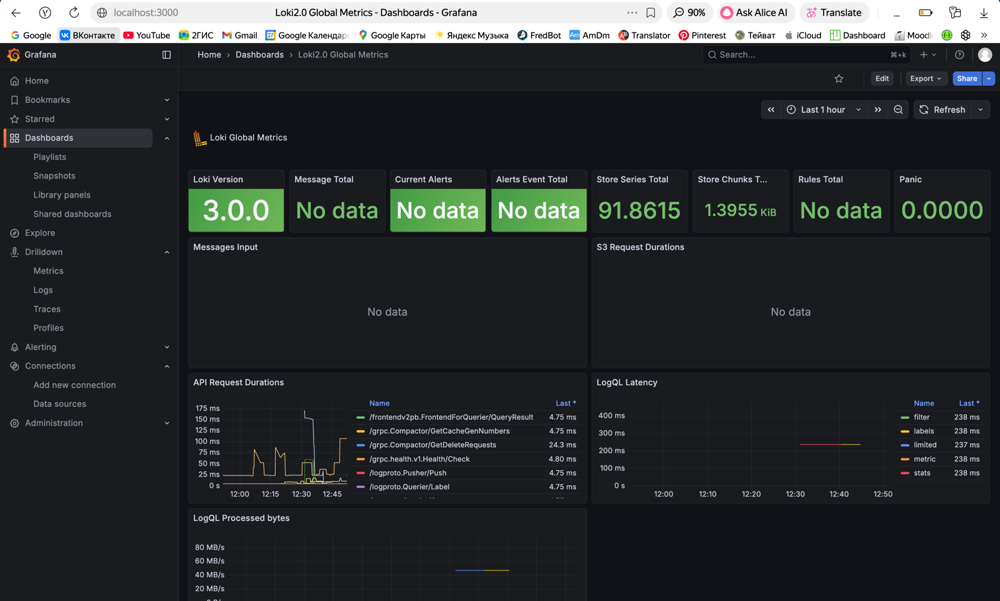

## Task 4 — Production Configuration

### docker compose ps showing all services healthy
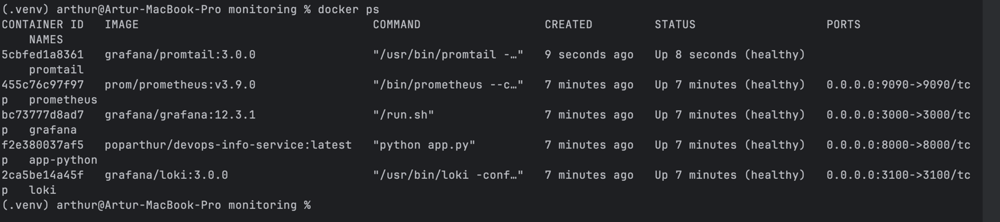

### Documentation of retention policies
Prometheus is configured with 15-day time-based retention and 10GB size-based retention – whichever limit is reached first triggers deletion of oldest data. This dual policy ensures efficient disk usage while maintaining sufficient historical data for trend analysis. Loki retains logs for 30 days (720h) as defined in its configuration, providing extended log history for debugging. Grafana stores only dashboard configurations permanently, while all metric and log data follows the retention periods of their respective source systems.

### Proof of data persistence after restart

To ensure validity of the provided screenshots you can check the time

1. Everything works
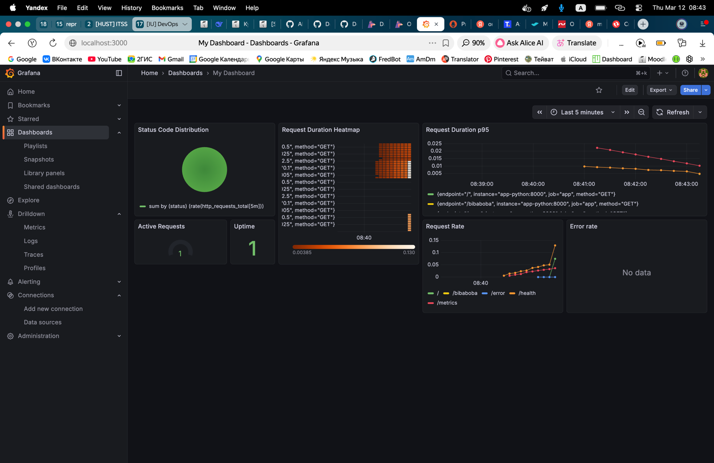
2. Removed all the containers
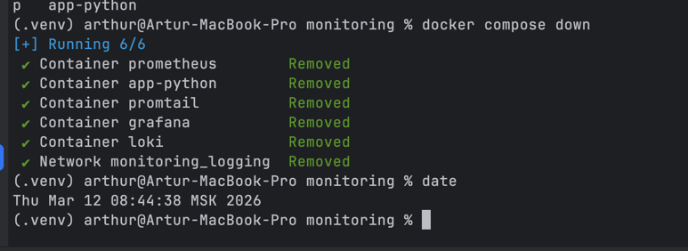
3. Grafana is unavailable
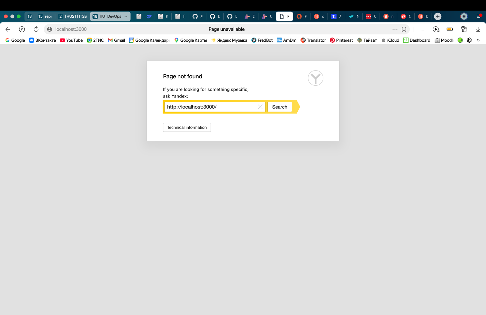
4. Start all the containers
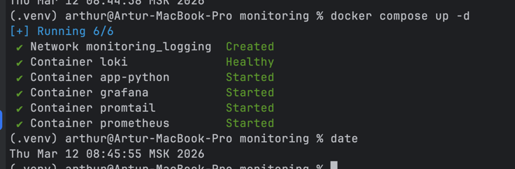
5. Dashboard still exists
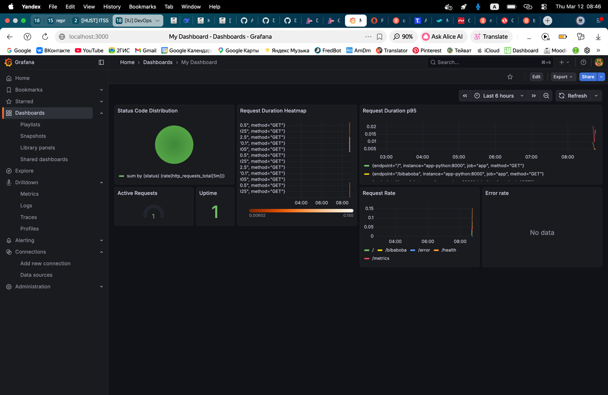

## Task 5 - Documentation

#### Architecture - Diagram showing metric flow (app → Prometheus → Grafana)

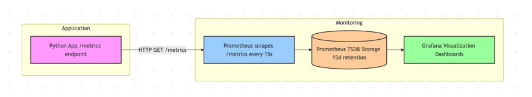

#### Application Instrumentation - What metrics you added and why

| Metric | Type | Labels | Purpose |
|--------|------|--------|---------|
| `http_requests_total` | **Counter** | `method`, `endpoint`, `status_code` | Tracks total request volume for rate and error calculation (RED method) |
| `http_request_duration_seconds` | **Histogram** | `method`, `endpoint` | Measures latency with buckets (5ms-2.5s) for percentile analysis |
| `http_requests_in_progress` | **Gauge** | none | Shows current concurrent requests for load monitoring |
| `devops_info_endpoint_calls_total` | **Counter** | `endpoint` | Tracks business metrics - which endpoints are used most |

**Why these metrics:**
- **RED Method** covered: **R**ate (`http_requests_total`), **E**rrors (`status_code="5xx"`), **D**uration (`http_request_duration_seconds`)
- **Gauge** provides instant snapshot of concurrent load
- **Business metric** reveals feature usage patterns
- All metrics include **endpoint labels** for granular breakdown

#### Prometheus Configuration - Scrape targets, intervals, retention

Scrape Targets & Intervals

| Job Name | Target | Port | Metrics Path | Scrape Interval |
|----------|--------|------|--------------|-----------------|
| **prometheus** | `localhost:9090` | 9090 | `/metrics` | 15s |
| **app** | `app-python:8000` | 8000 | `/metrics` | 15s |
| **loki** | `loki:3100` | 3100 | `/metrics` | 15s |
| **grafana** | `grafana:3000` | 3000 | `/metrics` | 15s |

Global Settings

| Setting | Value | Description |
|---------|-------|-------------|
| `scrape_interval` | **15s** | How often Prometheus collects metrics |
| `evaluation_interval` | **15s** | How often rules are evaluated |

Retention Policy

| Parameter | Value | Description |
|-----------|-------|-------------|
| `--storage.tsdb.retention.time` | **15d** | Keep metrics for 15 days |
| `--storage.tsdb.retention.size` | **10GB** | Max storage size |

All services are scraped every 15 seconds with metrics exposed at the standard `/metrics` endpoint.

#### Dashboard Walkthrough - Each panel's purpose and query

| Panel | Type | Query | Purpose |
|-------|------|-------|---------|
| **Status Code Distribution** | Pie Chart | `sum by (status) (rate(http_requests_total[5m]))` | Shows traffic breakdown by HTTP status (2xx vs 4xx vs 5xx) |
| **Request Duration Heatmap** | Heatmap | `rate(http_request_duration_seconds_bucket[5m])` | Visualizes latency distribution over time |
| **Request Duration p95** | Time Series | `histogram_quantile(0.95, rate(http_request_duration_seconds_bucket[5m]))` | Tracks 95th percentile latency - the "slow" requests |
| **Active Requests** | Gauge | `http_requests_in_progress` | Shows current concurrent requests (load snapshot) |
| **Uptime** | Stat | `up{job="app"}` | Binary 1/0 indicator if app is running |
| **Request Rate** | Time Series | `sum(rate(http_requests_total[5m])) by (endpoint)` | Requests per second broken down by endpoint |
| **Error Rate** | Time Series | `sum(rate(http_requests_total{status=~"5.."}[5m]))` | 5xx errors per second (service problems) |


#### PromQL Examples - 5+ queries with explanations

# 📈 PromQL Examples - 5+ Queries with Explanations

1. Request Rate by Endpoint
```promql
sum(rate(http_requests_total[5m])) by (endpoint)
```
**Explanation:** Calculates requests per second for each endpoint over the last 5 minutes. Shows which endpoints are most popular.

2. Error Percentage
```promql
(sum(rate(http_requests_total{status_code=~"5.."}[5m])) / sum(rate(http_requests_total[5m]))) * 100
```
**Explanation:** Computes the percentage of 5xx errors relative to total requests. Values >1% indicate problems.

3. 95th Percentile Latency
```promql
histogram_quantile(0.95, sum(rate(http_request_duration_seconds_bucket[5m])) by (le, endpoint))
```
**Explanation:** Shows the latency value where 95% of requests are faster. The "slow user" experience metric.

4. Top 3 Slowest Endpoints
```promql
topk(3, avg_over_time(http_request_duration_seconds_sum[1h]) / avg_over_time(http_request_duration_seconds_count[1h]))
```
**Explanation:** Identifies the 3 endpoints with highest average latency over the last hour.

5. Service Health Summary
```promql
up{job="app"} or up{job="prometheus"} or up{job="loki"}
```
**Explanation:** Returns 1 for each service that's running, 0 for down services. Quick health check.

6. Memory Usage Trend
```promql
avg_over_time(process_memory_bytes[30m]) / 1024 / 1024
```
**Explanation:** Average memory usage in MB over 30 minutes. Helps detect memory leaks.

7. Request Spike Detection
```promql
deriv(rate(http_requests_total[10m])[30m:]) > 0.5
```
**Explanation:** Detects sudden traffic increases where request rate grows by >0.5 req/s per second.

#### Production Setup - Health checks, resources, retention policies


Health Checks

| Service | Endpoint | Interval | Timeout | Purpose |
|---------|----------|----------|---------|---------|
| **Loki** | `http://localhost:3100/ready` | 10s | 5s | Verifies Loki is ready to accept logs |
| **Promtail** | TCP port 9080 | 30s | 10s | Checks if Promtail is listening |
| **Grafana** | `http://localhost:3000/api/health` | 10s | 5s | Confirms Grafana API is responsive |
| **App** | `http://localhost:8000/health` | 10s | 5s | Validates application health endpoint |
| **Prometheus** | `http://localhost:9090/-/healthy` | 10s | 5s | Ensures Prometheus is operational |

Resource Limits

| Service | CPU Limit | Memory Limit | CPU Reservation | Memory Reservation |
|---------|-----------|--------------|------------------|---------------------|
| **Loki** | 1.0 core | 1 GB | 0.25 core | 256 MB |
| **Promtail** | 0.5 core | 256 MB | 0.1 core | 64 MB |
| **Grafana** | 1.0 core | 512 MB | 0.25 core | 128 MB |
| **App** | 0.5 core | 256 MB | 0.1 core | 64 MB |
| **Prometheus** | 1.0 core | 1 GB | 0.25 core | 256 MB |

Retention Policies

| Service | Retention Setting | Value | Description |
|---------|-------------------|-------|-------------|
| **Prometheus** | Time-based | **15 days** | Metrics older than 15d are deleted |
| **Prometheus** | Size-based | **10 GB** | Oldest data removed when storage exceeds 10GB |
| **Loki** | Configured in config | **30 days** | Logs retained for 30 days |

Restart Policy - 
All services use `restart: unless-stopped` - automatic recovery from crashes.

#### Testing Results - Screenshots showing everything working
- provided

#### Challenges & Solutions - Issues encountered and fixes

| Challenge | Issue | Solution                                                                                |
|-----------|-------|-----------------------------------------------------------------------------------------|
| **Unhealthy Container** | App container showed `unhealthy` despite `/health` responding from host | Fixed by using Python for healthcheck instead of curl (curl not installed in container) |
| **Missing curl/wget** | Healthchecks failed because curl not installed in slim Python image | Added installation to Dockerfile                                                        |
| **Label Mismatch** | PromQL query `{status=~"5.."` returned no data | Fixed by using correct label `status_code` (actual metric label) instead of `status`    |
| **Prometheus Target Down** | App target showed DOWN in Prometheus UI | Corrected target address from `localhost:8000` to container name `app-python:8000`      |

## Comparison: metrics vs logs (Lab 7) - when to use each

| Aspect | **Metrics** | **Logs** |
|--------|-------------|----------|
| **What it tells you** | **How much/often** something happened | **What exactly** happened |
| **Data type** | Numbers, counters, gauges | Text, JSON, unstructured messages |
| **Storage** | Time-series database (Prometheus) | Log storage (Loki, Elasticsearch) |
| **Retention** | Short-term (days/weeks) - 15 days | Longer-term (weeks/months) - 30 days |
| **Query language** | PromQL - aggregations, rates, percentiles | LogQL - text search, filtering |
| **Use when...** | • Tracking trends over time<br>• Alerting on thresholds<br>• Capacity planning<br>• SLA monitoring | • Debugging errors<br>• Auditing user actions<br>• Forensic analysis<br>• Detailed transaction traces |
| **Example** | `rate(http_requests_total[5m]) > 100` shows traffic spike | Searching `error` in logs shows exact stack trace |

Metrics allows to find out that somewhere is mistake, while logs allows to find out the reason of mistake.
So better to use together!
